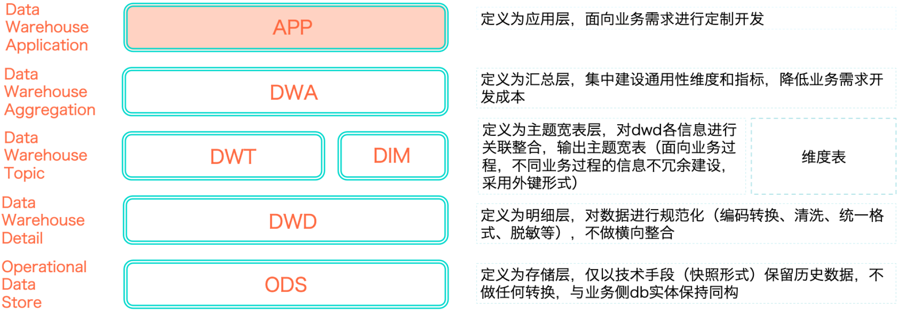
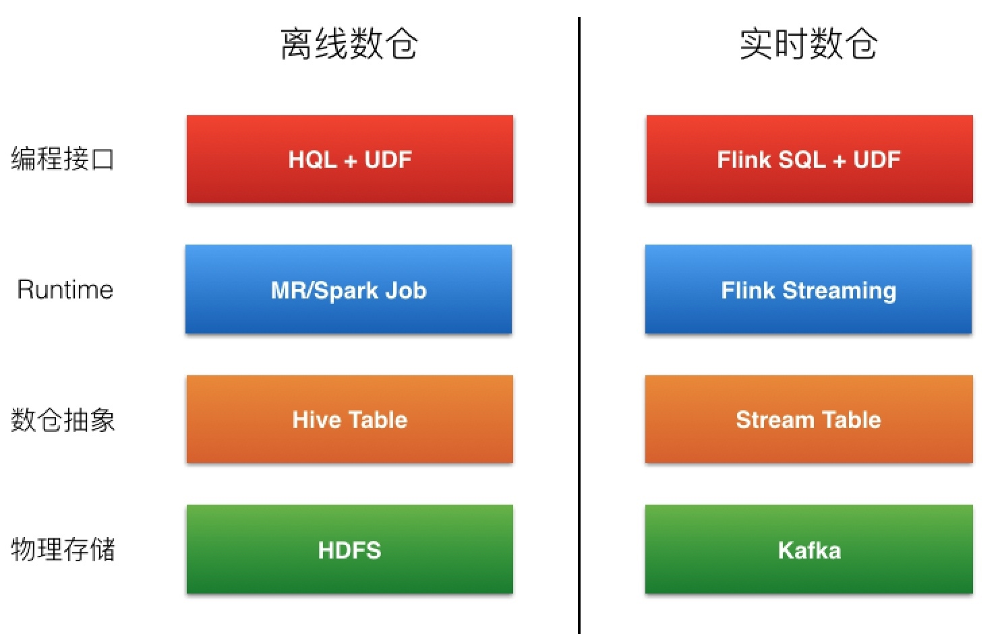
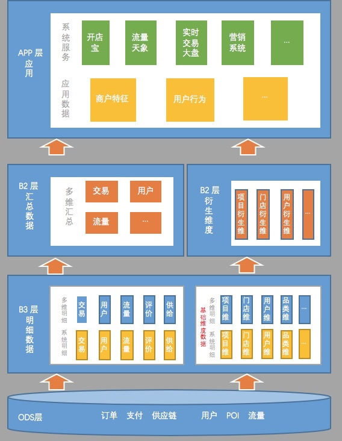

---
title: 数据仓库
toc: false
date: 2017-10-30
---      

数据仓库描述是⼀个⾯向主题的、集成的、随时间变化的、⾮易失的数据集合，⽤于⽀持管理者的决策过程。

* 面向主题：数据仓库中的数据是按照一定的主题域进行组织的，每一个主题对应一个宏观的分析领域。数据仓库排除对于决策无用的数据，提供特定主题的简明视图。 
* 集成的：企业内不同业务部门数据的完整集成。 对于企业内所有数据的集成要注意一致性（假设财务系统中对于性别使用 F/M，而 OA 系统对性别使用 A/B，这就是数据不一致，如果想搭建企业级的数据仓库，需要数据具有一 致性）。
* 随时间变化的：数仓里会完整的记录某个对象在一段时期内的变化情况。
* 非易失：⼀旦进⼊到数据仓库中，数据就不应该再有改变。

为什么不能直接操作业务系统中的数 据⽤于分析，⽽要使⽤数据仓库呢？

* 某些业务数据由于安全或其他因素不能直接访问。
* 业务系统的数据格式，如⽇期、数字的格式不统⼀。
* 业务系统的列名通常是硬编码，有时仅仅是⽆意义的字符串，这让编写分析系统更加困难。
* 通常事务处理的优先级⽐分析系统⾼，所以如果分析系统和事务 处理运⾏在同⼀硬件之上，分析系统往往性能很差。

<!--Kimball对数据仓库的理论与维度设计和建模有关。维度建 模将客观世界分为：

度量： 主要由业务过程和支持业务的源系统产生的数据，

地分割成多个独立的逻辑块，维度建模称之为维这些上下文通常被直观 常以数值形式（订 

单金额、库存数量）存在，称为事实

– 上下文：围绕着事实的大量文本形式存在的上下文，

。维描述了度量的5个W（

When、Where、What、Who和W

拉链表 https://blog.csdn.net/iteye_2280/article/details/82400178
-->

#### 数据仓库架构

以下是[美团的数据仓库架构](https://tech.meituan.com/2019/10/17/meituan-saas-data-warehouse.html)：

* ODS(Operation Data Store): 原始数据层，未经任何加工处理的原始业务层数据, 常见的ODS数据有业务日志数据(Log)和业务DB数据(DB)。
* DWD(Data Warehouse Detail): 数据明细层，对数据进行规范化
* DWS(Data Warehouse Service)：数据服务层。对数据进行轻度汇总
* ADS(Application Data Store): 数据应用层，为各种数据提供报表服务。
    * DM(data Mart): 数据集市，狭义ADS层

#### 实时数仓
https://tech.meituan.com/2018/10/18/meishi-data-flink.html

该方案由以下四层构成：

* ODS 层：Binlog 和流量日志以及各业务实时队列。
* 数据明细层：业务领域整合提取事实数据，离线全量和实时变化数据构建实时维度数据。
* 数据汇总层：使用宽表模型对明细数据补充维度数据，对共性指标进行汇总。
* App 层：为了具体需求而构建的应用层，通过 RPC 框架对外提供服务。

#### 数据仓库建模基本理论

##### ER 实体模型
##### 维度模型
