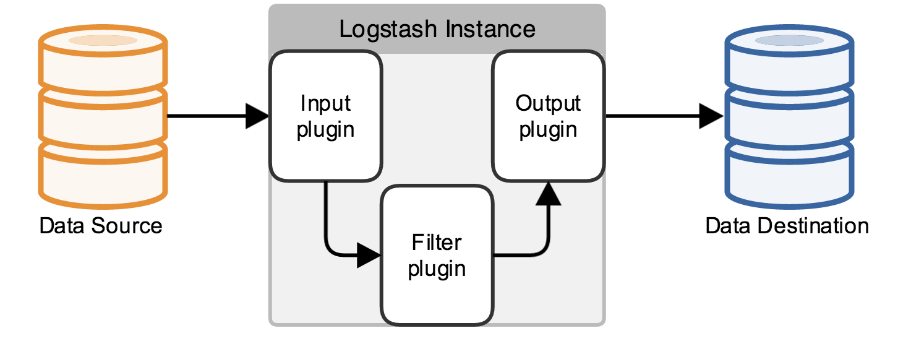
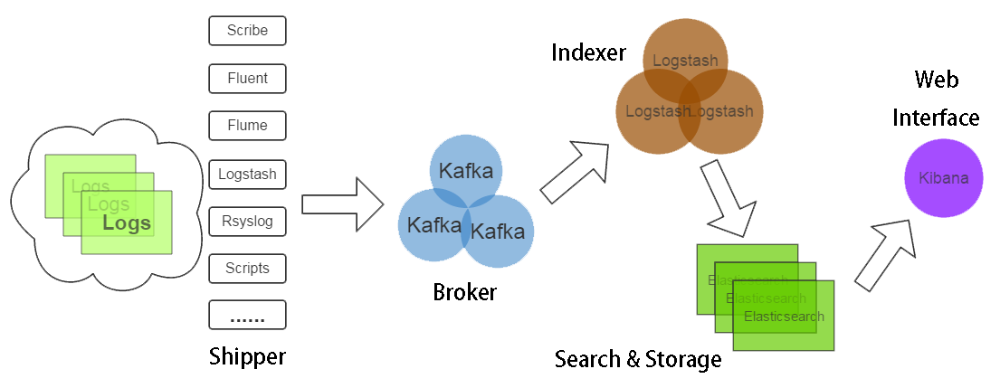

### 0 简介


### 2 Logstash


#### pipeline 

A Logstash pipeline has two required elements, input and output, and one optional element, filter. The input plugins consume data from a source, the filter plugins modify the data as you specify, and the output plugins write the data to a destination.




### 附录

#### 安装

下载好以后，修改配置文件`config/elasticsearch.yml`后，使用`elasticsearch -d`命令启动。

```yml tab="elasticsearch.yml"
#集群名称
cluster.name: es
#节点名称，要唯一
node.name: es-1
#日志存放位置
path.logs: /home/hadoop/elasticsearch/logs
#数据存放位置
path.data: /home/hadoop/elasticsearch/data
#es绑定的ip地址
network.host: 192.168.56.101
#初始化时可进行选举的节点
discovery.zen.ping.unicast.hosts: ["centos1", "centos2", "centos3"]
```

接着，可以使用[Cerebro](https://github.com/lmenezes/cerebro)网页进行管理。进行数据可视化Kibana安装只要设置`kibana`中的`"elasticsearch.url: "http://centos1:9200"`。