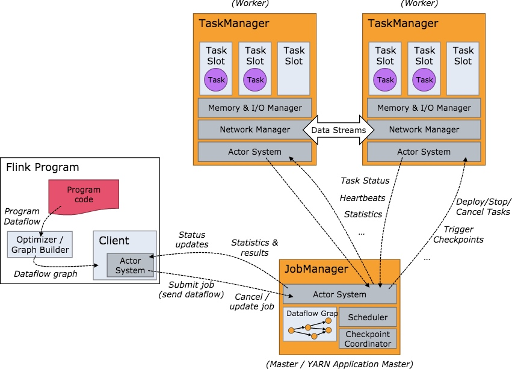
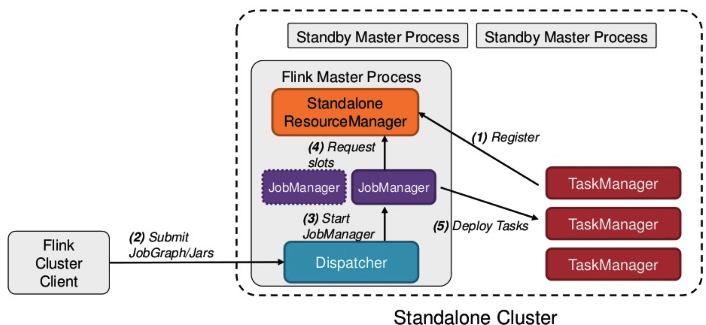
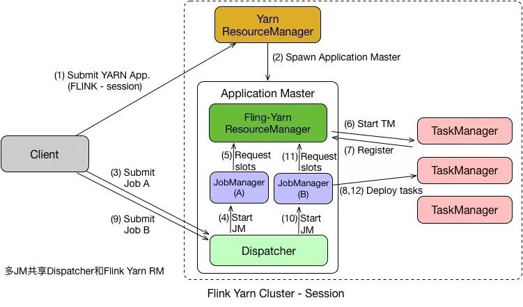
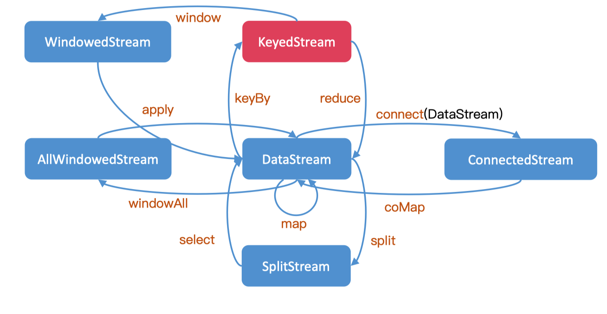
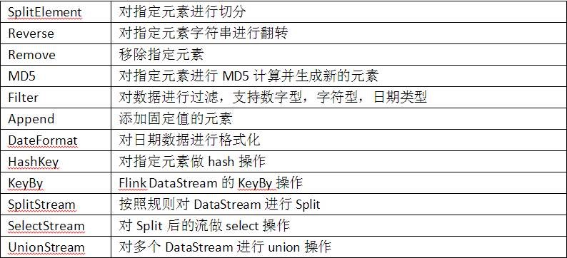
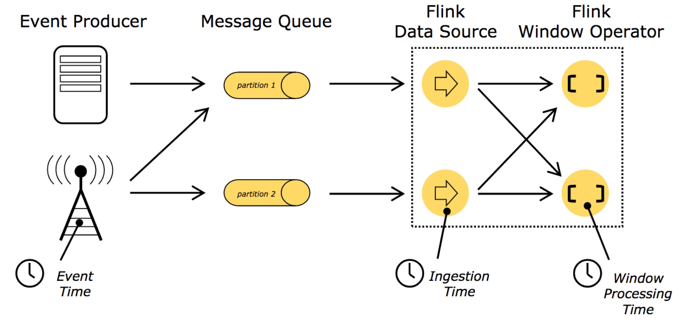
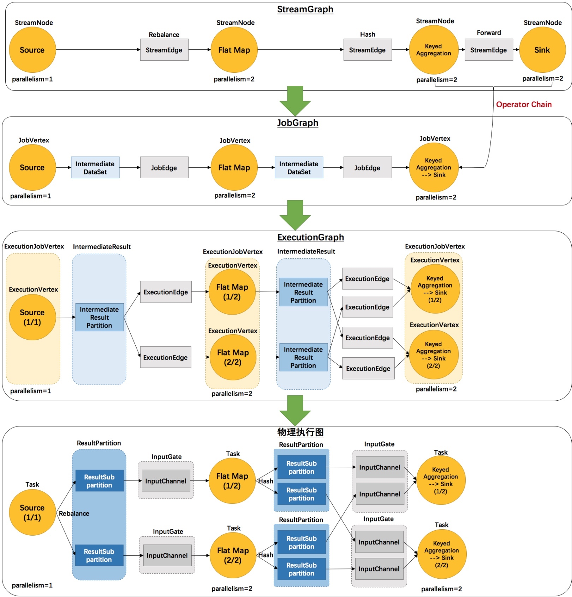

---
title: Flink
toc: false
date: 2017-10-30
---      

[Apache Flink](https://flink.apache.org/zh)是一个框架和分布式处理引擎，用于在无边界和有边界数据流上进行有状态的计算。Flink能在所有常见集群环境中运行，并能以内存速度和任意规模进行计算。

Flink用特有的DataSet和DataStream类来表示程序中的数据。你可以将它们视为可能包含重复项的不可变数据集合。对于DataSet，数据是有限的，而对于DataStream，元素的数量可以是无限的。


### 1 简介 

> Apache Flink is a framework and distributed processing engine for stateful computations over unbounded and bounded data streams.

##### 事件驱动型
event-driven: 事件驱动型应用是一类具有状态的应用，它从一个或多个事件流提取数据，并根据到来的事件触发计算、状态更新或其他外部动作。比较典型的就是以kafka为代表的消息队列几乎都是事件驱动型应用。


##### 流与批的世界观

在spark的世界观中，一切都是由批次组成的，离线数据是一个大批次，而实时数据是由一个一个无限的小批次组成的。而在flink的世界观中，一切都是由流组成的，离线数据是有界限的流，实时数据是一个没有界限的流，这就是所谓的有界流和无界流。


##### 支持有状态
Stateful:


##### 恰好一次


##### 分层API


* ProcessFunctions： the most expressive function interfaces that Flink offers. Flink provides ProcessFunctions to process individual events from one or two input streams or events that were grouped in a window.
* DataStreamAPI：provides primitives for many common stream processing operations, such as windowing, record-at-a-time transformations, and enriching events by querying an external data store. 
* SQL/TableAPI: relational APIs.



#### 架构

用户编写Flink任务后生成一个JobGraph。JobGraph是由source、map()、keyBy()/window()/apply() 和 Sink 等算子组成的。当 JobGraph 提交给 Flink 集群后，能够以 Local、Standalone、Yarn 和 Kubernetes 四种模式运行。





JobManager的功能主要有：

* 将JobGraph转换成Execution Graph，最终将Execution Graph拿来运行；
* Scheduler组件负责Task的调度；
* Checkpoint Coordinator组件负责协调整个任务的Checkpoint，包括Checkpoint的开始和完成；
* 通过Actor System与TaskManager进行通信；
* 其它的一些功能，例如Recovery Metadata，用于进行故障恢复时，可以从 Metadata 里面读取数据。


TaskManager是负责具体任务的执行过程，在JobManager申请到资源之后开始启动。TaskManager被分成很多个TaskSlot，每个任务都要运行在一个TaskSlot 里面，TaskSlot是调度资源里的最小单位。TaskManager里面的主要组件有：

* Memory & I/O Manager，即内存 I/O 的管理；
* Network Manager，用来对网络方面进行管理；
* Actor system，用来负责网络的通信；


##### Flink Standalone



* 在 Standalone 模式下，Master和TaskManager可以运行在同一台机器上，也可以运行在不同的机器上。
* 在 Master 进程中，Standalone ResourceManager的作用是对资源进行管理。当用户通过Flink Cluster Client 将 JobGraph 提交给 Master 时，JobGraph 先经过 Dispatcher。
* 当 Dispatcher 收到客户端的请求之后，生成一个 JobManager。接着 JobManager 进程向 Standalone ResourceManager 申请资源，最终再启动 TaskManager。
* TaskManager 启动之后，会有一个注册的过程，注册之后 JobManager 再将具体的 Task 任务分发给这个 TaskManager 去执行。

##### Flink on yarn


Flink on Yarn 中的 Per Job 模式是指每次提交一个任务，然后任务运行完成之后资源就会被释放，具体如下：

* 首先 Client 提交 Yarn App，比如 JobGraph 或者 JARs。
* 接下来 Yarn 的 ResourceManager 会申请第一个 Container。这个 Container 通过 Application Master 启动进程，Application Master 里面运行的是 Flink 程序，即 Flink-Yarn ResourceManager 和 JobManager。
* 最后 Flink-Yarn ResourceManager 向 Yarn ResourceManager 申请资源。当分配到资源后，启动 TaskManager。TaskManager 启动后向 Flink-Yarn ResourceManager 进行注册，注册成功后 JobManager 就会分配具体的任务给 TaskManager 开始执行。




在 Per Job 模式中，执行完任务后整个资源就会释放，包括 JobManager、TaskManager 都全部退出。而Session模式则不一样，它的 Dispatcher 和 ResourceManager 是可以复用的。Session 模式下，当 Dispatcher 在收到请求之后，会启动 JobManager(A)，让 JobManager(A) 来完成启动 TaskManager，接着会启动 JobManager(B) 和对应的 TaskManager 的运行。当 A、B 任务运行完成后，资源并不会释放。Session 模式也称为多线程模式，其特点是资源会一直存在不会释放，多个 JobManager 共享一个 Dispatcher，而且还共享 Flink-YARN ResourceManager。

### 2 Streamin Processing


Flink程序看起来像是转换数据集合的规范化程序。每个程序由一些基本的部分组成：

* 获取执行环境，
* 加载/创建初始数据，
* 指定对数据的转换操作，
* 指定计算结果存放的位置，
* 触发程序执行


```scala
object WordCountDemo {
  def main(args: Array[String]): Unit = {
    // 1. 获取执行环境
    val env: ExecutionEnvironment = ExecutionEnvironment.getExecutionEnvironment
    // 2. 加载/创建初始数据
    val text: DataSet[String] = env.readTextFile("/Users/larry/Desktop/面试题/测试题.txt")
    // 3. 指定对数据的转换操作
    val wordcount: AggregateDataSet[(String, Int)] = text.flatMap(_.split(" "))
      .map((_, 1))
      .groupBy(0)
      .sum(1)
    // 4.指定计算结果存放的位置
    wordcount.writeAsText("/Users/larry/Desktop/面试题/wordcountResult")
    // 5. 触发程序执行
    env.execute("wordcount")
  }
}
```
#### source
#### transform

DataStream支持的转换操作有如下几种：


这些转换操作会将DataStream进行各种转换：




物理分组
#### sink

### 2 Window & Time

#### time



Event Time：是事件创建的时间。它通常由事件中的时间戳描述，例如采集的日志数据中，每一条日志都会记录自己的生成时间，Flink通过时间戳分配器访问事件时间戳。
Ingestion Time：是数据进入Flink的时间。
Processing Time：是每一个执行基于时间操作的算子的本地系统时间，与机器相关，默认的时间属性就是Processing Time。


#### window

Flink 中 Window 可以是时间驱动的（TimeWindow），也可以是数据驱动的（CountWindow）

* CountWindow：按照指定的数据条数生成一个Window，与时间无关。
    * 划分为：滚动窗口（Tumbling Window）：将数据依据固定的窗口长度对数据进行切片、
    * 滑动窗口（Sliding Window）：由固定的窗口长度和滑动间隔组成
    * 和会话窗口（Session Window）：不会有重叠和固定的开始时间和结束时间的情况，当它在一个固定的时间周期内不再收到元素，即非活动间隔产生，那个这个窗口就会关闭
*	TimeWindow：按照时间生成Window。


#### connector


###  High-level Analytics API


####  Flink Table
#### Flink SQL


### hi

#### 执行流程


* 第⼀层:Program -> StreamGraph 
* 第⼆层：StreamGraph -> JobGraph 
* 第三层：JobGraph -> ExecutionGraph 
* 第四层：Execution -> 物理执⾏计划




#### job调度和执行


