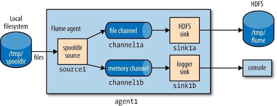
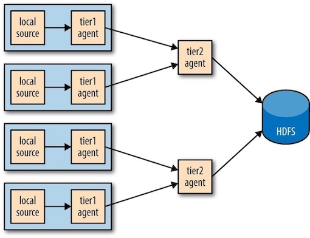

[Apache Flume](http://flume.apache.org/)是一个分布式、高可靠和高可用的服务，用来高效地收集、聚合和移动大量的日志数据。一个典型的例子是利用Flume从一组Web服务器中收集日志文件，然后把这些文件中的日志事件转移到一个新的HDFS汇总文件中做进一步处理，其终点通常是HDFS。

### 0 简介
#### 组成架构
要想使用Flume，就需要运行一个Flume agent。Flume agent是由一个持续运行的Java进程，由source、sink以及连接它们的channel一起组成。source产生事件，并将其传送给channel，channel存储这些事件直至转发给sink。


* Source的类型有Avro, thrift, exec, spooling directory, netcat
* Channel的类型有Memory Channel, File Channel
* Sink的类型有hdfs, logger, kafka, hbase, avro


#### 简单实例
##### 实时读取目录文件到控制台

为了演示Flume是如何工作的，首先从以下设置出发：

1. 监视新增文本文件所在的本地目录
2. 每当有新增文件时，文件中的每一行都将被发往控制台


Flume配置使用一个spooling directory source和一个logger sink。属性名称构成了一个分级结构，顶级为agent的名称，下一级为agent中不同组件的名称(sources, channels, sinks)，再下一级是组件的属性。
    
```text
agent1.sources = source1 
agent1.sinks = sink1 
agent1.channels = channel1
    
agent1.sources.source1.type = spooldir
agent1.sources.source1.spoolDir = /tmp/spooldir
agent1.sinks.sink1.type = logger
agent1.channels.channel1.type = file
    
agent1.sources.source1.channels = channel1 
agent1.sinks.sink1.channel = channel1
```


```bash
# 创建一个缓冲目录
mkdir /tmp/spooldir
# 使用 flume-ng 命令启动flume agent:
flume-ng agent --conf-file spool-to-logger.properties \
    --name agent1  -Dflume.root.logger=INFO, console
```
在新终端中，写入字符串到新的缓冲文件。
```
echo "Hello Flume" > /tmp/spooldir/.file1.txt
~ mv /tmp/spooldir/.file1.txt /tmp/spooldir/file1.txt
```


##### 实时读取目录文件到HDFS


```text tab="spool-to-hdfs.properties"
agent1.sources = source1
agent1.sinks = sink1
agent1.channels = channel1

# Describe/configure the source
agent1.sources.source1.type = spooldir
agent1.sources.source1.spoolDir = /tmp/upload
agent1.sources.source1.fileSuffix = .COMPLETED
agent1.sources.source1.fileHeader = true
#忽略所有以.tmp结尾的文件，不上传
agent1.sources.source1.ignorePattern = ([^ ]*\.tmp)

# Describe the sink
agent1.sinks.sink1.type = hdfs
agent1.sinks.sink1.hdfs.path = hdfs://bi/flume/upload/%Y%m%d%H
#上传文件的前缀
agent1.sinks.sink1.hdfs.filePrefix = upload-
#是否按照时间滚动文件夹
agent1.sinks.sink1.hdfs.round = true
#多少时间单位创建一个新的文件夹
agent1.sinks.sink1.hdfs.roundValue = 1
#重新定义时间单位
agent1.sinks.sink1.hdfs.roundUnit = hour
#是否使用本地时间戳
agent1.sinks.sink1.hdfs.useLocalTimeStamp = true
#积攒多少个Event才flush到HDFS一次
agent1.sinks.sink1.hdfs.batchSize = 100
#设置文件类型，可支持压缩
agent1.sinks.sink1.hdfs.fileType = DataStream
#多久生成一个新的文件
agent1.sinks.sink1.hdfs.rollInterval = 600
#设置每个文件的滚动大小大概是128M：多大生成一个新文件
agent1.sinks.sink1.hdfs.rollSize = 134217700
#文件的滚动与Event数量无关
agent1.sinks.sink1.hdfs.rollCount = 0
#最小冗余数
agent1.sinks.sink1.hdfs.minBlockReplicas = 1

# Use a channel which buffers events in memory
agent1.channels.channel1.type = memory
agent1.channels.channel1.capacity = 1000
agent1.channels.channel1.transactionCapacity = 100

# Bind the source and sink to the channel
agent1.sources.source1.channels = channel1
agent1.sinks.sink1.channel = channel1
```

```bash tab="运行"
flume-ng agent --conf-file spool-to-hdfs.properties --name agent1
```

##### 通过代理层分发

要想实现Flume事件的汇聚，就需要使用分层结构的Flume代理。第一层代理负责采集来自原始source的事件，并将它们发送到第二层。第二层代理的数量比第一层少，这些代理先汇总来自第一层代理的事件，再把这些事件写入HDFS。

要构建分层结构，需要使用某种特殊的sink来通过网络发送事件，再加上相应的source来接收事件。Avro sink可通过Avro RPC将事件发送给运行在另一个Flume代理上的其他的Avro。


    
```text tab="spool-to-hdfs-tiered"
# First-tier agent: centos1
spool-avro.sources = source1 
spool-avro.sinks = sink1 
spool-avro.channels = channel1
spool-avro.sources.source1.channels = channel1 
spool-avro.sinks.sink1.channel = channel1
spool-avro.sources.source1.type = spooldir 
spool-avro.sources.source1.spoolDir = /tmp/spooldir
spool-avro.sinks.sink1.type = avro 
spool-avro.sinks.sink1.hostname = centos2 
spool-avro.sinks.sink1.port = 10000
spool-avro.channels.channel1.type = file 
spool-avro.channels.channel1.checkpointDir=/tmp/agent1/file-channel/checkpoint 
spool-avro.channels.channel1.dataDirs=/tmp/agent1/file-channel/data

# Second-tier agent: centos2
avro-hdfs.sources = source2 
avro-hdfs.sinks = sink2 
avro-hdfs.channels = channel2
avro-hdfs.sources.source2.channels = channel2 
avro-hdfs.sinks.sink2.channel = channel2
avro-hdfs.sources.source2.type = avro 
avro-hdfs.sources.source2.bind = centos2 
avro-hdfs.sources.source2.port = 10000
avro-hdfs.sinks.sink2.type = hdfs 
avro-hdfs.sinks.sink2.hdfs.path = hdfs://bi/flume/upload/%Y%m%d%H
avro-hdfs.sinks.sink2.hdfs.filePrefix = events 
avro-hdfs.sinks.sink2.hdfs.fileSuffix = .log 
avro-hdfs.sinks.sink2.hdfs.fileType = DataStream
avro-hdfs.sinks.sink2.hdfs.useLocalTimeStamp = true
avro-hdfs.channels.channel2.type = file 
avro-hdfs.channels.channel2.checkpointDir=/tmp/agent2/file-channel/checkpoint 
avro-hdfs.channels.channel2.dataDirs=/tmp/agent2/file-channel/data
```

这两个agent需要分别运行，它们用的`--conf-file`参数相同，但是`-name`参数不同

```bash
# 先启动agent2，再启动agent1
flume-ng agent --conf-file spool-to-hdfs-tiered.properties --name avro-hdfs
flume-ng agent --conf-file spool-to-hdfs-tiered.properties --name spool-avro
```
##### 扇出


扇出(*Fan out*)指的是从一个source向多个sink传递事件(event)。




```text tab="fanout.properties"
agent1.sources = source1 
agent1.sinks = sink1a sink1b 
agent1.channels = channel1a channel1b
agent1.sources.source1.channels = channel1a channel1b 
agent1.sinks.sink1a.channel = channel1a 
agent1.sinks.sink1b.channel = channel1b
agent1.sources.source1.type = spooldir 
agent1.sources.source1.spoolDir = /tmp/spooldir
agent1.sinks.sink1a.type = hdfs 
agent1.sinks.sink1a.hdfs.path = hdfs://bi/flume/upload/%Y%m%d%H 
agent1.sinks.sink1a.hdfs.filePrefix = events 
agent1.sinks.sink1a.hdfs.fileSuffix = .log 
agent1.sinks.sink1a.hdfs.fileType = DataStream
agent1.sinks.sink1a.hdfs.useLocalTimeStamp = true
agent1.sinks.sink1b.type = logger
agent1.channels.channel1a.type = file 
agent1.channels.channel1b.type = memory
```

```bash
flume-ng agent --conf-file fanout.properties --name agent1 -Dflume.root.logger=INFO, console
```


##### kafka

Flume和Kafka可以结合来使用，Flume作为日志收集端，Kafka作为日志消费端。

```text tab="avro-memory-kafka.properties"
avro-memory-kafka.sources = avro-source 
avro-memory-kafka.sinks = kafka-sink 
avro-memory-kafka.channels = memory-channel

avro-memory-kafka.sources.avro-source.type = avro 
avro-memory-kafka.sources.avro-source.bind = centos2 
avro-memory-kafka.sources.avro-source.port = 10000

avro-memory-kafka.sinks.kafka-sink.type = org.apache.flume.sink.kafka.KafkaSink 
avro-memory-kafka.sinks.kafka-sink.kafka.bootstrap.servers = centos1:9092
avro-memory-kafka.sinks.kafka-sink.kafka.topic = test-topic
avro-memory-kafka.sinks.kafka-sink.flumeBatchSize = 100
avro-memory-kafka.sinks.kafka-sink.kafka.producer.acks = 1

avro-memory-kafka.channels.memory-channel.type = memory 
avro-memory-kafka.sources.avro-source.channels = memory-channel 
avro-memory-kafka.sinks.kafka-sink.channel = memory-channel
```


```bash tab="启动，并显示消息"
# centos2
flume-ng agent --conf-file avro-memory-kafka.properties --name avro-memory-kafka
# centos1
flume-ng agent --conf-file spool-to-hdfs-tiered.properties --name agent1
kafka-console-consumer.sh --zookeeper centos1:2181 --from-beginning --topic test-topic
```


### 2 事务和可靠性

Flume使用两个独立的**事务**分别负责从source到channel以及从channel到sink的事件传递。例如上面的例子中，spooling directory source为文件的每一行创建一个事件。一旦事务中的所有事件全部传递到channel且全部成功，那么source就将该文件标记为完成。如果由于原因导致事件无法记录，那么事务将会回滚。

每个事件到达sink至少一次(**at least once**)。也就是说同一事件有可能会重复到达。例如，即使代理重启之前有部份或者全部事件已经被提交到channel，但是在代理重启之后，spooling directory source还是会为所有未完成的文件重新传递事件，logger sink也会重新记录那些已经记录但未被提交的事件。

为了提交效率，Flume在有可能的情况下尽量以事务为单位来批量处理事件，而不是逐个事件地处理。


#### Delivery Guarantees

Flume uses a separate transaction to deliver each batch of events from the spooling directory source to each channel. If either of these transactions fails (if a channel is full, for example), then the events will not be removed from the source, and will be retried later.


### 3 Distribution: Agent Tiers

Aggregating Flume events is achieved by having tiers of Flume agents. 

The first tier collects events from the original sources (such as web servers) and sends them to a smaller set of agents in the second tier, which aggregate events from the first tier before writing them to HDFS. Further tiers may be warranted for very large numbers of source nodes.




### 4 Sink组

**sink组**(sink group)允许将多个sink当作一个sink处理，以实现故障转移(failover)或负载均衡(load-balancing)。若某个第二层agent不可用，时间将被传递给另一个第二层agent，从而使这些事件不断地到达HDFS。


### 附录
#### 安装

下载解压后，在`$FLUME_HOME/flume-env.sh`中配置JAVA_HOME即可。
