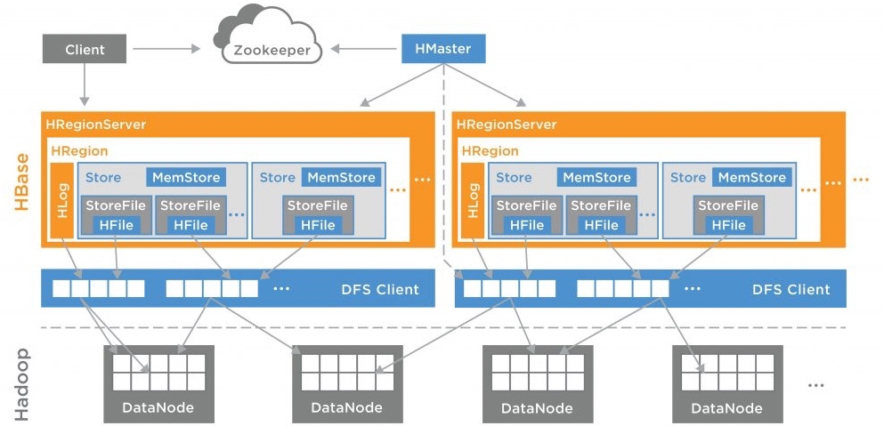
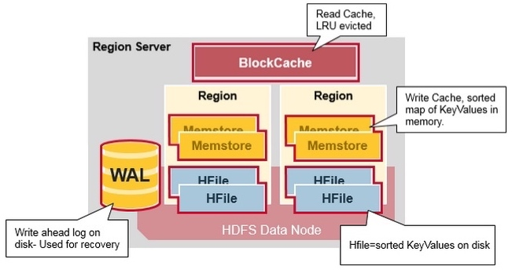
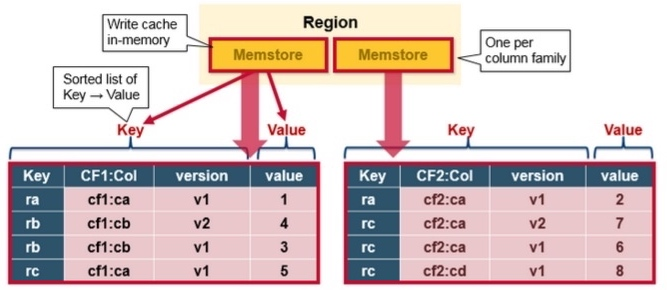
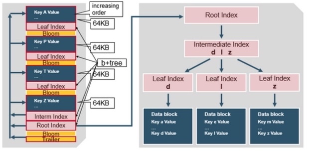
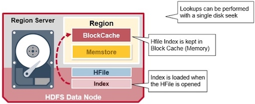
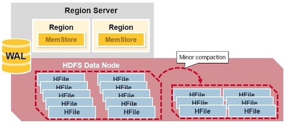
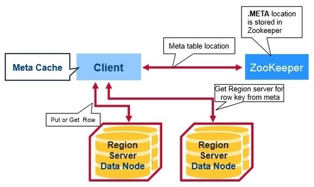
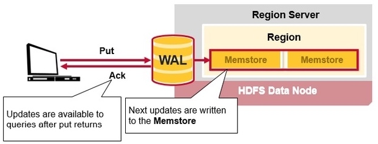
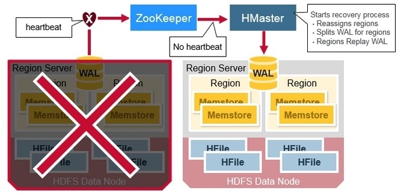

> Use Apache HBase™ when you need **random**, **realtime** read/write access to your Big Data. It's goal is the hosting of **very large** tables -- billions of rows X millions of columns -- atop clusters of commodity hardware. Apache HBase is an open-source, distributed, versioned, non-relational database modeled after Google's Bigtable. 


### 1 简介
#### 数据模型


HBase表格由行和列组成。表格的**单元格**(cell)由行和列的坐标决定，其版本号(version)为HBase插入单元格时的时间戳(timestamp)，其内容是未解释的字节数组(byte array)。


所有对表格的访问都要通过行键。表格**行键**(row key)是字节数组。表格的行根据行键的字节顺序(byte order)进行排序。

列被组合成**列族**(column families)。所有的列族成员有相同的前缀，例如`info:format`和`info:geo`都是`info`列族的成员。一个表的列族必须预先定义，但是新的列族成员可以随时加入。


HBase自动把表水平划分成**区域**(region)。一开始，一个表只有一个区域，但是随着区域开始变大，等到超出设定的大小阈值，便会在某行的边界上把表分成两个大小基本相同的新分区。


!!! Question "如何设计row key"

#### 应用场景

**Hbase的优点及应用场景**:

1. 半结构化或非结构化数据: 
   对于数据结构字段不够确定或杂乱无章非常难按一个概念去进行抽取的数据适合用HBase，因为HBase支持动态添加列。
2. 记录很稀疏： 
   RDBMS的行有多少列是固定的。为null的列浪费了存储空间。HBase为null的Column不会被存储，这样既节省了空间又提高了读性能。
3. 多版本号数据： 
   依据Row key和Column key定位到的Value能够有随意数量的版本号值，因此对于须要存储变动历史记录的数据，用HBase是很方便的。比方某个用户的Address变更，用户的Address变更记录也许也是具有研究意义的。
4. 仅要求最终一致性： 
   对于数据存储事务的要求不像金融行业和财务系统这么高，只要保证最终一致性就行。（比如HBase+elasticsearch时，可能出现数据不一致）
5. 高可用和海量数据以及很大的瞬间写入量： 
   WAL解决高可用，支持PB级数据，put性能高
   适用于插入比查询操作更频繁的情况。比如，对于历史记录表和日志文件。（HBase的写操作更加高效）
6. 业务场景简单： 
   不需要太多的关系型数据库特性，列入交叉列，交叉表，事务，连接等。

**Hbase的缺点：**

1. 单一RowKey固有的局限性决定了它不可能有效地支持多条件查询
2. 不适合于大范围扫描查询
3. 不直接支持 SQL 的语句查询


### 2 架构

HBase由一个*Master*(`HMaster`进程)协调管理一个或多个*RegionServer*(`HRegionServer`进程)，并由Zookeeper负责维护和记录整个HBase集群的状态。




#### Zookeeper


HBase依赖于ZooKeeper。ZooKeeper集合体(ensemble)负责管理诸如 ==`hbase:meta`目录表== (meta table)的位置以及当前集群主控机地址等重要信息。`hbase:meta`是HBase内部的特殊目录表(catalog table)，维护着当前集群上所有区域的列表、状态和位置。`hbase:meta`表中的项使用区域名作为键。区域名由所属的表名、区域的起始行、区域的创建时间以及对其整体进行的MD5哈希值组成。例如，表`TestTable`中起始行为*xyz*的区域的名称如下：

```text
TestTable, xyz, 1279729913622.1b6e176fb8d8aa88fd4ab6bc80247ce.
表名，   起始行，  时间戳     . MD5 哈希值 .
```

另外，ZooKeeper实现了HBase的高可用：HBase中可以启动多个HMaster。当HMaster宕机时(Zookeeper监测到心跳超时)，Zookeeper中的`/hbase/master`节点将会消失，同时Zookeeper通知其他备用HMaster节点，重新创建`/hbase/master`并转化为active master。

#### HMaster

HBase Master的功能有：

* 协调RegionServer
* 在集群处于数据恢复或者动态调整负载时，分配region到某一个RegionServer中
    * 当Zookeeper中任一RegionServer节点状态发生变化时，HMaster都会收到通知，并作出相应处理，例如RegionServer宕机，HMaster重新分配Regions至其他RegionServer以保证集群整体可用性。
* 提供DDL相关的API，新建/删除/更新表结构。

#### RegionServer

RegionServer负责region的管理以及相应客户端的读写请求，还负责region的划分并通知HBase Master新的子region。一个RegionServer最多可以管理1000个region。RegionServer一般和HDFS的data node运行在同一台主机上，由4个部分组成：

* WAL(Write Ahead Log)：预写日志。用于RegionServer崩溃后，恢复还没有存储在硬盘上的数据(即MemStore)。
* BlockCache：读取缓存。满了之后，会根据LRU算法选出最近最不常使用数据，然后释放掉。
* MemStore：写入缓存。在数据真正被写入硬盘前，MemStore在内存中缓存新写入的数据。每个列族都有一个MemStore。
* HFile： HDFS上的数据文件，里面存储键值对。





#### MemStore

MemStore在内存中按照Key的顺序，存储key-Value对，一个MemStore对应一个列族。当MemStore累积了足够多的数据后，RegionServer将MemStore中的数据写入HDFS，存储为一个HFile。每个列族对应一个HFile。写入时，系统额外保存最后写入操作的序列号(last written sequence number)，所以HBase知道有多少数据已经写入硬盘。




#### HFile


HFile中存储有序的键值对。MemStore写入HDFS形成新HFile时，写入是顺序的，这很好的避免了机械硬盘的磁头移动，所以写入速度非常快。HFile存储了⼀个多级索引(multi-layered index), 查询请求不需要遍历整个HFile查询数据, 通过多级索引就可以快速得到数据。查询布隆过滤器可以很快得确定row key是否在HFile内。




当打开HFile后, 系统⾃动缓存HFile的索引在Block Cache⾥, 这样后续查找操作只需要⼀次硬盘的寻道。



#### Compaction

**Minor compaction**指HBase⾃动选择较⼩的HFile, 将它们合并成更⼤的HFile。HFile的合并采⽤归并排序的算法。




**Major compaction**指⼀个region下的所有HFile做归并排序, 最后形成⼀个⼤的HFile。虽然可以提高读性能，但是这会重写所有的HFile, 占⽤⼤量硬盘IO和⽹络带宽，所以通常在只会每周执⾏⼀次或者只在凌晨运⾏。


### 3 读写流程

#### 第一次读写流程

新连接到Zookeeper集群上的客户端首先查找`hbase:meta`(meta table)的位置。然后客户端通过查找合适的`hbase:meta`区域来获取用户空间区域所在节点及其位置。接着客户端就可以直接和管理那个区域的regionserver进行交互。客户端会缓存meta table的位置和row key的位置信息，这样就不用每次访问都读ZooKeeper。




到达regionserver的写操作首先追加到提交日志(commit log)中，然后加入内存中的memstore。如果memstore满，它的内容会被刷入(flush)文件系统。


#### 混合读

HBase中的⼀个行⾥⾯的数据, 被分配在多个地⽅：已经持久化存储的Cell在HFile, 最近写⼊的Cell在Memstore⾥, 最近读取的Cell在Block Cache⾥。 所以当读HBase的⼀⾏时, 混合了Block Cache, MemStore和HFile的读操作：

1. ⾸先, 在Block Cache(读cache)⾥⾯查找cell, 因为最近的读取操作都会缓存在这⾥。 如果找到就返回, 没有找到就执⾏下⼀步；
2. 其次, 在MemStore(写cache)⾥查找cell, MemStore⾥⾯存储⾥最近的新写⼊, 如果找到就返回, 没有找到就执⾏下⼀步；
3. 最后, 在读写cache中都查找失败的情况下, HBase查询Block Cache⾥⾯的Hfile索引和布隆过滤器, 查询有可能存在这个cell的HFile, 最后在HFile中找到数据。


#### HBase的写入流程

当HBase客户端发起写入请求时:

* 将修改的操作记录写入预写日志(WAL)的末尾，用来在RegionServer崩溃时，恢复MemStore。
* 将数据存储在memstore之后，向用户返回写成功。




### 4 复制

HDFS⾃动复制所有WAL和HFile的数据块到其他节点。 HBase依赖HDFS保证数据安全。 当在HDFS⾥⾯写⼊⼀个⽂件时, ⼀份存储在本地节点, 另两份存储到其他节点。但如果系统崩溃后重启, Hbase如何恢复Memstore⾥⾯的数据?

#### 灾难恢复



当RegionServer宕机后，Zookeeper发现RegionServer的heartbeat停⽌, 判断RegionServer宕机并通知Master节点。 Hbase Master得知该RegionServer停机后, 将崩溃的RegionServer管理的region分配给其他RegionServer。 HBase从预写日志(WAL)⾥恢复MemStore⾥的数据.


### 5 客户端

#### HBase Shell


使用`hbase shell`启动HBase的shell环境

| 名称 | 命令表达式 |
| --- | --- |
| 创建表 | create '表名', '列族名 1', '列族名 2', '列族名 N' |
| 查看所有表 |  list |
| 描述表 | describe '表名' |
| 判断表存在  | exists '表名' |
| 判断是否禁用启用表. | is_enabled '表名' is_disabled '表名' |
| 添加记录 | put '表名', 'rowKey', '列族 : 列','值' |
| 查看记录 | rowkey 下的所有数据. get '表名' , 'rowKey' |
| 查看表中的记录总数 | count '表名' |
| 获取某个列族 | get '表名', 'rowkey', '列族' |
| 获取某个列族的某个列 | get '表名', 'rowkey', '列族：列' |
| 删除记录 | delete '表名', '行名' , '列族：列'.  |
| 删除整行 | deleteall '表名', 'rowkey' |
| 删除一张表 | 先要禁用该表，才能对该表进行删除 第一步 disable '表名' ，第二步 drop '表名' |
| 清空表    | truncate '表名' |
| 查看所有记录 | scan "表名"  |
| 查看某个表某个列中所有数据 | scan "表名" , {COLUMNS=>'列族名:列名'} |
| 更新记录       | 就是重写一遍，进行覆盖， hbase 没有修改，都是追加 | 

#### Java API

#### Phoenix


### 附录

#### 安装分布式集群

下载好HBase之后，设置`HBASE_HOME`, 将`$HADOOP_CONF_DIR`下的`hdfs-site.xml`和`core-site.xml`复制到`$HBASE_HOME/conf`目录下。接下来修改`$HBASE_HOME/conf/hbase-env.sh`中的`JAVA_HOME`，并注释掉PermSize的相关内容(只有JDK7有用)，设置`HBASE_MANAGES_ZK`为false(使用自己搭建的Zookeeper集群)。接下来设置`hbase-site.xml`文件：

```xml
<property>
    <name>hbase.master</name>
    <value>centos1:60000</value>
</property>
<property>
    <name>hbase.master.maxclockskew</name>
    <value>180000</value>
</property>
<property>
    <name>hbase.rootdir</name>
<value>hdfs://bi/hbase</value>
</property>
<property>
    <name>hbase.cluster.distributed</name>
    <value>true</value>
</property>
<property>
    <name>hbase.zookeeper.quorum</name>
    <value>centos1,centos2,centos3,centos4</value>
</property>
<property>
    <name>hbase.zookeeper.property.dataDir</name>
    <value>/home/larry/hbase/tmp/zookeeper</value>
</property>
<!-- hbase master的web ui页面的端口 -->
<property>
    <name>hbase.master.info.port</name>
    <value>60010</value>
</property>
```

其中`hbase.zookeeper.quorum`和`hbase.zookeeper.property.dataDir`得和Zookeeper一致，可以去Zookeeper配置文件`$ZOOKEEPER_HOME/conf/zoo.cfg`)中找。使用`start-hbase.sh`命令启动HBase集群。使用`hbase-daemon.sh start thrift`启动HBase ThriftServer。