###  1 Meet Hadoop


#### 数据！数据！

现在是数据大爆炸时代，全球数据总量远远超过了全世界每人一块硬盘中所能保存的数据总量。

* 个人产生的数据正在快速增长
    * 个人信息档案将日益普及（电话、邮件、文件、照片）
* 物联网的机器设备产生的数据可能远远超过个人产生的数据 
    * 机器日志、传感器网络、零售交易数据等

#### 数据的存储与分析

遇到的问题：硬盘存储容量不断提升，访问速度却没有与时俱进

* 读写硬盘中的数据需要更长时间

解决方法： 同时从多个硬盘上读取数据，每个硬盘存储一部分数据

* 虽然浪费了硬盘容量，但是由于用户的分析工作都是在不同时间点进行的，所以彼此之间的干扰并不太大

新的问题：要对多个硬盘中的数据并行进行读写数据，还有更多问题要解决

* 硬件故障问题：最常见的做法是系统保存数据的副本(replica)
* 大多数分析任务需要以某种方式结合大部分数据来共同完成分析，保证其正确性是一个非常大的挑战：MapReduce

#### 查询所有数据

MapReduce是一个**批量查询处理器**(batch query processor)，能够在合理的时间范围内处理针对整个数据集的动态查询。

#### 不仅仅是批处理

MapReduce从根本上说是一个**批处理系统**(batch processing system)，并不适合交互式分析:

* 你不可能执行一条查询并在几秒内或更短时间内得到结果；典型情况下，执行查询需要几分钟或更多时间。
* MapReduce更适合没有用户在现场等待查询结果的离线使用场景。

Hadoop的发展已经超越了批处理本身。

* Hadoop有时被用于指代一个更大的、多个项目组成的生态系统，而不仅仅是HDFS和MapReduce，例如

    * HBase：一种使用HDFS做底层存储的键值存储模型。 
    * YARN: 一个集群资源管理系统
    
#### 相较于其他系统的优势

##### 关系型数据库系统

为什么不能用配有大量硬盘的数据库来进行大规模数据分析？

* 寻址时间的提升远远不及传输速率的提升：如果数据访问中包含大量的硬盘寻址，读取大量数据集必然会花更长时间
* 大量数据更新，B树效率低：因为要使用sort/merge来重建数据库

MapReduce比较适合解决需要以批处理方式分析整个数据集的问题，适合一次写入、多次读取数据的应用。关系型数据库更适合持续更新的数据集。


|   | 传统的关系型数据库 | MapReduce |
| --- | --- | --- |
| 数据大小 | GB | PB  |
| 数据存取 | 交互型和批处理 | 批处理  |
| 更新 | 多次读/写  | 一次写入，多次读取 |
| 事务 | ACID | 无  |
| 结构 | 写时模式 | 读时模式  |
| 完整性 | 高 | 低 |
| 横向扩展 | 非线性 | 线性 |

##### 高性能计算

高性能计算采用的方法是将作业分散到集群的各台机器上，这些机器访问存储区域网格(SAN)所组成的共享文件系统。适合于计算密集型的作业。

但如果节点需要访问大量数据，计算节点就会因为网络带宽的瓶颈问题而不得不闲下来等数据。

而Hadoop尽量在计算节点上存储数据，以实现数据的本地快速访问。**数据局部性**(data locality)特性是Hadoop数据处理的核心。


#### 发展历史

* Hadoop是Doug Cutting创建的，起源于开源网络搜索引擎Apache Nutch.
* Apache Nutch是起始于2002年，并借鉴了“谷歌分布式文件系统(GFS)"和MapReduce。
* 2006年，Doug Cutting加入雅虎，雅虎为此组织了专门的团队和资源，将Hadoop发展成能够以Web规模运行的系统。 
* 2008年，Hadoop已经成为Apache的顶级项目，证明了它的成功、多样化和生命力。
* 目前，Hadoop被主流企业广泛使用。在工业界，Hadoop已经是 _*公认的大数据通用存储和分析平台*_ 。

#### Hadoop家族

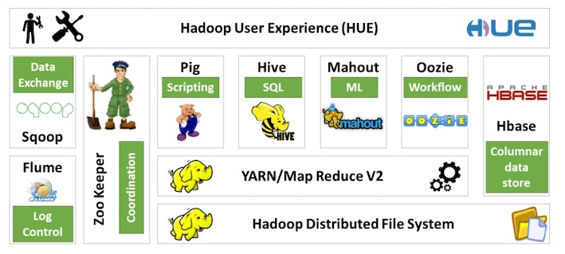

###  2 关于MapReduce


MapReduce is a programming model for data processing. MapReduce programs are inherently parallel, thus putting very large-scale data analysis into the hands of anyone with enough machines at their disposal. MapReduce comes into its own for large datasets.


MapReduce是一种用于数据处理的编程模型。MapReduce程序本质上是并行运行的，因此可以将大规模的数据分析任务分发给任何一个拥有足够多机器的数据中心。MapReduce的优势在于处理大规模数据集。

#### A Weather Dataset

For our example, we will write a program that mines weather data. The data we will use is from the National Climatic Data Center. It is stored using a line-oriented ASCII format, in which each line is a record.

##### Analyzing the Data with Hadoop

MapReduce works by breaking the processing into two phases: the map phase and the reduce phase. Each phase has key-value pairs as input and output, the types of which may be chosen by the programmer. The programmer also specifies two functions: the map function and the reduce function.


MAPINPUT:

* Key: the offset of the beginning of the line from the beginning of the file. (no need here, just ignore it)
* Value: raw NCDC data

```text
(0, 0067011990999991950051507004…9999999N9+00001+99999999999…) 
(106, 0043011990999991950051512004…9999999N9+00221+99999999999…) 
(212, 0043011990999991950051518004…9999999N9-00111+99999999999…) 
(318, 0043012650999991949032412004…0500001N9+01111+99999999999…) 
(424, 0043012650999991949032418004…0500001N9+00781+99999999999…)
```

MAPOUTPUT: 

* The map function merely extracts the year and the air temperature , and emits them as output.
* Key: year
* Value: air temperature

```text
(1950, 0)
(1950, 22) 
(1950, −11) 
(1949, 111) 
(1949, 78)
```

The output from the map function is processed by the MapReduce framework *before* being sent to the reduce function. This processing ***sorts*** and ***groups*** the key-value pairs by key.

```text
(1949, [111, 78]) 
(1950, [0, 22, −11])
```

All the reduce function has to do now is iterate through the list and pick up the maximum reading:

```text
(1949, 111) 
(1950, 22)
```


##### Java MapReduce

MapReduce programs need three things: a map function, a reduce function, and some code to run the job. 


<hh>Map</hh>

The map function is represented by the <C>Mapper</C> class, which declares an abstract <C>map()</C> method.


The <C>Mapper</C> class is a generic type, with four formal type parameters that specify the input key, input value, output key, and output value types of the map function.

```Java
public class Mapper<KEYIN, VALUEIN, KEYOUT, VALUEOUT> {}
```


Rather than using built-in Java types, Hadoop provides its own set of basic types that are optimized for network serialization. These are found in the <C>org.apache.hadoop.io</C> package.

Here we use <C>LongWritable</C>, which corresponds to a Java <C>Long</C>, <C>Text</C> (like Java <C>String</C>), and <C>IntWritable</C> (like Java <C>Integer</C>).

```Java
import org.apache.hadoop.io.IntWritable;
import org.apache.hadoop.io.LongWritable;
import org.apache.hadoop.io.Text;
import org.apache.hadoop.mapreduce.Mapper;
import java.io.IOException;

public class MaxTemperatureMapper
        extends Mapper<LongWritable, Text, Text, IntWritable> {

    private static final int MISSING = 9999;

    @Override
    protected void map(LongWritable key, Text value, Context context)
            throws IOException, InterruptedException {
        String line = value.toString();
        String year = line.substring(15, 19);
        int airTemperature;
        if (line.charAt(87) == '+'){ //parseInt doesn't like leading plus signs
            airTemperature = Integer.parseInt(line.substring(88, 92));
        } else {
            airTemperature = Integer.parseInt(line.substring(87, 92));
        }

        String quality = line.substring(92, 93);
        if (airTemperature != MISSING && quality.matches("[01459]]")) {
            context.write(new Text(year), new IntWritable(airTemperature));
        }
    }
}
```

<hh>Reduce</hh>

The reduce function is similarly defined using a <C>Reducer</C>.

```Java
import org.apache.hadoop.io.IntWritable;
import org.apache.hadoop.io.Text;
import org.apache.hadoop.mapreduce.Reducer;

import java.io.IOException;

public class MaxTemperatureReducer
        extends Reducer<Text, IntWritable, Text, IntWritable> {

    @Override
    protected void reduce(Text key, Iterable<IntWritable> values, Context context) 
                throws IOException, InterruptedException {
        int maxValue = Integer.MIN_VALUE;
        for (IntWritable value : values) {
            maxValue = Math.max(maxValue, value.get());
        }
        context.write(key, new IntWritable(maxValue));

    }
}
```

<hh>MapReduce Job</hh>


The third piece of code runs the MapReduce job

```Java
import org.apache.hadoop.fs.Path;
import org.apache.hadoop.io.IntWritable;
import org.apache.hadoop.io.Text;
import org.apache.hadoop.mapreduce.Job;
import org.apache.hadoop.mapreduce.lib.input.FileInputFormat;
import org.apache.hadoop.mapreduce.lib.output.FileOutputFormat;

public class MaxTemperature {

    public static void main(String[] args)
        throws Exception {
        if (args.length != 2) {
            System.err.println("Usage: MaxTempeature <intput path> 
                        <output path>");
            System.exit(-1);
        }

        Job job = new Job();
        job.setJarByClass(MaxTemperature.class);
        job.setJobName("Max Temperature");
        FileInputFormat.addInputPath(job, new Path(args[0]));
        FileOutputFormat.setOutputPath(job, new Path(args[1]));
        job.setMapperClass(MaxTemperatureMapper.class);
        job.setReducerClass(MaxTemperatureReducer.class);
        job.setOutputKeyClass(Text.class);
        job.setOutputValueClass(IntWritable.class);
        System.exit(job.waitForCompletion(true) ? 0 : 1);
    }
}
```
A <C>Job</C> object forms the specification of the job and gives you control over how the job is run.

Rather than explicitly specifying the name of the JAR file, we can pass a class in the Job’s <C>setJarByClass()</C> method, which Hadoop will use to locate the relevant JAR file by looking for the JAR file containing this class.


<hh>A test run</hh>

```bash
$ export HADOOP_CLASSPATH=/Users/larry/JavaProject/out/artifacts/MaxTemperature/MaxTemperature.jar 
$ hadoop com.definitivehadoop.weatherdata.MaxTemperature resources/HadoopBook/ncdc/sample.txt output
```

When the <C>hadoop</C> command is invoked with a classname as the first argument, it launches a JVM to run the class. The <C>hadoop</C> command adds the Hadoop libraries (and their dependencies) to the classpath and picks up the Hadoop configuration, too. To add the application classes to the classpath, we need an environment variable called <C>HADOOP_CLASSPATH</C>, which the <C>hadoop</C> script picks up.

<font size=0.6em>
```text
//OUTPUT 
18:20:18,944 INFO mapreduce.Job: Counters: 30
        File System Counters
                FILE: Number of bytes read=148485300
                FILE: Number of bytes written=150614384
                FILE: Number of read operations=0
                FILE: Number of large read operations=0
                FILE: Number of write operations=0
        Map-Reduce Framework
                Map input records=5
                Map output records=0
                Map output bytes=0
                Map output materialized bytes=6
                Input split bytes=131
                Combine input records=0
                Combine output records=0
                Reduce input groups=0
                Reduce shuffle bytes=6
                Reduce input records=0
                Reduce output records=0
                Spilled Records=0
                Shuffled Maps =1
                Failed Shuffles=0
                Merged Map outputs=1
                GC time elapsed (ms)=5
                Total committed heap usage (bytes)=406847488
        Shuffle Errors
                BAD_ID=0
                CONNECTION=0
                IO_ERROR=0
                WRONG_LENGTH=0
                WRONG_MAP=0
                WRONG_REDUCE=0
        File Input Format Counters 
                Bytes Read=529
        File Output Format Counters 
                Bytes Written=8
```
</font>


The last section of the output, titled “Counters,” shows the statistics that Hadoop generates for each job it runs. These are very useful for checking whether the amount of data processed is what you expected.


#### Scaling Out

To scale out(横向扩展), we need to store the data in a distributed filesystem (typically HDFS). This allows Hadoop to move the MapReduce computation to each machine hosting a part of the data, using Hadoop’s resource management system, YARN.

##### 数据流

A MapReduce ***job*** (作业) is a unit of work that the client wants to be performed: it consists of the input data, the MapReduce program, and configuration information. Hadoop runs the job by dividing it into ***tasks*** (任务), of which there are two types: ***map tasks*** and ***reduce tasks***. The tasks are scheduled using YARN and run on nodes in the cluster.

Hadoop divides the input to a MapReduce job into fixed-size pieces called ***input splits*** (输入分片), or just ***splits*** (分片). Hadoop creates one map task for each split, which runs the user-defined map function for each record in the split.

So if we are processing the splits in parallel, the processing is better load balanced when the splits are small. On the other hand, if splits are too small, the overhead of managing the splits and map task creation begins to dominate the total job execution time.

Hadoop does its best to run the map task on a node where the input data resides in HDFS, because it doesn’t use valuable cluster bandwidth. This is called the ***data locality optimization*** (数据本地优化).

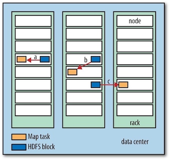


==Map tasks write their output to the local disk, not to HDFS==. Why is this? ***Map output is intermediate output:*** it’s processed by reduce tasks to produce the final output, and once the job is complete, the map output can be thrown away. So, storing it in HDFS *with replication* would be overkill.

When there are multiple reducers, the map tasks **partition** their output, ==each creating one partition for each reduce task==. There can be many keys (and their associated values) in each partition, but the records for any given key are all in a single partition. The partitioning can be controlled by a user-defined partitioning function, but normally the default **partitioner** — which buckets keys using a hash function — works very well.

The data flow for the general case of multiple reduce tasks is illustrated in figure below. This diagram makes it clear why the data flow between map and reduce tasks is colloquially known as “the shuffle,” as each reduce task is fed by many map tasks.

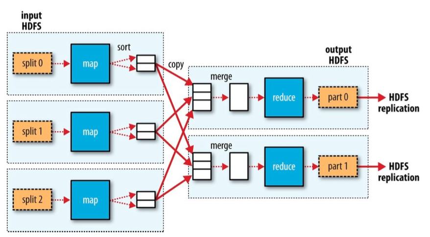


##### Combiner Functions

Many MapReduce jobs are limited by the bandwidth available on the cluster, so it pays to minimize the data transferred between map and reduce tasks. Hadoop allows the user to specify a ***combiner function*** to be run on the map output, and the combiner function’s output forms the input to the reduce function. Because the combiner function is an optimization, ==Hadoop does not provide a guarantee of how many times it will call it for a particular map output record==, if at all.


For max temperature problem described above, the combiner function is the same implementation as the reduce function in <C>MaxTemperatureReducer</C>. The only change we need to make is to set the combiner class on the Job.

```Java
job.setMapperClass(MaxTemperatureMapper.class);
job.setCombinerClass(MaxTemperatureReducer.class);
job.setReducerClass(MaxTemperatureReducer.class);
```

A part of output information for running <C>MaxTemperatureReducer</C> is:

```text
Map input records=5
                Map output records=5
                Map output bytes=45
                Map output materialized bytes=28
                Input split bytes=131
                Combine input records=5
                Combine output records=2
                Reduce input groups=2
                Reduce shuffle bytes=28
                Reduce input records=2
                Reduce output records=2
```

#### Hadoop Streaming

Hadoop provides an API to MapReduce that allows you to write your map and reduce functions in languages other than Java. ==Hadoop Streaming uses Unix standard streams (Unix标准流) as the interface between Hadoop and your program==, so you can use any language that can read standard input and write to standard output to write your MapReduce program.

Streaming is naturally suited for text processing. Map input data is passed over standard input to map function. A map output key-value pair is written as a single tab-delimited line. The reduce function reads lines from standard input, which the framework guarantees are sorted by key, and writes its results to standard output.


##### Python

Here, We take Python as an example.

```Python tab="map"
#!/Users/larry/anaconda3/bin/python
import re
import sys

for line in sys.stdin:
  val = line.strip()
  (year, temp, q) = (val[15:19], val[87:92], val[92:93])
  if (temp != "+9999" and re.match("[01459]", q)):
    print("%s\t%s"%(year, temp))
```

```Python tab="reduce"
#!/Users/larry/anaconda3/bin/python

import sys

(last_key, max_val) = (None, -sys.maxsize)
for line in sys.stdin:
  (key, val) = line.strip().split("\t")
  if last_key and last_key != key:
    print("%s\t%s"%(last_key, max_val))
    (last_key, max_val) = (key, int(val))
  else:
    (last_key, max_val) = (key, max(max_val, int(val)))

if last_key:
  print("%s\t%s"%(last_key, max_val))
```

For example, to run a test:

```bash
$ cat sample.txt | ./max_temperature_map.py | sort | ./max_temperature_reduce.py
1949 111 
1950 22
```

The <C>hadoop</C> command doesn’t support a Streaming option; instead, you specify the Streaming JAR file along with the <C>jar</C> option. Options to the Streaming program specify the input and output paths and the map and reduce scripts.

```bash
$hadoop jar $HADOOP_HOME/share/hadoop/tools/lib/hadoop-streaming-3.1.0.jar \
-input sample.txt \
-output output \
-mapper max_temperature_map.py \
-reducer max_temperature_reduce.py
```


###  3 Hadoop分布式文件系统


Filesystems that manage the storage across a network of machines are called ***distributed filesystems***(分布式文件系统) . Hadoop comes with a distributed filesystem called HDFS, which stands for ***Hadoop Distributed Filesystem***(Hadoop 分布式文件系统).


#### The Design of HDFS

HDFS is a filesystem designed for storing very large files with streaming data access patterns, running on clusters of commodity hardware.

* Very large files: files that are hundreds of megabytes, gigabytes, or terabytes in size.
* Streaming data access: HDFS is built around the idea that the most efficient data processing pattern is a ***write-once, read-many-times***(一次写入，多次读取) pattern.
* Commodity hardware: It’s designed to run on clusters of commodity hardware.

These are areas where HDFS is not a good fit today:

* Low-latency data access
* Lots of small files
* Multiple writers, arbitrary file modifications


#### HDFS Concepts

##### Blocks

A disk has a block size, which is the minimum amount of data that it can read or write. Filesystems for a single disk build on this by dealing with data in blocks, which are an integral multiple of the disk block size.

HDFS, too, has the concept of a ***block***(块), but it is a much larger unit — 128 MB by default (typically a few kilobytes for ordinary file system). Unlike a filesystem for a single disk, ==a file in HDFS that is smaller than a single block does not occupy a full block’s worth of underlying storage==. (For example, a 1 MB file stored with a block size of 128 MB uses 1 MB of disk space, not 128 MB.)

!!! Question "HDFS中的块为什么这么大?"

    为了最小化寻址时间。如果块足够大，从磁盘传输数据的时间会明显大于定位这个块所需要的时间。因而，传输一个由多个块组成的大文件取决于磁盘传输速率。
    
Having a block abstraction for a distributed filesystem brings several benefits.

* A file can be larger than any single disk in the network.
* Making the unit of abstraction a block rather than a file simplifies the storage subsystem.
    * storage management: because blocks are a fixed size, it is easy to calculate how many can be stored on a given disk.
    * metadata concerns: because blocks are just chunks of data to be stored, file metadata such as permissions information does not need to be stored with the blocks.
* Blocks fit well with replication for providing fault tolerance and availability.
    * To insure against corrupted blocks and disk and machine failure, each block is replicated to a small number of physically separate machines (typically three).


##### Namenodes and Datanodes

An HDFS cluster has two types of nodes: a ***namenode*** (the master) and a number of ***datanodes*** (workers). 

* The namenode manages the filesystem namespace. It maintains the filesystem tree and the metadata for all the files and directories in the tree. This information is stored persistently on the local disk in the form of two files: the *namespace image* and the *edit log*. 
* The namenode also knows the datanodes on which all the blocks for a given file are located;
* Datanodes are the workhorses of the filesystem. They store and retrieve blocks when they are told to (by clients or the namenode), and they report back to the namenode periodically with lists of blocks that they are storing.


If the machine running the namenode were obliterated, all the files on the filesystem would be lost since there would be no way of knowing how to reconstruct the files from the blocks on the datanodes. Possible solution:

* to back up the files that make up the persistent state of the filesystem metadata.
* to run a secondary namenode, which keeps a copy of the merged namespace image.


##### Block Caching

For frequently accessed files, the blocks may be *explicitly* cached in the datanode’s memory, in an **off-heap block cache**(堆外块缓存). Users or applications instruct the namenode which files to cache (and for how long) by adding a *cache directive* to a *cache pool*.

##### HDFS Federation

[官方文档](http://hadoop.apache.org/docs/current/hadoop-project-dist/hadoop-hdfs/Federation.html)

Problem: On very large clusters with many files, memory becomes the limiting factor for scaling, since namenode keeps a reference to every file and block in the filesystem in memory.

For example, a 200-node cluster with 24 TB of disk space per node, a block size of 128 MB, and a replication factor of 3 has room for about 2 million blocks (or more): $200\times 24TB⁄(128MB×3)$, So in this case, setting the namenode memory to 12,000 MB would be a good starting point.

Solution: HDFS federation, allows a cluster to scale by adding namenodes, each of which manages a portion of the filesystem namespace.
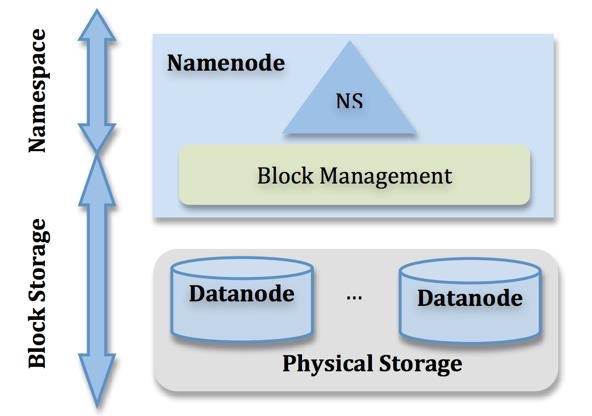

HDFS主要有两层：

* Namespace: 由目录、文件、块组成，支持namespace有关的文件系统操作(例如新建、删除、修改文件和文件夹)
* 块存储服务：包括块管理和存储


HDFS federation使用了多个独立的Namenodes/namespace:

* namenode相互独立，不需要协调， 每个datanode都在每个namenode中注册；
* 每个namespace对应一个block pool(数据块池)，block pool相互独立
* namespace和block pool一起被称为namespace volume, 它是管理的基本单位。当一个namenode/namespace被删除后，其所有datanode上对应的block pool也会被删除。当集群升级时，每个namespace volume作为一个基本单元进行升级。


##### HDFS High Availability

To remedy a failed namenode, a pair of namenodes in an ***active-standby*** configuration is introduced in Hadoop 2. In the event of the failure of the active namenode, the standby takes over its duties to continue servicing client requests *without* a significant interruption.

#### The Command-Line Interface

##### Basic Filesystem Operations

Hadoop’s filesystem shell command is `fs`, which supports a number of subcommands (type `hadoop fs -help` to get detailed help).

Copying a file from the local filesystem to HDFS:

```bash
#The local file is copied tothe HDFS instance running on localhost.
$ hadoop fs -copyFromLocal test.copy /test.copy
## works as the same
$ hadoop fs -copyFromLocal test.copy hdfs://localhost:9000/test2.copy
```

Copying the file from the HDFS to the local filesystem:

```bash
$ hadoop fs -copyToLocal /test.copy test.copy.txt
```

#### Hadoop Filesystems

Hadoop has an abstract notion of filesystems, of which HDFS is just one implementation. The Java abstract class `org.apache.hadoop.fs.FileSystem` represents the client interface to a filesystem in Hadoop, and there are several concrete implementations.


| Filesystem | URI scheme | Java implementation | Description |
| --- | --- | --- | --- |
| Local | file | fs.LocalFileSystem | A filesystem for a locally connected disk with client-side checksums |
| HDFS | hfs | hdfs.DistributedFileSystem | Hadoop’s distributed filesystem |
| WebHDFS | webhdfs | hdfs.web.WebHdfsFileSystem | Providing authenticated read/write access to HDFS over HTTP. |
| Secure WebHDFS | swebhdfs | hdfs.web.SWebHdfsFileSystem | The HTTPS version of WebHDFS. |

When you are processing large volumes of data you should choose a distributed filesystem that has the data locality optimization, notably HDFS.

##### HTTP

The HTTP REST API exposed by the WebHDFS protocol makes it easier for other languages to interact with HDFS. Note that the HTTP interface is slower than the native Java client, so should be avoided for very large data transfers if possible.

There are two ways of accessing HDFS over HTTP:

* Directly, where the HDFS daemons serve HTTP requests to clients;
* Via a proxy (or proxies), which accesses HDFS on the client’s behalf using the usual DistributedFileSystem API.


HDFS proxy allows for stricter firewall and bandwidth-limiting policies to be put in place. It’s common to use a proxy for transfers between Hadoop clusters located in different data centers, or when accessing a Hadoop cluster running in the cloud from an external network.

#### The Java Interface

Hadoop `FileSystem` class is the API for interacting with one of Hadoop’s filesystems. In general you should strive to ***write your code against the `FileSystem` abstract class*** , to retain portability across filesystems. This is very useful when testing your program, for example, because you can rapidly run tests using data stored on the local filesystem.

##### Reading Data from a Hadoop URL

NOT recommended, because `setURLStreamHandlerFactory()` method can be called only once per JVM, which means that if some other part of your program sets it, you won't be able to use.

##### Reading Data Using the FileSystem API

A file in a Hadoop filesystem is represented by a Hadoop `Path` object(`org.apache.hadoop.fs.Path`, not `java.io.File`). You can think of a `Path`  as a Hadoop filesystem URI, such as `hdfs://localhost/user/tom/test.copy`


Since `FileSystem` is a general filesystem API, so the first step is to retrieve an instance for the filesystem we want. There are several static factory methods for getting a `FileSystem` instance:

```Java
// Returns the default filesystem
public static FileSystem get(Configuration conf) throws IOException 
// Uses the given URI’s scheme and authority to determine the filesystem to use
public static FileSystem get(URI uri, Configuration conf) throws IOException 
// Retrieves the filesystem as the given user
public static FileSystem get(URI uri, Configuration conf, String user) throws IOException
// Retrieves a local filesystem instance
public static LocalFileSystem getLocal(Configuration conf) throws IOException
```

A `Configuration` object encapsulates a client or server's configuration, which is set using configuration files read from the classpath, such as `etc/hadoop/core-site.xml`.


With a `FileSystem` instance in hand, we invoke an `open()` method to get the input stream for a file:

```Java
// Uses a default buffer size of 4 KB
public FSDataInputStream open(Path f) throws IOException
// Uses a buffer size of bufferSize
public abstract FSDataInputStream open(Path f, int bufferSize) throws IOException
```

Displaying files from a Hadoop filesystem on standard output by using the FileSystem directly:

```Java
// $ hdfs://localhost:9000/test2.copy
import org.apache.hadoop.conf.Configuration;
import org.apache.hadoop.fs.FileSystem;
import org.apache.hadoop.fs.Path;
import org.apache.hadoop.io.IOUtils;

import java.io.InputStream;
import java.net.URI;

public class FileSystemCat {
    public static void main(String[] args) throws Exception {
        String uri = args[0];
        Configuration conf = new Configuration();
        FileSystem fs = FileSystem.get(URI.create(uri), conf);
        InputStream in = null;
        try {
            in = fs.open(new Path(uri));
            IOUtils.copyBytes(in, System.out, 4096, false);
        } finally {
            IOUtils.closeStream(in);
        }
    }
}
```

##### FSDataInputStream

The `open()` method on `FileSystem` actually returns an `FSDataInputStream` rather than a standard java.io class. This class is a specialization of `java.io.DataInputStream` with support for random access, so you can read from any part of the stream:

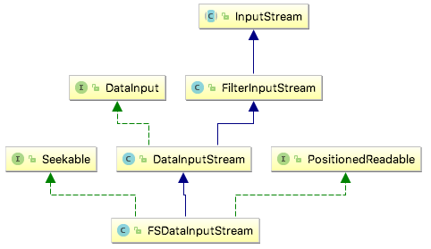


The `Seekable` interface permits seeking to a position in the file and provides a query method for the *current* offset from the start of the file (`getPos()`):

```Java
public interface Seekable { 
    void seek(long pos) throws IOException; 
    long getPos() throws IOException; }
```

Displaying files from a Hadoop filesystem on standard output twice, by using `seek()`:

```Java
// hdfs://localhost:9000/test2.copy

import org.apache.hadoop.conf.Configuration;
import org.apache.hadoop.fs.FSDataInputStream;
import org.apache.hadoop.fs.FileSystem;
import org.apache.hadoop.fs.Path;
import org.apache.hadoop.io.IOUtils;
import java.net.URI;

public class FileSystemDoubleCat {
    public static void main(String[] args) throws Exception {
        String uri = args[0];
        Configuration conf = new Configuration();
        FileSystem fs = FileSystem.get(URI.create(uri), conf);
        FSDataInputStream in = null;
        try {
            in = fs.open(new Path(uri));
            IOUtils.copyBytes(in, System.out, 4096, false);
            in.seek(0); // go back to the start of the file
            IOUtils.copyBytes(in, System.out, 4096, false);
        } catch (Exception ex) {
            ex.printStackTrace();
        } finally {
            IOUtils.closeStream(in);
        }
    }
}
```
##### Writing Data

The `FileSystem` class has a number of methods for creating a file. 

```Java
// takes a Path object for the file to be created 
// and returns an output stream to write to
public FSDataOutputStream create(Path f) throws IOException
// appends to an existing file
public FSDataOutputStream append(Path f) throws IOException
```

!!! Warning

    The `create()` methods create any parent directories of the file to be written that don’t already exist.
    
    
There’s an overloaded method of `create()` for passing a callback interface, `Progressable`, so your application can be notified of the progress of the data being written to the datanodes:

```
public interface Progressable { 
    public void progress(); 
}
```

!!! example 

    下面例子中将本地文件复制到Hadoop文件系统。每次将64KB数据包写入datanode pipeline之后， Hadoop调用`progress()`方法，打印一个句号。

    ```Java
    // args: /Users/larry/test.copy hdfs://localhost:9000/test4.copy
    // Copying a local file to a Hadoop filesystem
    public class FileCopyWithProgress {
    
        public static void main(String[] args) throws Exception {
            String localsrc = args[0];
            String dstsrc = args[1];
            BufferedInputStream in = new BufferedInputStream(new FileInputStream(localsrc));
    
            Configuration conf = new Configuration();
            FileSystem fs = FileSystem.get(URI.create(dstsrc), conf);
            try {
                OutputStream out = fs.create(new Path(dstsrc), new Progressable() {
                    @Override
                    public void progress() {
                        System.out.println(".");
                    }
                });
                IOUtils.copyBytes(in, out, 4096, true);
    
            } finally {
                IOUtils.closeStream(in);
            } //end try
        }// end main
    }
    ```


##### FSDataOutputStream

The `create()` method on `FileSystem` returns an `FSDataOutputStream`, which, like `FSDataInputStream`, has a method for querying the current position in the file:

```Java
public class FSDataOutputStream extends DataOutputStream implements Syncable {
    public long getPos() throws IOException { 
        // implementation elided 
    }// implementation elided
}
```

However, because HDFS allows only sequential writes to an open file or appends to an already written file, `FSDataOutputStream` does not permit seeking.

##### Directories

`FileSystem` provides a method to create a directory:

```Java
public boolean mkdirs(Path f) throws IOException
```

This method creates all of the necessary parent directories if they don’t already exist.

##### Querying the Filesystem

<hh>File metadata: FileStatus</hh>
<hh>Listing files</hh>
<hh>File patterns</hh>


##### Deleting Data

Use the `delete()` method on `FileSystem` to permanently remove files or directories:

```Java
public boolean delete(Path f, boolean recursive) throws IOException
```

If `f` is a file or an empty directory, the value of `recursive` is ignored.


#### Data Flow

##### 剖析文件读取

The figure below shows the main sequence of events when reading a file.

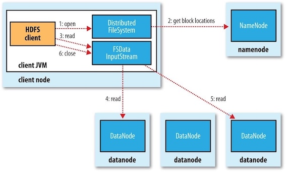


* step 1: The client opens the file it wishes to read by calling `open()` on the `FileSystem` object, which for HDFS is an instance of `DistributedFileSystem`. 
* step 2: `DistributedFileSystem` calls the namenode, using remote procedure calls (RPCs), to determine the locations of the first few blocks in the file. 
* step 3: For each block, the namenode returns the addresses of the datanodes that have a copy of that block. Furthermore, the datanodes are sorted according to their proximity to the client. 
    * If the client is itself a datanode, the client will read from the local datanode if that datanode hosts a copy of the block.
    * The `DistributedFileSystem` returns an `FSDataInputStream` to the client for it to read data from. `FSDataInputStream` in turn wraps a `DFSInputStream`, which manages the datanode and namenode I/O.
    * The client then calls `read()` on the stream. 
* step 4: `DFSInputStream`, which has stored the datanode addresses for the first few blocks in the file, then connects to the first (closest) datanode for the first block in the file. Data is streamed from the datanode back to the client, which calls `read()` repeatedly on the stream. 
* step 5: When the end of the block is reached, `DFSInputStream` will close the connection to the datanode, then find the best datanode for the next block. 
* step 6: This happens transparently to the client, which from its point of view is just reading a continuous stream.
    * Blocks are read in order, with the `DFSInputStream` opening new connections to datanodes as the client reads through the stream. 
    * It will also call the namenode to retrieve the datanode locations for the next batch of blocks as needed. When the client has finished reading, it calls `close()` on the `FSDataInputStream`.

##### 剖析文件写入

The figure below illustrates the case of creating a new file, writing data to it, then closing the file.


* step 1: The client creates the file by calling `create()` on `DistributedFileSystem`. 
* step 2: `DistributedFileSystem` makes an RPC call to the namenode to create a new file in the filesystem’s namespace, with no blocks associated with it. 
    * The namenode performs various checks to make sure the file doesn’t already exist and that the client has the right permissions to create the file. 
    * If these checks pass, the namenode makes a record of the new file; otherwise, file creation fails and the client is thrown an `IOException`. 
    * The `DistributedFileSystem` returns an `FSDataOutputStream` for the client to start writing data to. Just as in the read case, `FSDataOutputStream` wraps a `DFSOutputStream`, which handles communication with the datanodes and namenode.
* step 3: As the client writes data, the `DFSOutputStream` splits it into packets, which it writes to an internal queue called the ***data queue***(数据队列) . The data queue is consumed by the `DataStreamer`, which is responsible for asking the namenode to allocate new blocks by picking a list of suitable datanodes to store the replicas. 
* step 4: The list of datanodes forms a pipeline, and here we’ll assume the replication level is three, so there are three nodes in the pipeline. The `DataStreamer` streams the packets to the first datanode in the pipeline, which stores each packet and forwards it to the second datanode in the pipeline. Similarly, the second datanode stores the packet and forwards it to the third (and last) datanode in the pipeline .
* step 5: The `DFSOutputStream` also maintains an internal queue of packets that are waiting to be acknowledged by datanodes, called the ***ack queue***(确认队列). A packet is removed from the ack queue only when it has been acknowledged by _all the datanodes_ in the pipeline.
* step 6: When the client has finished writing data, it calls `close()` on the stream. This action flushes all the remaining packets to the datanode pipeline.
* step 7:  It waits for acknowledgments before contacting the namenode to signal that the file is complete. 

!!! note "怎么放副本"
    
    Hadoop的默认布局策略是
    
    * 在运行客户端的节点上放置第一个副本。如果客户端运行在集群之外，则随机挑选一个节点
    * 随机选择另一个机架上的节点，放置第二个副本
    * 随机选择与副本2同一个机架上的另一个节点，放置第三个副本

    一旦选定副本的放置位置，就根据网络拓扑创建一个管线，例如：
    
    
    


##### 一致性模型

A coherency model for a filesystem describes the data visibility of reads and writes for a file.

* After creating a file, it is visible in the filesystem namespace.
* Any content written to the file is NOT guaranteed to be visible, even if the stream is flushed.
* Once more than a block’s worth of data has been written, the first block will be visible to new readers.
* The `FSDataOutputStream.hflush()` method force all buffers to be flushed to the datanodes.
    * The `hflush()` guarantees that the data written up to that point in the file has reached all the datanodes in the write pipeline and is visible to all new readers.
    * But it does NOT guarantee that the datanodes have written the data to *disk*, only that it’s in the datanodes’ *memory*.
    * Closing a file in HDFS performs an implicit `hflush()`.
* The `hsync()` method syncs to *disk* for a file descriptor.

```Java
FileOutputStream out = new FileOutputStream(localFile); 
out.write("content".getBytes("UTF-8")); 
out.flush(); // flush to operating system 
out.getFD().sync(); // sync to disk 
assertThat(localFile.length(), is(((long) "content".length())));
```

<hh>Consequences for application design</hh>

You should call `hflush()` at suitable points, such as after writing a certain number of records or number of bytes.


#### 通过distcp并行复制

`distcp` 并行地把数据拷入/拷出Hdoop文件系统：

```bash
$ hadoop distcp file1 file2
```

`distcp`是作为一个MapReduce作业来实现的，该复制作业是通过集群中并行运行的map来完成的，没有reducer。


###  4 Hadoop IO


#### 数据完整性

The usual way of detecting corrupted data is by computing a *checksum*(校验和) for the data when it first enters the system, and again whenever it is transmitted across a channel that is unreliable and hence capable of corrupting the data.

A commonly used error-detecting code is **CRC-32** (32-bit cyclic redundancy check, 32位循环冗余校验), which computes a 32-bit integer checksum for input of any size. CRC32 is used for checksumming in Hadoop's <C>checksumFileSystem</C>, while HDFS uses a more efficient variant called **CRC-32C**.


##### Data Integrity in HDFS

HDFS transparently checksums all data written to it and by default verifies checksums when reading data. A separate checksum is created for every <C>ChecksumFileSystem.bytesPerChecksum</C>(default 512) bytes of data.

Datanodes are responsible for verifying the data they receive before storing the data and its checksum. When clients read data from datanodes, they verify checksums as well.

In addition to block verification on client reads, each datanode runs a <C>DataBlockScanner</C> in a background thread that *periodically* verifies all the blocks stored on the datanode.

You can find a file’s checksum with <C>hadoop fs -checksum</C>.

##### LocalFileSystem

The Hadoop <C>LocalFileSystem</C> performs client-side checksumming. It is possible to disable checksums, by using <C>RawLocalFileSystem</C> in place of <C>LocalFileSystem</C>.


##### ChecksumFileSystem

<C>LocalFileSystem</C> extends <C>ChecksumFileSystem</C>, and <C>ChecksumFileSystem</C> is also a wrapper around <C>FileSystem</C> (uses [decorator pattern](3 Decorator Pattern.md) here). The general idiom is as follows:

```Java
FileSystem rawFs = ...
FileSystem checksummedFs = new ChecksumFileSystem(rawFs);
```


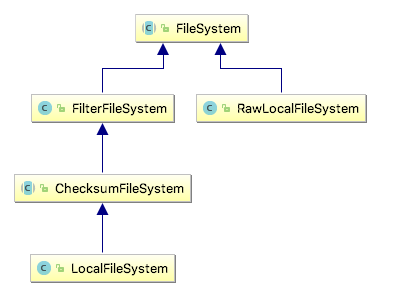


#### 压缩

文件压缩有两大好处:

*  **reduces the space** needed to store files, 
*  **speeds up data transfer** across the network or to or from disk. 

When dealing with large volumes of data, both of these savings can be significant.

压缩格式总结:


| 压缩格式| 工具 | 算法 | 文件扩展名 | CompressionCodec | 可切分? | 
| --- | --- | --- | --- | --- | --- |
| DEFLATE | N/A | DEFLATE | .deflate | DefaultCodec | No |
| gzip | gzip | DEFLATE | .gz | GzipCodec | No |
| bzip2 | bzip2 | bzip2 | .bz2 | BZip2Codec | Yes |
| LZO | lzop | LZO | .lzo | LzoCodec | No |
| Snappy | N/A | Snappy | .snappy | SnappyCodec | No |

All compression algorithm exhibit a space/time trade-off. The "Splittable" indicates whether the compression format supports splitting (that is, whether you can seek to any point in the stream and start reading from some point further on).  Splittable compression formats are especially suitable for MapReduce.

##### Codecs

A *codec* is the implementation of a compression-decompression algorithm. In Hadoop, a codec is represented by an implementation of the <C>CompressionCodec</C> interface. So, for example, <C>GzipCodec</C> encapsulates the compression and decompression algorithm for gzip.

| Compression format | Code |
| --- | --- |
| DEFLATE | `org.apache.hadoop.io.compress.DefaultCodec` | 
| gzip | `org.apache.hadoop.io.compress.GzipCodec` | 
| bzip2 | `org.apache.hadoop.io.compress.BZip2Codec` | 
| LZO | `com.hadoop.compression.lzo.LzopCodec` | 
| LZ4 | `org.apache.hadoop.io.compress.Lz4Codec` | 
| Snappy | `org.apache.hadoop.io.compress.SnappyCodec` | 


<!--<hh>Compressing and decompressing streams with CompressionCodec</hh>


Interface<C>CompressionCodec</C> has two methods that allow you to easily compress or decompress data. 

* To compress data being written to an output stream, use the <C>createOutputStream(OutputStream out)</C> method to create a <C>CompressionOutputStream</C>
* Conversely, to decompress data being read from an input stream, call <C>createInputStream(InputStream in)</C> to obtain a <C>CompressionInputStream</C>.


!!! example 
    
    该程序压缩从标准输入读取的数据，然后将其写入到标准输出

    ```Java
    //echo "Text" | hadoop StreamCompressor org.apache.hadoop.io.compress.GzipCodec | gunzip 
    public class StreamCompressor {
        public static void main(String[] args) throws Exception {
            String codecClassname = args[0];
            Class<?> codecClass = Class.forName(codecClassname);
            Configuration conf = new Configuration();
            CompressionCodec codec = (CompressionCodec)
                    ReflectionUtils.newInstance(codecClass, conf);
    
            CompressionOutputStream out = codec.createOutputStream(System.out);
            IOUtils.copyBytes(System.in, out, 4096, false);
            out.finish();
        }
    }
    ```

<hh>Inferring CompressionCodecs using CompressionCodecFactory</hh>

<C>CompressionCodecFactory</C> provides a way of mapping a filename extension to a <C>CompressionCodec</C> using its <C>getCodec()</C> method, <C>CodecPool</C>.

If you are using a native library and you are doing a lot of compression or decompression in your application, consider using <C>CodecPool</C>, which allows you to reuse compressors and decompressors, thereby amortizing the cost of creating these objects.-->

##### 压缩和输入分片

压缩格式支持切分(splitting)对于MapReduce处理数据是十分重要的。如果支持切分，一个占据多个HDFS块的大文件可以创建多个输入分片，每个分片作为一个单独的map任务的输入被独立处理；如果不支持切分，只能将整个文件作为一个分片。


!!! note "应该使用哪种压缩格式"
    
    Hadoop处理的数据集非常大，需要借助于压缩，下面是使用压缩文件的优先级：
    
    1. 使用容器文件格式，例如SequenceFile, Avroo, ORCFile, Parquet。这些文件格式同时支持压缩和切分。通常最好与一个快速压缩工具联合使用，例如LZO，LZ4或者Snappy
    2. 使用支持切分的压缩格式，例如bzip2
    

##### 在MapReduce中使用压缩


MapReduce会根据文件扩展名推断出相应的codec，在读取文件时自动解压缩文件。要想压缩输出，可以通过配置文件统一配置。

<!--
```xml tab="core-site.xml"
<property>
    <name>io.compression.codecs</name>
    <value>
        org.apache.hadoop.io.compress.BZip2Codec,
        org.apache.hadoop.io.compress.DefaultCodec,
        org.apache.hadoop.io.compress.GzipCodec
    </value>
</property>
```
-->

```xml tab="mapred-site.xml"
<property>
    <name>mapreduce.output.fileoutputformat.compress</name>
    <value>true</value>
</property>
<property>
    <name>mapreduce.output.fileoutputformat.compress.codec</name>
    <value>org.apache.hadoop.io.compress.BZip2Codec</value>
</property>
```

也可以在程序中的`FileOutputFormat`中单独指定。

```java
FileOutputFormat.setCompressOutput(job, true);
FileOutputFormat.setOutputCompressorClass(job, GzipCodec.class);
```

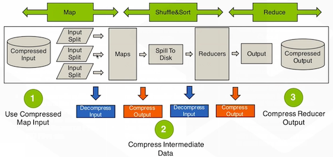

推荐在MapReduce的不同阶段使用不同的压缩格式。

* 输出格式：bzip2(高压缩比并且支持分片)
* 中间结果：snappy(快速压缩解压)


#### 序列化

See concepts of serialization and deserialization in [Serialization and File IO](14 Serialization and File IO.md) .

*Serialization* is the process of turning structured objects into a byte stream for transmission over a network or for writing to persistent storage. *Deserialization* is the reverse process of turning a byte stream back into a series of structured objects.


Serialization is used in two quite distinct areas of distributed data processing: for **interprocess communication** and for **persistent storage**.


In Hadoop, interprocess communication between nodes in the system is implemented using remote procedure calls (RPCs). The RPC protocol uses serialization to render the message into a binary stream to be sent to the remote node, which then deserializes the binary stream into the original message. In general, four desirable properties are crucial for an RPC serialization and persistent storage:


| Properties | PRC Serialization | Persistent Storage |
| --- | --- | --- |
| Compact | makes the best use of network bandwidth | make efficient use of storage space |
| Fast | little performance overhead | little overhead in reading or writing |
| Extensible | meet new requirements | transparently read data of older formats |
| Interoperable | support clients written in different languages | read/write using different languages |


Hadoop uses its own serialization format, <C>Writables</C>, which is certainly compact and fast, but not so easy to extend or use from languages other than Java. Apache [Avro](12 Avro.md) is a language-neutral data serialization system.


##### The Writable Interface

The <C>Writable</C> interface defines two methods:

* <C>write</C>: writing its state to a <C>DataOutput</C> binary stream.
* <C>readFields</C>: reading its state from a <C>DataInput</C> binary stream.

```Java
public interface Writable { 
    void write(DataOutput out) throws IOException; 
    void readFields(DataInput in) throws IOException; 
}
```
###### WritableComparable接口和comparator

`WritableComparable`接口继承自`Writable`和`Comparable`接口：

```java
public interface WritableComparable<T> extends Writable, Comparable<T> {
}
```

`RawComparator`继承自Java的`Comparator`接口：

```java
public interface RawComparator<T> extends Comparator<T> {
    public int compare(byte[] b1, int s1, int l1, byte[] b2, int s2, int l2);
}
```

该接口允许其实现直接比较数据流中的记录，无需先把数据流反序列化为对象，这样便避免了新建对象的额外开销。

`WritableComparator`是对`RawComparator`类的一个通用实现。

##### Writable类

###### Writable wrappers for Java primitives

There are <C>Writable</C> wrappers for all the Java primitive types except <C>char</C> (which can be stored in an <C>IntWritable</C>). All have a <C>get()</C> and <C>set()</C> method for retrieving and storing the wrapped value.

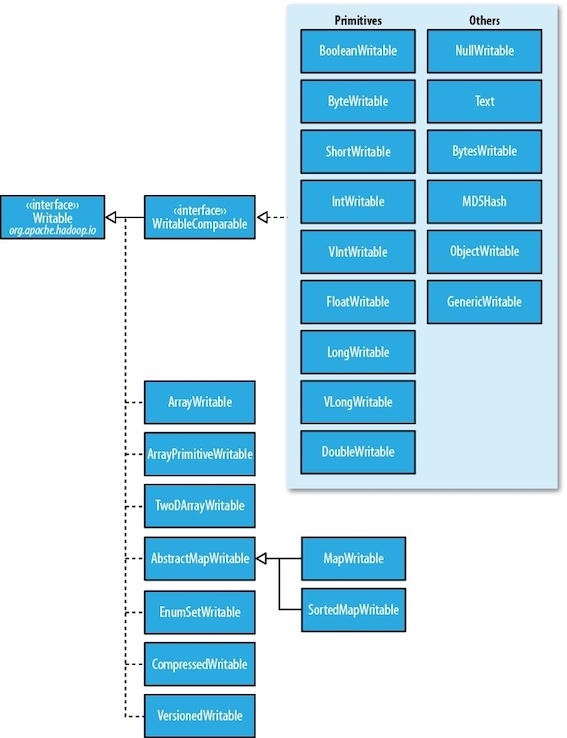

When it comes to encoding integers, there is a choice between the fixed-length formats (<C>IntWritable</C> and <C>LongWritable</C>) and the variable-length formats (<C>VIntWritable</C> and <C>VLongWritable</C>). Fixed-length encodings are good when the distribution of values is fairly uniform across the whole value space, such as when using a (well-designed) hash function. Most numeric variables tend to have nonuniform distributions, though, and on average, the variable-length encoding will save space.

###### Text

<C>Text</C> is a Writable for UTF-8 sequences. It can be thought of as the Writable equivalent of <C>java.lang.String</C>.

Indexing for the <C>Text</C> class is in terms of position in the encoded byte sequence, not the Unicode character in the string or the Java <C>char</C> code unit (as it is for <C>String</C>). For ASCII strings, these three concepts of index position coincide.

Another difference from <C>String</C> is that <C>Text</C> is mutable. You can reuse a <C>Text</C> instance by calling one of the <C>set()</C> methods on it.

```Java
Text t = new Text("hadoop"); t.set("pig");
```

<C>Text</C> doesn’t have as rich an API for manipulating <C>java.lang.String</C>, so in many cases, you need to convert the <C>Text</C> object to a <C>String</C>: `:::Java new Text("hadoop").toString()`

###### BytesWritable
`BytesWritable` is a wrapper for an array of binary data.

###### NullWritable


`NullWritable` is a special type of `Writable`, as it has a zero-length serialization. No bytes are written to or read from the stream. It is used as a placeholder;


##### 实现自定义Writable

!!! tip

    If you are considering writing a custom <C>Writable</C>, it may be worth trying another serialization framework, like Avro, that allows you to define custom types declaratively.


##### Serialization Frameworks

Any type can be used to serialize, because Hadoop has an API for pluggable serialization frameworks, which is represented by an implementation of <C>Serialization</C>. For instance, <C>WritableSerialization</C>, is the implementation of <C>Serialization</C> for <C>Writable</C> types; <C>AvroSerialization</C>, is the implementation of <C>Serialization</C> for <C>Avro</C> types.


```Java
public class WritableSerialization extends Configured
	implements Serialization<Writable>
public abstract class AvroSerialization<T> extends Configured 
	implements Serialization<T>
```

A <C>Serialization</C> defines a mapping from types to <C>Serializer</C> instances (for turning an object into a byte stream) and <C>Deserializer</C> instances (for turning a byte stream into an object).


```Java
public interface Serialization<T> {
  // Allows clients to test whether this  Serialization
  // supports the given class.
  boolean accept(Class<?> c);
  // @return a {@link Serializer} for the given class.
  Serializer<T> getSerializer(Class<T> c);
  //return a {@link Deserializer} for the given class.
  Deserializer<T> getDeserializer(Class<T> c);
}
```

!!! note
    
    Although it makes it convenient to be able to use standard Java types such as <C>Integer</C> or <C>String</C> in <C>MapReduce</C> programs, Java Object Serialization is not as efficient as <C>Writables</C>, so it’s not worth making this trade-off.

<hh>Serialization IDL</hh>

Apache Thrift and Google Protocol Buffers are both popular serialization frameworks, and both are commonly used as a format for persistent binary data. Avro is an IDL-based serialization framework designed to work well with large-scale data processing in Hadoop.

#### File-Based Data Structures

For some applications, you need a specialized data structure to hold your data. For doing MapReduce-based processing, putting each blob of binary data into its own file doesn’t scale, so Hadoop developed a number of higher-level containers for these situations.


##### SequenceFile

Hadoop’s <C>SequenceFile</C> provides a persistent data structure for binary key-value pairs. It is suitable for a log file, where each log record is a new line of text. To use it as a logfile format, you would choose a key, such as timestamp represented by a <C>LongWritable</C>, and the value would be a <C>Writable</C> that represents the quantity being logged.

<hh>Writing a SequenceFile</hh>

To create a <C>SequenceFile</C>, use one of its <C>createWriter()</C> static methods, which return a <C>SequenceFile.Writer</C> instance. Then write key-value pairs using the <C>append()</C> method. When you’ve finished, you call the <C>close()</C> method.

<hh>Displaying a SequenceFile with the command-line interface</hh>

The hadoop <C>fs</C> command has a <C>-text</C> option to display sequence files in textual form.

```Java
% hadoop fs -text numbers.seq | head
```

<hh>The SequenceFile format</hh>

A **sequence file**(顺序文件) consists of a header followed by one or more records. The **sync marker**(同步标识) is used to allow a reader synchronize to a record boundary from any position in the file, which incurs less than a 1% storage overhead.


The internal format of the records depends on whether compression is enabled, and if it is, whether it is **record compression**(记录压缩) or **block compression**(块压缩).

The format for record compression is almost identical to that for no compression, except the value bytes are compressed using the codec defined in the header. Note that keys are not compressed.


Block compression compresses multiple records at once; it is therefore more compact than and should generally be preferred over record compression because it has the opportunity to take advantage of similarities between records. A sync marker is written before the start of every block. The format of a block is a field indicating the number of records in the block, followed by four compressed fields: the key lengths, the keys, the value lengths, and the values.

##### MapFile

A <C>MapFile</C> is a sorted <C>SequenceFile</C> with an index to permit lookups by key. The index is itself a <C>SequenceFile</C> that contains a fraction of the keys in the map.

### 6 Hadoop HA


#### namenode目录结构


一个运行中的namenode有如下的目录结构


##### VERSION

VERSION文件是一个Java属性文件，该文件一般包含以下内容：

    #Mon Sep 29 09:54:36 BST 2014 
    namespaceID=1342387246 
    clusterID=CID-01b5c398-959c-4ea8-aae6-1e0d9bd8b142 
    cTime=0 
    storageType=NAME_NODE 
    blockpoolID=BP-526805057-127.0.0.1-1411980876842 
    layoutVersion=-57

##### 编辑日志  

编辑日志为以*edits*为前缀、以事务ID为后缀的多个文件。任一时刻只有一个文件处于打开可写状态(文件名包含*inprogress*)。

`seen_txid`文件中记录的是edits滚动的序号，每次重启namenode时，namenode就知道要将哪些*edits*进行加载。 

`in_use.lock`文件是一个锁文件，可以避免其他namenode实例同时使用同一个存储目录。

 

##### fsimage

每个`fsimage`文件都是文件系统元数据的一个完整的永久性检查点，包含文件系统中的所有目录和文件inode的序列化信息。每个inode时一个文件或目录的元数据的内部描述方式。

> **Checkpointing**(检查点) is basically a process which involves merging the `fsimage` along with the latest edit log(编辑日志) and creating a new `fsimage` for the namenode to possess the latest configured metadata of HDFS namespace.
    


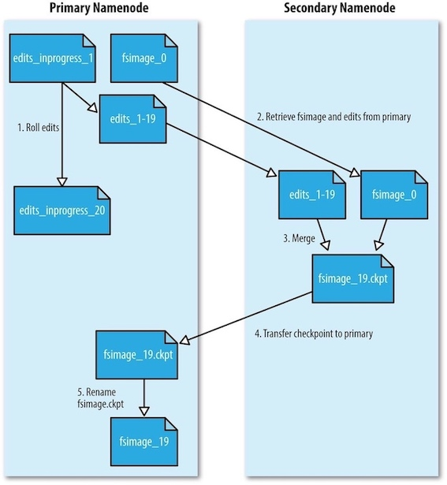


Hadoop会运行secondary namenode为主namenode内存中的文件系统元数据创建检查点：

* secondary namenode请求primary namenode停止使用正在进行中的*edits*文件，新的编辑操作将记录到新的*edits*文件中。并更新*seen_txid*文件。
* secondary namenode从primary namenode获取最近的*fsimage*和*edits*文件。
* secondary namenode将*fsimage*文件载入内存，逐一执行*edits*文件中的事务，创建新的合并后的*fsimage*文件。
* secondary namenode将新的*fsimage*文件发送回primary namenode, primary namenode将其保存为临时的*.ckpt*文件。
* primary namenode重新命名临时的*fsimage*文件，以便日后使用。


#### datanode目录结构

datanode的存储目录是初始阶段自动创建的，不需要额外格式化。datanode的关键文件和目录如下：


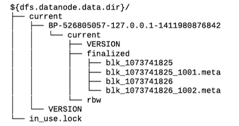

HDFS块存储在以*blk_*为前缀的文件中。每个块由一个相关的带有*.meta*后缀的元数据文件。元数据文件包括版本、类型信息和校验和。每个块属于一个数据块池(block pool), 每个数据块池都有自己的存储目录，目录根据数据块池ID形成(和namenode的VERSION文件中的数据块池ID相同)。


#### 安全模式

当namenode启动时，首先将*fsimage*文件载入内存，并执行*edits*文件中的操作。一旦在内存中成功建立文件系统元数据的映像，则创建一个新的*fsimage*文件(该操作不需要借助secondary namenode)和一个空的*edits*文件。在这个过程中，namenode运行在**安全模式**(safe mode)：namenode的文件系统对于客户端来说是只读的。


#### 高可用

hadoop2.0官方提供了两种HDFS HA的解决方案，一种是NFS，另一种是QJM。这里我们使用简单的QJM。在该方案中，主备NameNode之间通过一组JournalNode同步元数据信息，一条数据只要成功写入多数JournalNode即认为写入成功。通常配置奇数个JournalNode。Hadoop-2.2.0中依然存在一个问题，就是ResourceManager只有一个，存在单点故障，hadoop-2.6.4解决了这个问题，有两个ResourceManager，一个是Active，一个是Standby，状态由zookeeper进行协调。


1. **Active NameNode 和 Standby NameNode**：多个NameNode中只有一个处于Active状态，其他的处在Standby状态。其中ActiveNameNode负责集群中的所有客户端操作，StandbyNameNode仅仅充当备机，保证一旦ActiveNameNode出现问题能够快速切换。
2. **ZKFailoverController（主备切换控制器，ZKFC）**：一个ZooKeeper客户端，负责监视和观测NameNode的状态。每一个运行NameNode的机器也运行一个ZKFC。
3. **JournalNode**: Standby NameNode和Active NameNode通过JournalNode进行元数据信息(edit log)同步。Active Namenode将数据写入JournalNode，而Standby监听该系统，一旦发现有新数据写入，则读取这些数据，并加载到自己内存中，以保证自己内存状态与 ActiveNameNode保持基本一致。
4. **Zookeeper 集群**：Active NameNode选举。
5. **共享存储系统**：共享存储系统是实现 NameNode 的高可用最为关键的部分，共享存储系统保存了 NameNode 在运行过程中所产生的 HDFS 的元数据。主 NameNode 和备 NameNode 通过共享存储系统实现元数据同步。在进行主备切换的时候，新的主 NameNode 在**确认元数据完全同步之后才能继续对外提供服务**。
6. **DataNode 节点**：为了使故障切换能够快速进行，DataNode会同时向Active NameNode 和Standby NameNode发送数据块的位置信息。


#### 管理Hadoop

* hdfs dfsadmin -report	 查看hdfs的各节点状态信息
* hdfs haadmin -getServiceState nn1 获取一个namenode节点的HA状态

#### 代理用户

[参考](https://my.oschina.net/OttoWu/blog/806814)

Hadoop2.0版本开始支持ProxyUser的机制。含义是使用User A的用户认证信息，以User B的名义去访问hadoop集群。对于服务端来说就认为此时是User B在访问集群，相应对访问请求的鉴权（包括HDFS文件系统的权限，YARN提交任务队列的权限）都以用户User B来进行。User A被认为是superuser（这里super user并不等同于hdfs中的超级用户，只是拥有代理某些用户的权限，对于hdfs来说本身也是普通用户），User B被认为是proxyuser。


在实际应用中，通常有第三方用户平台或系统会统一用户对集群的访问，并且执行一系列任务调度逻辑，例如Oozie、华为的BDI系统等。此时访问集群提交任务的实际只有一个客户端。使用ProxyUser机制，则可以在这一个客户端上，实现多个用户对集群的访问。

服务端需要在NameNode和ResourceManager的core-site.xml中进行代理权限相关配置。 对于每一个superUser用户，配置参数：


| 配置 | 说明 | 
| --- | --- |
| hadoop.proxyuser.$superuser.hosts | 配置该superUser允许通过代理访问的主机节点 | 
| hadoop.proxyuser.$superuser.groups | 配置该superUser允许代理的用户所属组 | 
| hadoop.proxyuser.$superuser.users | 配置该superUser允许代理的用户 | 

### 附录

#### 安装配置


集群规划

|	主机名	|  运行的进程 | 
| --- | --- |
|	centos1 | NameNode, ResourceManager, DFSZKFailoverController(zkfc), QuorumPeerMain |
|	centos2 | NameNode, ResourceManager, DFSZKFailoverController(zkfc), QuorumPeerMain |
|	centos3 | DataNode, NodeManager, JournalNode, QuorumPeerMain |
|	centos3 | DataNode, NodeManager, JournalNode |

配置文件：

|	配置文件名	 | 配置对象 | 主要内容 | 
| --- | --- | --- |
| `hadoop-env.sh` | hadoop运行环境 | 配置JAVA_HOME环境变量、为hadoop的JVM指定特定的选项、指定日志文件所在的目录路径以及master和slave文件的位置 | 
| `core-site.xml` | 集群全局参数 | 用于定义系统级别的参数，如HDFS URL 、Hadoop的临时目录等 | 
| `hdfs-site.xml`	| HDFS | 如namenode和datanode的存放位置、文件副本的个数、文件的读取权限等 | 
| `mapred-site.xml` | Mapreduce参数 | 如reduce任务的默认个数、任务所能够使用内存的默认上下限等 | 
| `yarn-site.xml` | 	集群资源管理系统参数 | 配置ResourceManager，nodeManager的通信端口，web监控端口等 |	
```text tab="hadoop-env.sh"
export JAVA_HOME=/home/hadoop/apps/jdk1.8.0_201
export HADOOP_COMMON_LIB_NATIVE_DIR=$HADOOP_HOME/lib/native
export HADOOP_OPTS="-Djava.library.path=$HADOOP_HOME/lib/native/"
```

```xml tab="core-site.xml"
<configuration>
  <property>
   <name>fs.defaultFS</name>
   <value>hdfs://bi/</value>
 </property>
 <property>
   <name>hadoop.tmp.dir</name>
   <value>/home/larry/hadoopHA/tmp</value>
 </property>
 <property>
   <name>ha.zookeeper.quorum</name>
   <value>centos1:2181,centos2:2181,centos3:2181</value>
 </property>
 <property>
   <name>hadoop.proxyuser.root.hosts</name>
   <value>*</value>
 </property>
 <property>
  <name>hadoop.proxyuser.root.groups</name>
  <value>*</value>
</property>
</configuration>
```

```xml tab="hdfs-site.xml"
<configuration>

    <property>
        <name>dfs.replication</name>
        <value>2</value>
    </property>
    <property>
        <name>dfs.datanode.data.dir</name>
        <value>/home/hadoop/hadoopHA/data</value>
    </property>
    <property>
        <name>dfs.permissions</name>
        <value>false</value>
    </property>
    <property>
        <name>dfs.webhdfs.enabled</name>
        <value>true</value>
    </property>
    <!--指定hdfs的nameservice为bi，需要和core-site.xml中的保持一致 -->
    <property>
        <name>dfs.nameservices</name>
        <value>bi</value>
    </property>
    <!-- bi下面有两个NameNode，分别是nn1，nn2 -->
    <property>
        <name>dfs.ha.namenodes.bi</name>
        <value>nn1,nn2</value>
    </property>
    <!-- nn1的RPC通信地址 -->
    <property>
        <name>dfs.namenode.rpc-address.bi.nn1</name>
        <value>centos1:9000</value>
    </property>
    <!-- nn1的http通信地址 -->
    <property>
        <name>dfs.namenode.http-address.bi.nn1</name>
        <value>centos1:50070</value>
    </property>
    <!-- nn2的RPC通信地址 -->
    <property>
        <name>dfs.namenode.rpc-address.bi.nn2</name>
        <value>centos2:9000</value>
    </property>
    <!-- nn2的http通信地址 -->
    <property>
        <name>dfs.namenode.http-address.bi.nn2</name>
        <value>centos2:50070</value>
    </property>
    <!-- 指定NameNode的edits元数据在JournalNode上的存放位置 -->
    <property>
        <name>dfs.namenode.shared.edits.dir</name>
        <value>qjournal://centos3:8485;centos4:8485/bi</value>
    </property>
    <!-- 指定JournalNode在本地磁盘存放数据的位置 -->
    <property>
        <name>dfs.journalnode.edits.dir</name>
        <value>/home/larry/hadoopHA/journaldata</value>
    </property>
    <!-- 开启NameNode失败自动切换 -->
    <property>
        <name>dfs.ha.automatic-failover.enabled</name>
        <value>true</value>
    </property>
    <!-- 配置失败自动切换实现方式 -->
    <property>
        <name>dfs.client.failover.proxy.provider.bi</name>
        <value>org.apache.hadoop.hdfs.server.namenode.ha.ConfiguredFailoverProxyProvider</value>
    </property>
    <!-- 配置隔离机制方法，多个机制用换行分割，即每个机制暂用一行-->
    <property>
        <name>dfs.ha.fencing.methods</name>
        <value>
            sshfence
            shell(/bin/true)
        </value>
    </property>
    <!-- 使用sshfence隔离机制时需要ssh免登陆 -->
    <property>
        <name>dfs.ha.fencing.ssh.private-key-files</name>
        <value>/home/larry/.ssh/id_rsa</value>
    </property>
    <!-- 配置sshfence隔离机制超时时间 -->
    <property>
        <name>dfs.ha.fencing.ssh.connect-timeout</name>
        <value>30000</value>
    </property>

</configuration>
```

```xml tab="yarn-site.xml"
<configuration>
    <!-- 开启RM高可用 -->
    <property>
        <name>yarn.resourcemanager.ha.enabled</name>
        <value>true</value>
    </property>
    <!-- 指定RM的cluster id -->
    <property>
        <name>yarn.resourcemanager.cluster-id</name>
        <value>yrc</value>
    </property>
    <!-- 指定RM的名字 -->
    <property>
        <name>yarn.resourcemanager.ha.rm-ids</name>
        <value>rm1,rm2</value>
    </property>
    <!-- 分别指定RM的地址 -->
    <property>
        <name>yarn.resourcemanager.hostname.rm1</name>
        <value>centos1</value>
    </property>
    <property>
        <name>yarn.resourcemanager.hostname.rm2</name>
        <value>centos2</value>
    </property>
    <property>
    <!--分别添加rm1, rm2 -->
    <name>yarn.resourcemanager.ha.id</name>
        <value>rm1</value>
        </property>
    <property>
    <!-- 指定zk集群地址 -->
    <property>
        <name>yarn.resourcemanager.zk-address</name>
        <value>centos1:2181,centos2:2181,centos3:2181</value>
    </property>
    <property>
        <name>yarn.nodemanager.aux-services</name>
        <value>mapreduce_shuffle</value>
    </property>
</configuration>
```

```xml tab="slaves"
<!--datanode和nodemanager的位置-->
centos3
centos4
```

启动流程


1. 在centos1, centos2, centos3上启动Zookpeeper： `zkServer.sh start`
2. 在centos3, centos4上启动JournalNode: `hadoop-daemon.sh start journalnode`
3. 在centos1上格式化hdfs: `hdfs namenode -format`
4. 将格式化后的`hadoop.tmp.dir`文件夹拷贝到standbynamenode(即centos2)相同目录下（`hdfs namenode -bootstrapStandby`)
5. 格式化ZKFC：`hdfs zkfc -formatZK`
6. 启动: `start-dfs.sh`, `start-yarn.sh`
7. 其他可选启动: `mr-jobhistory-daemon.sh start historyserver`, `httpfs.sh start`

##### Operation category READ is not supported in state standby

由于ZKFailOverController宕机引起的不能选举。强行手工将nn1状态转换为active。

```bash
$ hdfs haadmin -getServiceState nn1
standby
$ hdfs haadmin -getServiceState nn2
standby
$ hdfs haadmin -transitionToActive --forcemanual nn1
``` 