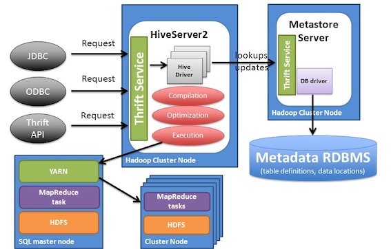
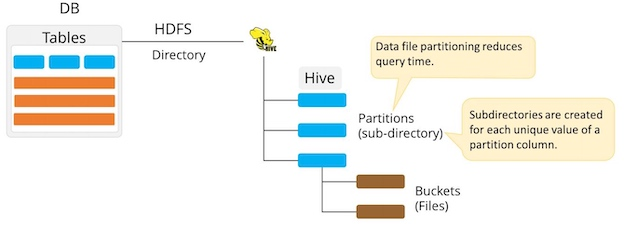
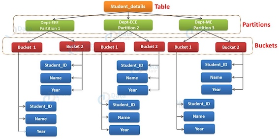

### 1  简介

> The [Apache Hive ™](http://hive.apache.org/) data warehouse software facilitates reading, writing, and managing large datasets residing in distributed storage using SQL. Structure can be projected onto data already in storage. A command line tool and JDBC driver are provided to connect users to Hive. 

Hive是一个构建在Hadoop上的*数据仓库*(data warehouse)框架，其设计目的是让精通SQL技能但Java编程相对较弱的分析师能够对存放在HDFS中的大规模数据集进行查询。

!!! note "Data WareHouse v.s. Database"

    | Parameter  | Database  | Data Warehouse  | 
    | --- | --- | --- |
    | Parameter  | Database  | Data Warehouse  | 
    | Purpose  | Is designed to *record*  | Is designed to *analyze*  | 
    | Processing Method  | The database uses the Online *Transactional* Processing (OLTP, 联机事务处理)  | Data warehouse uses Online *Analytical* Processing (OLAP, 联机分析处理).  | 
    | Tables and Joins  | Tables and joins of a database are *complex* as they are normalized.  | Table and joins are *simple* in a data warehouse because they are denormalized.  | 
    | Orientation  | Is an *application*-oriented collection of data  | It is a *subject*-oriented collection of data  | 
    | Storage limit  | Generally limited to a single application  | Stores data from any number of applications  | 
    | Availability  | Data is available real-time  | Data is refreshed from source systems as and when needed  | 
    | Data Type  | Data stored in the Database is up to date.  | Current and *Historical* Data is stored in Data Warehouse. May not be up to date.  | 
    | Query Type  | Simple transaction queries are used.  | Complex queries are used for analysis purpose.  | 


####  与传统数据库相比

##### 读时模式v.s写时模式


传统数据库是在写入时对照模式(schema)进行检查，称之为**写时模式**(schema on write)。Hive只在查询时对数据进行验证，称之为**读时模式**(schema on read)。


##### 更新、事务和索引

更新、事务和索引是传统数据库最重要的特性。而Hive是不支持这些特性的。对于Hive，全表扫描(full-table scan)是常态操作，表更新则是通过把数据变换后放入新表实现的。

#### 运行Hive

##### 执行引擎
Hive的默认执行引擎是MapReduce。它还支持Apache Tez和Spark执行引擎，可以由属性`hive.execution.engin`来控制。

##### Hive服务

Hive服务包括：

* cli：命令行界面，默认的服务，使用`hive`命令启动
* hiveserver: 以提供Thrift服务的服务器形式运行，使用`hive --service hiveserver2`命令启动
* hwi：hive的web接口(默认端口9999)，使用`hive –-service hwi`命令启动


如果以hive server的方式运行hive服务，则可以通过以下方式进行客户端连接：

```bash
# mini1是hiverserver2所启动的那台主机名，端口默认是10000
> beeline -u jdbc:hive2://mini1:10000 -n hadoop
```


##### MetaStore

metastore包含metastore服务和后台数据，有以下三种运行方式：

* **内嵌metastore**(embedded metastore): 默认情况下，metastore服务和Hive服务运行在同一个JVM中，包含一个内嵌的以本地磁盘作为存储的Derby数据库实例。由于仅有一个Derby数据库，所以仅支持一个hive会话。
* **本地metastore**(local metastore): metastore服务仍然和Hive服务运行在同一个JVM中，但是连接的却是在另一个进程中的数据库(可以在本机或远程机器上)。支持多个hive会话。任何JDBC兼容的数据库都可以供metastore使用，最流行的是MySQL数据库。
* **远程metastore**(remote metastore): metastore服务和Hive服务运行在不同JVM中。


#### 架构



### 2 表

Hive的表在逻辑上由存储的数据和描述表中数据形式的相关元数据组成。

* 数据可以存放在任何Hadoop文件系统中，包括HDFS、本地文件系统等；
* 元数据存放在关系型数据库中，例如Derby, MySql中。


#### 托管表和外部表

加载数据到**托管表**(managed table)时，Hive会把原始数据移到**仓库目录**(warehouse directory)；表被丢弃后，其元数据和数据都会被删除。对于**外部表**(external table)，Hive不会把数据移到仓库目录；并且表被丢弃后，Hive只会删除其元数据。

!!! example "托管表/外部表"

    ```sql
    create table managed_table (dummy string);
    load data inpath '/user/tom/data.txt' into table managed_table;
    drop table managed_table;
    
    create external table external_table (dummy string);
        location '/user/tom/external_table'
    load data inpath '/user/tom/data.txt' into table external_table;
    ```

普遍的做法是把存放在HDFS的初始数据集用作外部表使用，然后用Hive的变换功能把数据移动到托管表。


#### 分区和桶

Hive把表组织成**分区**(partition)，可以加快数据分片(slice)的查询速度。表或分区进一步分为**桶**(bucket)，为数据提供额外的结构以获得更高效的查询处理。



分区是在创建表时用`PARTITION BY`子句定义的。`PARTITION BY`子句中的列定义是表中正式的列，称为**分区列**(partition column)，但是*数据文件并不包含这些列的值*，因为它们源自目录名。把数据加载到分区表时，需要显式指定分区值。


!!! example "日志文件"

    例如每条记录包含一个时间戳的日志文件，可以根据日期来进行分区；除此之外，还可以进一步根据国家对每个分区进行**子分区**(subpartition)。对于特定日期的查询，只需要扫描范围内的分区中的文件即可。
    
    ```sql
    create table logs(ts bigint, line string)
    partitioned by (dt string, country string)
    
    LOAD DATA LOCAL INPATH 'input/hive/partitions/file1' 
    INTO TABLE logs PARTITION (dt='2001-01-01', country='GB');
    ```
    
    
    
    使用`show partitions`命令展示分区：
    
    ```sql
    hive> show partitions logs;
    OK
    dt=2001-01-01/country=GB
    dt=2001-01-01/country=US
    dt=2001-01-02/country=GB
    dt=2001-01-02/country=US
    ```
    
    分区列是表中正式的列，但是并不包含在数据中：
    
    ```sql
    hive> select * from logs;
    OK
    1	Log line 1	2001-01-01	GB
    2	Log line 2	2001-01-01	GB
    3	Log line 3	2001-01-01	US
    4	Log line 4	2001-01-02	GB
    5	Log line 5	2001-01-02	US
    6	Log line 6	2001-01-02	US
    ```

把表或分区组织成**桶**(bucket)有两个理由：

* 获得更高的查询处理效率。桶为表加上了额外的结构，Hive在处理有些查询时能利用这个结构。具体而言，连接两个在（包含连接列的）相同列上划分了桶的表，可以使用Map端连接(Map-side join)高效的实现。比如JOIN操作。对于JOIN操作两个表有一个相同的列，如果对这两个表都进行了桶操作。那么将保存相同列值的桶进行JOIN操作就可以，可以大大较少JOIN的数据量。
* 使取样（sampling）更高效。在处理大规模数据集时，在开发和修改查询的阶段，如果能在数据集的一小部分数据上试运行查询，会带来很多方便。

使用`CLUSTERED BY`子句来指定划分桶所用的列和要划分的桶的个数：

```sql
create table bucketed_users (id int, name string)
clustered by (id) into 4 buckets;
```


!!! example "student"

    

#### 存储格式

Hive从两个维度对表进行管理，分别是行格式(row format)和文件格式(file format)。

* 行格式由**SerDe**(Serializer-Deserializer, 序列化和反序列化工具)定义。
    * 查询表时，SerDe把文件中字节形式的数据反序列化为Hive内部操作数据时使用的对象格式。
    * 执行插入时，表的SerDe会把Hive的数据行内表示形式序列化成字节形式并写到输出文件中。
* 文件格式
    * 分隔的文本
    * ORCFile

##### 默认存储格式：分隔的文本

Hive使用的默认存储格式是**分隔的文本**，每行存储一个数据行。默认的行内分隔符是`CONTROL-A`。集合类的分隔符是`CONTROL-B`，用于分隔ARRAY或STRUCT或MAP的键值对中的元素。表中各行之间用换行符分隔。

等价于：

```hiveql
create table ...
row format delimited
    fields terminated by '\001'
    collection items terminated by '\002'
    map keys terminated by '\003'
    lines terminated by '\n'
stored as textfile;
```


#### ORC

Hive还支持Sequence File, Avro, Parquet, RCFile, ORCFile等二进制存储格式。只需要指定`SAVE AS SEQUENCEFILE|AVRO|TEXTFILE|RCFILE`而不用加上`ROW FORMAT`，因为其格式由底层的二进制文件格式来控制。


### 3 HiveQL

Hive的SQL方言称为HiveQL。


#### 数据类型

Hive支持基本和复杂数据类型。基本数据类型(primitive data type)基本对应于Java中的类型，包括：

* 数值型：TINYINT, SMALLINT, INT, BIGINT, FLOAT, DOUBLE, DECIMAL
* 布尔型：BOOLEAN
* 字符串类型：STRING(无上限可变长度字符串), VARCHAR(可变长度字符串), CHAR(固定长度字符串)
* 时间戳类型：TIMESTAMP(时间戳)，DATE(日期)

复杂数据类型(complex data type)包括：

* 数组：ARRAY
* 映射： MAP
* 结构：STRUCT, UNION

##### 类型转换

隐式转换规则：

* 任何数值类型都可以隐式地转换为一个范围更广的类型或文本类型(STRING, VARCHAR, CHAR)。
* 所有文本类型都可以隐式地转为另一种文本类型。
* 文本类型都能转换为DOUBLE或DECIMAL。
* 时间戳类型可以被隐式地转换为文本类型。


可以使用CAST操作显示地进行数据类型转换。如`CAST('1' AS INT)`。


#### 操作符与函数

Hive提供的操作符基本与MySQL匹配：

* 关系操作符： 等值判断： `x='a'`, 空值判断： `x is null`, 模式匹配: `x like 'a%'`
* 算术操作符： `+`, `-`
* 逻辑操作符: `or`, `and` 

#### DDL


##### 创建表

```sql
CREATE [EXTERNAL] TABLE [IF NOT EXISTS] table_name
    [(col_name data_type [COMMENT col_comment], ...)]
    [COMMENT table_comment]
    [PARTITIONED BY (col_name data_type [COMMENT col_comment], ...)]
    [CLUSTERED BY (col_name, col_name, ...)
    [SORTED BY (col_name [ASC|DESC], ...)] INTO num_buckets BUCKETS]
    [ROW FORMAT row_format]
    [STORED AS file_format]
    [LOCATION hdfs_path]
```

1. `CREATE TABLE` 创建一个指定名字的表。如果相同名字的表已经存在，则抛出异常；用户可以用`IF NOT EXISTS`选项来忽略这个异常。
2. `EXTERNAL`关键字可以让用户创建一个外部表
3. `LIKE`允许用户复制现有的表结构，但是不复制数据。
4. `ROW FORMAT DELIMITED [FIELDS TERMINATED BY char] [COLLECTION ITEMS TERMINATED BY char] [MAP KEYS TERMINATED BY char] [LINES TERMINATED BY char] | SERDE serde_name [WITH SERDEPROPERTIES (property_name=property_value, property_name=property_value, ...)]` 
   
       * 用户在建表的时候可以自定义 SerDe 或者使用自带的 SerDe。
       * 如果没有指定`ROW FORMAT`或者`ROW FORMAT DELIMITED`，将会使用自带的 SerDe。在建表的时候，用户还需要为表指定列，用户在指定表的列的同时也会指定自定义的SerDe，Hive通过 SerDe 确定表的具体的列的数据。
       
1. `STORED AS SEQUENCEFILE|TEXTFILE|RCFILE`如果文件数据是纯文本，可以使用`STORED AS TEXTFILE`。如果数据需要压缩，使用 `STORED AS SEQUENCEFILE`。
2. `PARTITIONED BY` 分区
3. `CLUSTERED BY`桶


##### 修改表

| 命令 | 解释 |
| --- | --- |
| ALTER TABLE table_name RENAME TO new_table_name |  重命名表格 |
| ALTER TABLE table_name ADD COLUMNS (col_name STRING) | 增加表格列 |
| ALTER TABLE table_name ADD partition_spec [LOCATION 'location']| 增加分区 |
| ALTER TABLE table_name DROP partition_spec | 删除分区 |

!!! example "修改表"

    ```sql
    ALTER TABLE page_view ADD 
            PARTITION (dt='2008-08-08', country='us') location '/path/to/us/part080808'
            PARTITION (dt='2008-08-09', country='us') location '/path/to/us/part080809';
    ALTER TABLE page_view DROP PARTITION (dt='2008-08-08', country='us');
    ```

##### 丢弃表

| 命令 | 解释 |
| --- | --- |
| DROP TABLE [IF EXISTS] table_name |  删除表的数据和原数据 |
| TRUNCATE TABLE table_name | 删除表内的所有数据，但保留表的定义 |

##### 显示命令

* show tables|databases|partitions|functions
* desc [extended|formatted] table_name;

#### DML

##### Load

Load DATA操作把文件复制或移动到表的目录中：

```sql
LOAD DATA [LOCAL] INPATH 'filepath' [OVERWRITE] INTO
TABLE tablename [PARTITION (partcol1=val1, partcol2=val2 ...)]
```

* filepath: 支持绝对路径和相对路径
* LOCAL关键字：如果使用了LOCAL关键字，则去本地文件系统中寻找；否则默认去HDFS中查找
* OVERWRITE：如果使用了OVERWRITE关键字，则目标表或者分区中的内容会被删除，然后将filepath指向的文件/目录中的内容添加到表/分区中

##### Insert

INSERT语句把数据从一个Hive表填充到另一个：

```sql
INSERT OVERWRITE TABLE tablename1 [PARTITION (partcol1=val1, partcol2=val2 ...)] 
select_statement1 FROM from_statement
```


##### CREATE TABLE... AS SELECT

可以把Hive查询的输出结果存放到一个新的表格中。

##### SELECT

```sql
SELECT [ALL | DISTINCT] select_expr, select_expr, ... 
FROM table_reference 
[WHERE where_condition] 
[GROUP BY col_list [HAVING condition]] 
[CLUSTER BY col_list | 
    [DISTRIBUTE BY col_list] [SORT BY| ORDER BY col_list] ] 
[LIMIT number]
```


!!! note "order by/sort by/ distribute by"

    请参考[Order, Sort, Cluster, and Distribute By](https://cwiki.apache.org/confluence/display/Hive/LanguageManual+SortBy)
    
    * `order by`会对输入做全局排序，只有一个reducer，会导致当输入规模较大时， 需要较长的计算时间。 
    * `sort by`不是全局排序，它为每个reducer产生一个排序文件。其在数据进入reducer前完成排序。因此，如果用sort by进行排序，并且设置`mapred.reduce.tasks`>1，则`sort by`只保证每个reducer的输出有序，不保证全局有序。 
    * `distribute by` 根据`distribute by`指定的内容将数据分到同一个reducer
    * `cluster by` = `distribute by` + `sort by`

    
    使用distribute by确保所有具有相同年份的行最终都在同一个reducer分区中：    
    
    ```sql
    from records 2
    select year, temperature
    distribute by year
    sort by year asc, temperature desc
    ```


##### 连接

Hive支持内连接和外连接。


```sql tab="inner join"
select sales.*, things.*
from sales joins things 
on sales.id = things.id;
```

```sql tab="outter join"
select sales.*, things.*
from sales [left| right | full] outer join things 
on sales.id = things.id;
```

**MAP JOIN**：在小数据量情况下，SQL会将用户指定的小表全部加载到执行JOIN操作的程序的内存中，从而加快JOIN的执行速度。在小表和大表进行join时，将小表放在前边，效率会高。hive会将小表进行缓存。

在必要的时候触发该优化操作将普通JOIN转换成MapJoin，可以通过以下两个属性来设置该优化的触发时机

```text
hive.auto.convert.join = true
hive.mapjoin.smalltable.filesize = 2500000
```


##### 函数

ROW_NUMBER() 是从1开始，按照顺序，生成分组内记录的序列，用法如下：

```sql
ROW_NUMBER() OVER (partition BY COLUMN_A ORDER BY COLUMN_B ASC/DESC) rank
```


!!! example "按照学生科目取每个科目的TopN"

    ```sql
    create table grade(student_id int, course_id int, score int)
        row format delimited fields terminated by ',' stored as textfile;
    select top.* from 
        (select student_id, course_id, score, 
            row_number() over (partition by course_id order by score desc) rank 
        from grade) top
    where top.rank < 5
    ```
    
    
### 4 调优

##### 压缩


支持压缩:  `hive.exec.compress.output=true`
压缩方式: `mapreduce.fileoutputformat.compress.codec=org.apache.hadoop.io.compress.BZip2Codec`

##### 并行执行

前提条件：多个task没有依赖。设置`hive.exec.parallel=true`, `hive.exec.parallel.thread.number`


##### jvm重用

maptask/reducetask其实都是以进程的方式运行的，那么有多少个task就会启动多少个jvm。当task运行完之后该jvm就会被销毁。jvm启动和销毁是需要资源的开销。每个jvm可以执行多个task。

`mapred.job.reuse.jvm.num.tasks`


### 附录

#### 安装

详细参见[Hive On Spark](https://cwiki.apache.org/confluence/display/Hive/Hive+on+Spark:+Getting+Started)。下面以本地metastore, [Hive-3.1.2](https://mirrors.tuna.tsinghua.edu.cn/apache/hive)为例，安装配置Hive on Spark。首先安装mysql客户端和服务、新建数据库、新增用户并设置权限，并下载[mysql-connector-java](https://dev.mysql.com/downloads/connector/j/)放置到`$HIVE_HOME/lib`目录下。

```mysql
drop database if exists metastore;
create database metastore;
grant all on metastore.* to hive@'%'  identified by 'hive';
grant all on metastore.* to hive@'localhost'  identified by 'hive';
flush privileges;
```

接下来解决Spark的依赖，把`$SPARK_HOME/jars`的三个包到`$HIVE_HOME/lib`下： `scala-library`, `spark-core`, `spark-network-common`；把`$SPARK_HOME/jars`的所有jars拷贝到HDFS目录`hdfs://centos1:9000/spark-jars/*`。

下一步修改hive配置文件，如下。

```bash tab="hive-env.sh"
export JAVA_HOME=/home/hadoop/apps/jdk1.8.0_201
export HADOOP_HOME=/home/hadoop/apps/hadoop-2.7.7
```

```xml tab="hive-site.xml"
<?xml version="1.0" encoding="UTF-8" standalone="no"?>
<configuration>
<property>
    <name>hive.exec.scratchdir</name>
    <value>/home/hadoop/apps/apache-hive-3.1.2/tmp</value>
</property>
<property>
    <name>hive.metastore.warehouse.dir</name>
    <value>/home/hadoop/apps/apache-hive-3.1.2/warehouse</value>
</property>
<property>
    <name>hive.querylog.location</name>
    <value>/home/hadoop/apps/apache-hive-3.1.2/log</value>
</property>

<!-- 配置 MySQL 数据库连接信息 -->
  <property>
    <name>javax.jdo.option.ConnectionURL</name>
    <value>jdbc:mysql://centos1:3306/metastore?createDatabaseIfNotExist=true&amp;characterEncoding=UTF-8&amp;useSSL=false</value>
  </property>
  <property>
    <name>javax.jdo.option.ConnectionDriverName</name>
    <value>com.mysql.jdbc.Driver</value>
  </property>
  <property>
    <name>javax.jdo.option.ConnectionUserName</name>
    <value>hive</value>
  </property>
  <property>
    <name>javax.jdo.option.ConnectionPassword</name>
    <value>hive</value>
  </property>

<!--hive server2 settings-->
  <property>
        <name>hive.server2.thrift.bind.host</name>
        <value>centos1</value>
  </property>
  <property>
        <name>hive.server2.thrift.port</name>
        <value>10000</value>
  </property>
  <property>
        <name>hive.server2.webui.host</name>
        <value>centos1</value>
  </property>
  <property>
        <name>hive.server2.webui.host.port</name>
        <value>10002</value>
  </property>
  <property>
        <name>hive.server2.long.polling.timeout</name>
        <value>5000</value>
  </property>
  <property>
        <name>hive.server2.enable.doAs</name>
        <value>true</value>
  </property>
  <!-- 配置 Spark，如果用mr，则设置hive.execution.engine=mr-->
  <property>
    <name>spark.master</name>
    <value>spark://centos1:7077</value>
  </property>
    <property>
    <name>spark.eventLog.enabled</name>
    <value>true</value>
  </property>
  <property>
    <name>spark.eventLog.dir</name>
    <value>hdfs://centos1:9000/spark-log</value>
  </property>
  <property>
    <name>spark.serializer</name>
    <value>org.apache.spark.serializer.KryoSerializer</value>
  </property>
  <property>
    <name>hive.execution.engine</name>
    <value>spark</value>
  </property>
  <property>
    <name>spark.yarn.jars</name>
    <value>hdfs://centos1:9000/spark-jars/*</value>
  </property>
</configuration>
```

初始化hive: `$HIVE_HOME/bin/schematool -dbType mysql -initSchema hive hive`。最后启动hiveserver服务: `nohup hive --service hiveserver2 &`

