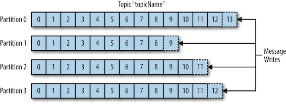
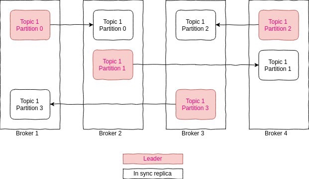
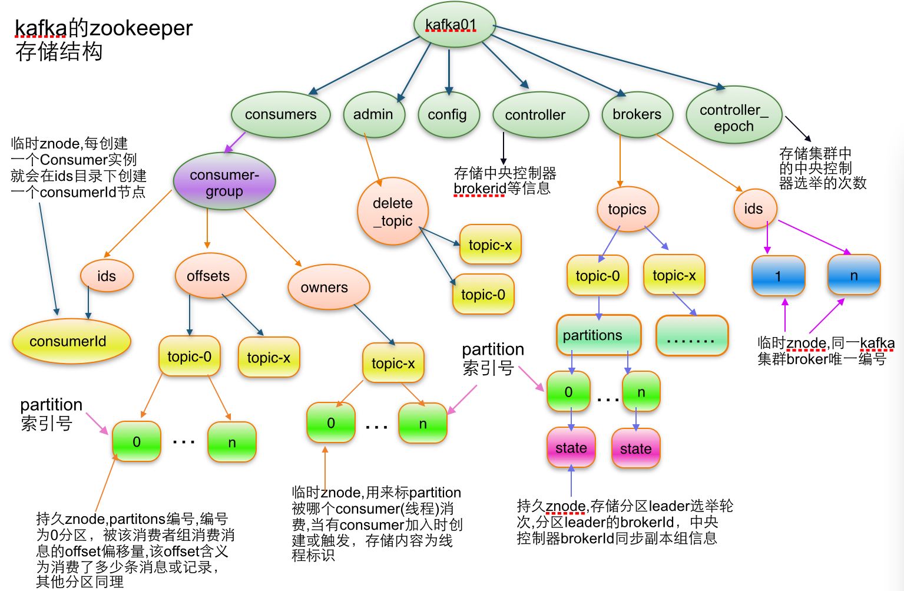
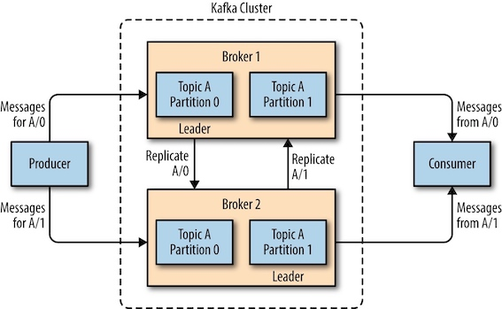
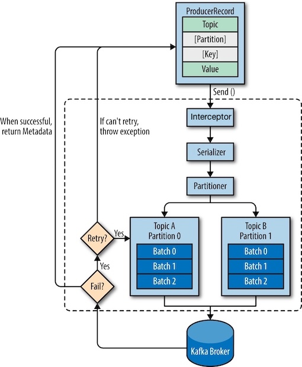

[Kafka](http://kafka.apache.org)是一款基于分布和订阅的消息系统(message system)，一般被称为"分布式提交日志"(distributed commit log)或者"分布式流平台"(distributing streaming platform)。

#### 0 简介

Kafka的数据单元被称为**消息**(message)。为了提高效率，消息被分批次(batch)写入Kafka。消息通过**主题**(topic)进行分类。主题可以被分为若干个**分区**(partition)，一个分区就是一个**提交日志**(commit log)。消息以追加的方式写入分区，然后以先入先出的顺序读取。分区可以分布在不同的服务器上，一个主题可以横跨多个服务器。




每个分区可以有一个或者多个**副本**(replica), 只有其中的⼀个副本可以成为分区**⾸领**(leader)。所有的事件都直接发送给⾸领，或者直接从⾸领读取事件。其他副本只需要与⾸领保持同步，并及时复制最新的事件。当⾸领不可⽤时，其中⼀个同步副本将成为新⾸领。




Kafka的客户端分为两种基本类型：**生产者**(producers)和**消费者**(customers)。

* 生产者创建消息。一般情况下，一个消息会被发布到一个特定的主题上。默认情况下会把消息平衡地分布到主题的所有分区上。
* 消费者读取消息。消费者订阅一个或者多个主题，并按照消息生成的顺序读取。消费者通过检查消息的**偏移量**(offset)来区分已经读过的消息。消费者把每个分区最后读取的消息偏移量保存在Zookeeper上。会有一个或多个消费者(**消费者群组**, consumer group)共同读取一个主题。群组保证每个分区只能被一个消费者使用。如果⼀个消费者失效，群组⾥的其他消费者可以接管失效消费者的⼯作。


Kafka使⽤Zookeeper保存集群的元数据信息和消费者信息。


!!! note "Kafka在Zookeeper中的存储"

    
    
    * /brokers/topics/[topic] 存储某个topic的partitions所有分配信息
    * /brokers/ids/[0...N] Broker注册信息
    * /controller_epoch -->  int (epoch)   第一次启动为1，每次重新选举增加1
    * /consumers/[groupId]/ids/[consumerIdString] consumer注册信息

一个独立的Kafka服务器被称为**broker**，其主要作用为：

* 接收来自生产者的消息，为消息设置偏移量，并提交消息到磁盘保存。
* 为消费者提供服务，对读取分区的请求作出响应，返回已经提交到磁盘上的消息

每个集群中都有一个broker同时充当了集群**控制器**(cluster controller)的角色。控制器负责管理工作，包括将分区分配给broker和监控broker。在集群中，⼀个分区从属于⼀个broker，该broker被称为分区的**⾸领**(leader)。⼀个分区可以分配给多个broker，这个时候会发⽣分区复制。这种复制机制为分区提供了消息冗余，如果有⼀个broker失效，其他broker可以接管领导权。



消息**保留**(retention)是Kafka的一个重要特性，它是指在一段时间内持久化存储消息。Kafka broker默认的消息保留策略是要么保留⼀段时间(⽐如7天)，要么保留到消息达到⼀定⼤⼩的字节数(⽐如1GB）。

基于发布与订阅的消息系统那么多，为什么选择Kafka？Kafka的优势在于：

* 支持多个生产者和消费者
* 基于磁盘的数据存储，允许消费者⾮实时地读取消息
* 具有灵活的伸缩性，从单个broker到上百个broker
* 高性能


Kafka在大数据基础设施的各个组件之间传递消息，为所有客户端提供一致的接口。当与提供消息模式的系统集成时，⽣产者和消费者之间不再有紧密的耦合，也不需要在它们之间建⽴任何类型的直连。


Kafka的使用场景有跟踪用户活动，传递消息，收集应⽤程序和系统度量指标以及⽇志，提交⽇志，流处理等。

##### 为什么要使用消息队列

* 解耦
* 异步
* 削峰


##### 为什么选择Kafka

* ⽆缝地⽀持多个⽣产者：很适合⽤来从多个前端系统收集数据，并以统⼀的格式对外提供数据
* ⽀持多个消费者从⼀个单独的消息流上读取数据，⽽且消费者之间互不影响
* 允许消费者⾮实时地读取消息
* 具有伸缩性
* 保证亚秒级的消息延迟

### 1 生产者

#### 生产者概览



生产者向Kafka发送消息的主要步骤：

* 创建`ProducerRecord`对象，包含目标主题和发送的内容，还可以指定键和分区
* 把建和值对象序列化为字节数组
* 分区器(partitioner)根据`ProducerRecord`对象指定的分区或者键选择分区
* 记录被添加到一个记录批次里，这个批次里的所有消息会被发送到相应的主题和分区上
* 有⼀个独⽴的线程负责把这些记录批次发送到相应的broker上。
* 服务器在收到这些消息时会返回⼀个响应。如果消息成功写⼊Kafka，就返回⼀个`RecordMetaData`对象，它包含了主题和分区信息，以及记录在分区⾥的偏移量。如果写⼊失败，则会返回⼀个错误
* ⽣产者在收到错误之后会尝试重新发送消息，⼏次之后如果还是失败，就返回错误信息。

#### 创建Kafka⽣产者

要往Kafka写⼊消息，⾸先要创建⼀个⽣产者对象`ProducerRecord`，并设置⼀些属性。 Kafka⽣产者有3个必选的属性:

* `bootstrap.servers`: 指定broker的地址清单，地址的格式为host:port
* `key.serializer`: 键的序列化器
* `value.serializer`: 值的序列化器

```java
private Properties kafkaProps = new Properties(); 
kafkaProps.put("bootstrap.servers", "broker1:9092,broker2:9092");
kafkaProps.put("key.serializer",
  "org.apache.kafka.common.serialization.StringSerializer"); 
kafkaProps.put("value.serializer", 
  "org.apache.kafka.common.serialization.StringSerializer");
producer = new KafkaProducer<String, String>(kafkaProps);
```

#### 发送消息到Kafka


发送消息主要有三种方式：

1. 发送并忘记(fire-and-forget): 把消息发送给服务器，但并不担心它是否正常到达。有时会丢失一些信息。
2. 同步发送(Synchronous send): 使用`send()`方法发送消息，返回一个`Future`对象，调用`get()`方法进行等待，就可以知道消息是否发送成功
3. 异步发送(Asynchronous send): 使用`send()`方法发送消息，并指定一个回调函数(callback function)，服务器在返回响应时调用该函数

```java
ProducerRecord<String, String> record = 
    new ProducerRecord<>("CustomerCountry", "Precision Products", "France"); 
// 同步发送
producer.send(record).get(); 

// 异步发送
private class DemoProducerCallback implements Callback { 
 @Override 
 public void onCompletion(RecordMetadata recordMetadata, Exception e) { 
  if (e != null)  e.printStackTrace(); 
 } 
}
producer.send(record, new DemoProducerCallback());
```

#### ⽣产者的配置

* `acks`: 指定了必须要有多少个分区副本收到消息，⽣产者才会认为消息写⼊是成功的。
    * `ack=0`: ⽣产者在成功写⼊消息之前不会等待任何来⾃服务器的响应
    * `ack=1`: 只要集群的⾸领节点收到消息，⽣产者就会收到⼀个来⾃服务器的成功响应
    * `ack=all`: 当所有参与复制的节点全部收到消息时，⽣产者才会收到⼀个来⾃服务器的成功响应
* `buffer.memory`: ⽣产者内存缓冲区的⼤⼩
* `compression.type`: 压缩格式(snappy, gzip, lz4)
* `retries`: ⽣产者可以重发消息的次数，如果达到这个次数，⽣产者会放弃重试并返回错误
* `batch.size`: 数据积累到多大之后才会发送数据
* `linger.ms`: ⽣产者在发送批次之前等待更多消息加⼊批次的时间
* `client.id`: 服务器会⽤来识别消息的来源

##### 拦截器

拦截器使生产者在发送消息之前，可以对消息做一些定制化需求，例如下面的`TimeInterceptor`会在消息发送前将时间戳信息加到消息value的最前部:


```java
public class TimeInterceptor implements ProducerInterceptor<String, String> {
    @Override
    public ProducerRecord<String, String> onSend(ProducerRecord<String, String> record) {
        // 创建一个新的record，把时间戳写入消息体的最前部
        return new ProducerRecord(record.topic(), record.partition(),
             record.timestamp(), record.key(),
             System.currentTimeMillis() + "," + record.value().toString());
    }
    @Override
    public void onAcknowledgement(RecordMetadata metadata, Exception exception) {
    }

    @Override
    public void close() {
    }

    @Override
    public void configure(Map<String, ?> configs) {
    }
}
```

在属性中加入拦截器的类即可使用：

```java
props.put(ProducerConfig.INTERCEPTOR_CLASSES_CONFIG,
    Collections.singletonList("com.bigdata.kafka.TimeInterceptor"));
```


#### 序列化器

建议使用Avro序列化

#### 分区

Kafka的消息是⼀个个键值对，拥有相同键的消息将被写到同⼀个分区。

* 如果键值为null，并且使⽤了默认的分区器，那么记录将被随机地发送到主题内各个可⽤的分区上。分区器使⽤轮询(Round Robin)算法将消息平衡地分布到各个分区上。
* 如果键不为空，并且使⽤了默认的分区器，那么Kafka会对键进⾏散列，然后根据散列值把消息映射到特定的分区上。

### 2 消费者

消费者从属于**消费者群组**(consumer group)。一个群组里的消费者订阅的是同一个主题，每个消费者接收主题一部分分区的消息。往群组⾥增加消费者是横向伸缩消费能⼒的主要⽅式。不过要注意，不要让消费者的数量超过主题分区的数量，多余的消费者只会被闲置。


* 消费者C1将收到主题T1全部4个分区的消息
* 如果群组G1有4个消费者，那么每个消费者可以分配到⼀个分区
* 如果我们往群组⾥添加更多的消费者，超过主题的分区数量，那么有⼀部分消费者就会被闲置，不会接收到任何消息，
* 如果新增⼀个只包含⼀个消费者的群组G2，那么这个消费者将从主题T1上接收所有的消息，与群组G1之间互不影响。


当⼀个消费者被关闭或发⽣崩溃时，它就离开了消费者群组，原本由它读取的分区将由群组⾥的其他消费者来读取。在主题发⽣变化时，⽐如管理员添加了新的分区，会发⽣分区重分配。分区的所有权从⼀个消费者转移到另⼀个消费者，这样的⾏为被称为**再平衡**(rebalance)。在再平衡期间，消费者⽆法读取消息，造成整个群组⼀⼩段时间的不可⽤。

消费者通过向被指派为**群组协调器**(group coordinator)的broker(不同的群组可以有不同的协调器)发送**⼼跳**(heatbeats)来维持它们和群组的从属关系以及它们对分区的所有权关系。消费者会在轮询消息(为了获取消息)或提交偏移量时发送⼼跳。如果消费者停⽌发送⼼跳的时间⾜够长，会话就会过期，群组协调器认为它已经死亡，就会触发⼀次再平衡。

#### 创建消费者

创建`KafkaConsumer`对象与创建`KafkaProducer`对象非常类似，有3个必选的属性: `bootstrap.servers`、`key.serializer`、`value.serializer`。


```java
Properties props = new Properties(); 
props.put("bootstrap.servers", "broker1:9092,broker2:9092");
props.put("key.deserializer", 
  "org.apache.kafka.common.serialization.StringDeserializer"); 
props.put("value.deserializer",
  "org.apache.kafka.common.serialization.StringDeserializer");
KafkaConsumer<String, String> consumer = new KafkaConsumer<>(props);
```

#### 订阅主题

使用`subscribe()`方法接受一个主题列表作为参数：

```java
consumer.subscribe(Collections.singletonList("customerCoutries"));
```

也可以在调用`subscribe()`方法时传入一个正则表达式用于匹配主题：

```java
# 订阅所有与test相关的主题
consumer.subscribe("test.*");
```


#### 轮询

消费者API的核心是消息轮询(pull loop)。一旦消费者订阅了主题，轮询就会处理所有的细节，包括群主协调、分区再平衡、发送心跳和获取数据。注意消费者必须持续对Kafka轮询，否则会被认为死亡，它的分区会被移交给群组里的其他消费者。

```java
try {
     // 无限循环，持续轮询向Kafka请求数据
     while (true) { 
        //返回⼀个记录列表, 100是超时参数，会在指定的毫秒数内⼀直等待broker返回数据
        ConsumerRecords<String, String> records = consumer.poll(100);  
        for (ConsumerRecord<String, String> record : records) { 
            int updatedCount = 1; 
            // 把结果保存起来或者对已有的记录进⾏更新
            if (custCountryMap.countainsValue(record.value())) 
                updatedCount = custCountryMap.get(record.value()) + 1; 
            custCountryMap.put(record.value(), updatedCount)
            JSONObject json = new JSONObject(custCountryMap); 
            System.out.println(json.toString(4))
        }
     } 
} finally {
 // 关闭消费者
 consumer.close(); 
}
```

每条记录`ConsumerRecord`包含了记录所属主题的信息、记录所在分区的信息、记录在分区里的偏移量，以及记录的键值对。


#### 消费者的配置

* `group.id`: 指定消费者群组。
* `fetch.min.bytes`: 指定了消费者从服务器获取记录的最⼩字节数。
* `session.timeout.ms`: 指定了消费者在被认为死亡之前可以与服务器断开连接的时间; 如果消费者没有在指定的时间内发送⼼跳给群组协调器，就被认为已经死亡，协调器就会触发再均衡，把它的分区分配给群组⾥的其他消费者。
* `enable.auto.commit`: 消费者是否⾃动提交偏移量; 为了尽量避免出现重复数据和数据丢失，可以把它设为false，由⾃⼰控制何时提交偏 移量。
* `partition.assignment.strategy`: 分区分配策略
    * Range：把主题的若⼲个连续的分区分配给消费者
    * RoundRobin：把主题的所有分区逐个分配给消费者


#### 提交和偏移量

更新分区(partition)当前位置的操作叫做**提交**(commit)。那么消费者是如何提交偏移量的呢？消费者往一个叫做`_consumer_offset`的特殊主题发送消息，消息里包含每个分区的偏移量。如果消费者发⽣崩溃或者有新的消费者加⼊群组，就会触发再平衡，完成再平衡之后，每个消费者可能分配到新的分区，⽽不是之前处理的那个。为了能够继续之前的⼯作，消费者需要读取每个分区最后⼀次提交的偏移量，然后从偏移量指定的地⽅继续处理。

如果提交的偏移量⼩于客户端处理的最后⼀个消息的偏移量，那么处于两个偏移量之间的消息就会被重复处理。如果提交的偏移量⼤于客户端处理的最后⼀个消息的偏移量，那么处于两个偏移量之间的消息将会丢失。


所以，处理偏移量的⽅式对客户端会有很⼤的影响。KafkaConsumer API提供了很多种⽅式来提交偏移量:

* 自动提交：设置``enable.auto.commit`为true。消费者自动提交偏移量，每次在进⾏轮询时会检查是否该提交偏移量了，如果是，那么就会提交从上⼀次轮询返回的偏移量。有丢失消息的可能性，并且在发⽣再平衡时会重复消息。 
* 同步提交当前偏移量：设置`auto.commit.offset`为false，让应⽤程序决定何时提交偏移量。一般使⽤`commitSync()`提交偏移量。`commitSync()`提交由`poll()`⽅法返回的最新偏移量，提交成功后马上返回，如果提交失败就抛出异常。这种方法在broker对提交请求作出回应之前，应⽤程序会⼀直阻塞，这样会限制应⽤程序的吞吐量。 
* 异步提交当前偏移量：使用`commitAsync()`提交偏移量，只管发送提交请求，⽆需等待broker的响应。可能在再平衡时会重复消息。
* 提交特定的偏移量：使用`commitSync(offset)`提交偏移量

```java tab="同步提交"
while (true) {
    ConsumerRecords<String, String> records = consumer.poll(1000);
    for (ConsumerRecord<String, String> record : records) {
        System.out.printf("[sync]offset = %d, key = %s, value = %s%n", record.offset(), record.key(), record.value());
    }
    try {
        consumer.commitSync();
    } catch (Exception e) {
        System.out.println("commit failed");
    }
}
```

```java tab="异步提交"
while (true) {
    ConsumerRecords<String, String> records = consumer.poll(1000);
    for (ConsumerRecord<String, String> record : records) {
        System.out.printf("[async]offset = %d, key = %s, value = %s%n", record.offset(), record.key(), record.value());
    }
    try {
        consumer.commitAsync();
    } catch (Exception e) {
        System.out.println("commit failed");
    }
}
```

```java tab=一起使用"
try {
    while (true) {
        ConsumerRecords<String, String> records = consumer.poll(1000);
        for (ConsumerRecord<String, String> record : records)
            System.out.printf("[both]offset = %d, key = %s, value = %s%n", 
                record.offset(), record.key(), record.value());
        consumer.commitAsync();
    }
} catch (Exception e) {
    System.out.println("commit failed");
} finally {
    try {
        consumer.commitSync();
    } finally {
        consumer.close();
    }
}
```


#### 再平衡监听器
#### 从特定偏移量处开始处理记录

有时候消费者需要从特定偏移量开始处理记录。例如，如果将Kafka中读取的数据经过处理后保存到数据库中，由于在记录被保存到数据库之后以及偏移量被提交之前，应⽤程序仍然有可能发⽣崩溃，导致重复处理数据，数据库⾥就会出现重复记录。所以可以在同⼀个事务⾥把记录和偏移量都写到数据库⾥。现在的问题是：如果偏移量是保存在数据库⾥⽽不是Kafka⾥，那么消费者在得到新分区时怎么知道该从哪⾥开始读取？这个时候可以使⽤`seek()`⽅法。


```seek
seek(TopicPartition partition, long offset)
```


#### 如何退出

如果要让消费者安全的退出循环，需要通过另一个线程调用`consumer.wakeup()`方法，使其退出`poll()`。

### 3 深入Kafka

#### 集群成员关系

Kafka组件订阅Zookeeper的`/brokers/ids`路径(broker在Zookeeper上的注册路径)，当有broker加⼊集群或退出集群时，这些组件就可以获得通知。在broker停机、出现⽹络分区或长时间垃圾回收停顿时，broker会从Zookeeper上断开连接，此时broker在启动时创建的临时节点会⾃动从Zookeeper上移除。监听broker列表的Kafka组件会被告知该broker已移除。

#### 控制器

**控制器**(controller)其实就是⼀个broker，只不过它除了具有⼀般broker的功能之外，还负责分区⾸领(leader)的选举。集群⾥第⼀个启动的 broker通过在Zookeeper⾥创建⼀个临时节点`/controller`让⾃⼰成为控制器。其他broker在启动时也会尝试创建这个节点，不过它们会收到⼀个“节点已存在”的异常，然后“意识”到控制器节点已存在，也就是说集群⾥已经有⼀个控制器了。其他broker会在控制器节点上创建 Zookeeper `watch`对象，这样它们就可以收到这个节点的变更通知。这种⽅式可以确保集群⾥⼀次只有⼀个控制器存在。如果控制器被关闭或者与Zookeeper断开连接，Zookeeper上的临时节点就会消失。集群⾥的其他broker通过`watch`对象得到控制器节点消失的通知，它们会尝试让⾃⼰成为新的控制器。

当控制器发现⼀个broker加⼊集群时，它会使⽤broker ID来检查新加⼊的broker是否包含现有分区的副本。如果有，控制器就把变更通知发送给新加⼊的broker和其他broker，新broker上的副本开始从⾸领那⾥复制消息。

#### 复制

复制(Replication)是Kafka架构的核⼼，它可以在个别节点失效时仍能保证Kafka的可⽤性和持久性。

每个分区有多个副本，副本有两种类型：

* **首领副本**(leader replica): 每个分区都有⼀个⾸领副本。为了保证⼀致性，所有⽣产者请求和消费者请求都会经过这个副本。
* **跟随者副本**(follower replica): ⾸领以外的副本都是跟随者副本。跟随者副本不处理来⾃客户端的请求，它们唯⼀的任务就是从⾸领那⾥复制消息，保持与⾸领⼀致的状态。如果⾸领发⽣崩溃，其中的⼀个跟随者会被提升为新⾸领。


和其他分布式系统一样，节点“活着” 定义在于我们能否处理一些失败情况。 kafka需要两个条件保证是“活着”

– 节点在zookeeper注册的session还在且可维护（基于zookeeper心跳机制）

– 如果是slave则能够紧随leader的更新不至于落得太远。

• kafka采用in sync来代替“活着”

– 如果follower挂掉或卡住或落得很远，则leader会移除同步列表中的in sync。至于落了多远 才叫远由replica.lag.max.messages配置，而表示复本“卡住”由replica.lag.time.max.ms 配置

所谓一条消息是“提交”的，意味着所有in sync的复本也持久化到了他们的log 中。这意味着消费者无需担心leader挂掉导致数据丢失。另一方面，生产者可以 选择是否等待消息“提交”。

• kafka动态的维护了一组in-sync(ISR)的复本，表示已追上了leader,只有处于该 状态的成员组才是能被选择为leader。这些ISR组会在发生变化时被持久化到 zookeeper中。通过ISR模型和f+1复本，可以让kafka的topic支持最多f个节点 挂掉而不会导致提交的数据丢失


#### 处理请求

#### 文件存储机制

Kafka文件存储在`log.dirs`(在`server.properties`中定义)，其中Kafka的每个分区为一个目录，其命名规则为：主题名称+分区号。例如用`tree`命令显示


```text
.
├── accesslogs-1
│   ├── 00000000000000000620.index
│   └── 00000000000000000620.log
├── first-2
│   ├── 00000000000000000002.index
│   └── 00000000000000000002.log
├── game-1
│   ├── 00000000000000000000.index
│   └── 00000000000000000000.log
├── gamelogs-1
│   ├── 00000000000000000031.index
│   └── 00000000000000000031.log
├── gamelogs-2
│   ├── 00000000000000000032.index
│   └── 00000000000000000032.log
├── orderMq-0
│   ├── 00000000000000200295.index
│   └── 00000000000000200295.log
├── paymentMq-0
│   ├── 00000000000000000000.index
│   └── 00000000000000000000.log
├── recovery-point-offset-checkpoint
├── replication-offset-checkpoint
├── second-0
│   ├── 00000000000000000000.index
│   └── 00000000000000000000.log
├── test-topic-0
│   ├── 00000000000000000000.index
│   └── 00000000000000000000.log
└── testTopic-1
    ├── 00000000000000000000.index
    └── 00000000000000000000.log

10 directories, 22 files
```

为了防止日志过大，每个分区的日志可以分为多个**segment**。segment文件由两部分组成，分别为“.index”文件和“.log”文件，分别表示为segment索引文件和数据文件。索引文件存储元数据，数据文件存储消息，索引文件中元数据指向对应数据文件中message的物理偏移地址。


message格式如下：


| 关键字 | 	解释说明 | 
| --- | --- |
| 8 byte offset	| 偏移量 |
| 4 byte message size	| message大小 |
| 4 byte CRC32	 | 用CRC32校验message |
| 1 byte "magic"	| 表示本次发布Kafka服务程序协议版本号 |
| 1 byte "attributes"	| 元数据，表示为独立版本、或标识压缩类型、或编码类型 |
| 4 byte key length	| 表示key的长度, 当key为-1时，K byte key字段不填 |
| K byte key	| 可选 |
| value bytes payload	| 表示实际消息数据 |


下面举例说明Kafka查找message的过程，例如读取offset=368776的message，需要通过下面2个步骤查找。


* 第一步查找segment file
    * 上图为例，其中00000000000000000000.index表示最开始的文件，起始偏移量(offset)为0。第二个文件00000000000000368769.index的消息量起始偏移量为368770 = 368769 + 1.同样，第三个文件00000000000000737337.index的起始偏移量为737338=737337 + 1，其他后续文件依次类推，以起始偏移量命名并排序这些文件，只要根据offset二分查找文件列表，就可以快速定位到具体文件。
    * 当offset=368776时定位到00000000000000368769.index|log
* 第二步通过segment file查找message
    * 通过第一步定位到segment file，当offset=368776时，再次用二分法定位到00000000000000368769.index的元数据物理位置和00000000000000368769.log的物理偏移地址，然后再通过00000000000000368769.log顺序查找直到offset=368776为止。

从上图可知这样做的优点，index file采取稀疏索引存储方式，它减少索引文件大小，通过mmap可以直接内存操作，稀疏索引为数据文件的每个对应message设置一个元数据指针,它比稠密索引节省了更多的存储空间，但查找起来需要消耗更多的时间。


Kafka可以规定数据被删除之前可以保留多长时间，或者清理数据之前可以保留的数据量⼤⼩。

#### 高吞吐

Kafka高吞吐的原因主要有顺序读写，零拷贝，数据压缩等：

* 顺序读写： Kafka数据会写入到日志文件中，写的方式是顺序追加到文件末尾，避免了大量随机写入的寻址时间。例如对于同样的机械硬盘，顺序写能到到600M/s，而随机写只有100k/s
* 零拷贝：Kafka为了减少拷贝，采用了`sendfile`系统调用。详见[Zero Copy](Zero Copy.md)
* 利用页缓存： 读写文件依赖OS文件系统的页缓存，而不是在JVM内部缓存数据，利用OS来缓存，内存利用率高
* 分批次：可以将消息缓存在本地，等到了指定条件(消息条数达到`batch.size`，或者时间达到`linger.ms`)发送到Kafka
* 数据压缩: Kafka还支持对消息集合进行压缩，Producer可以通过GZIP或Snappy格式对消息集合进行压缩

### 4 可靠的数据传递

Kafka有如下可靠性保证：

* 保证分区消息的顺序；
* 只有当消息被写⼊分区的所有同步副本时，它才被认为是“已提交”的；
* 只要还有⼀个副本是活跃的，那么已经提交的消息就不会丢失；
* 消费者只能读取已经提交的消息；

broker有3个配置参数会影响Kafka消息存储的可靠性

* 副本数`replication.factor=2`：至少大于1
* 不完全的⾸领选举`unclean.leader.election=false`：不允许不同步的副本成为⾸领
* 最少同步副本`min.insync.replicas=2`: 至少存在2个副本才能向分区写入数据


有些应⽤程序不仅仅需要“⾄少⼀次”（at-least-once）语义（意味着 没有数据丢失），还需要“仅⼀次”（exactly-once）语义。尽管 Kafka 现在还不能完全⽀持仅⼀次语义，消费者还是有⼀些办法可 以保证 Kafka ⾥的每个消息只被写到外部系统⼀次（但不会处理向 Kafka 写⼊数据时可能出现的重复数据）。

实现仅⼀次处理最简单且最常⽤的办法是把结果写到⼀个⽀持唯⼀ 键的系统⾥，⽐如键值存储引擎、关系型数据库、ElasticSearch 或 其他数据存储引擎。在这种情况下，要么消息本⾝包含⼀个唯⼀键 （通常都是这样），要么使⽤主题、分区和偏移量的组合来创建唯 ⼀键——它们的组合可以唯⼀标识⼀个 Kafka 记录。如果你把消息 和⼀个唯⼀键写⼊系统，然后碰巧又读到⼀个相同的消息，只要把 原先的键值覆盖掉即可。数据存储引擎会覆盖已经存在的键值对， 就像没有出现过重复数据⼀样。这个模式被叫作幂等性写⼊ ，它是 ⼀种很常见也很有⽤的模式。


### 7 构建数据管道


Kafka 为数据管道带来的主要价值在于，它可以作为数据管道各个数据 段之间的⼤型缓冲区，有效地解耦管道数据的⽣产者和消费者。

### 9 管理Kafka

#### 主题

使用`kafka-topics.sh`可以执行创建、修改、删除和查看集群里的主题。

```bash
# 创建主题
kafka-topics.sh --zookeeper <zookeeper connect> --create --topic <str> 
 --replication-factor <integer> --partitions <integer>
# 删除主题
kafka-topics.sh --zookeeper <zookeeper connect> --delete --topic <str>
# 列出所有主题
kafka-topics.sh --zookeeper <zookeeper connect> --list
# 列出主题详细信息
kafka-topics.sh --zookeeper <zookeeper connect> --describe --topic <str>
```


#### 消费者群组

使用`kafka-consumer-groups.sh`可以列出、描述、删除消费者群组和偏移量信息。

```bash
kafka-consumer-groups.sh --zookeeper <zookeeper connect> --list
```

通过 shell 消费消息

```bash
kafka-console-consumer.sh --zookeeper <zookeeper connect> 
  --from-beginning --topic <topic name>
```


### 附录

#### 安装

以kafka_2.11-0.8.2.2为例，在安装好ZooKeeper集群之后，编辑`$KAFKA_HOME/config/server.properties`文件，使得，

```xml
broker.id=1 # 不同机器依次为1,2,3
port=9092 #端口
log.dirs=/home/hadoop/kafka/logs
zookeeper.connect=localhost:2181
```

最后依次在各节点上启动kafka，并测试。随后可以安装Kafka集群的监控工具[Kafka-Eagle](https://www.kafka-eagle.org)，下载解压以后，编辑`conf/system-config.properties`文件，并启动。


```bash tab="KAFKA"
cd $KAFKA_HOME
bin/kafka-server-start.sh -daemon config/server.properties
# 测试
kafka-topics.sh --create --zookeeper centos1:2181 \
    --replication-factor 3 --partitions 1 --topic test-topic
kafka-topics.sh --describe --zookeeper centos1:2181 --topic test-topic
```

```text tab="KAFKA Eagle"
######################################
# multi zookeeper & kafka cluster list
######################################
kafka.eagle.zk.cluster.alias=cluster1
cluster1.zk.list=centos1:2181,centos2:2181,centos3:2181

######################################
# broker size online list
######################################
cluster1.kafka.eagle.broker.size=20

######################################
# zk client thread limit
######################################
kafka.zk.limit.size=25

######################################
# kafka eagle webui port
######################################
kafka.eagle.webui.port=8048

######################################
# kafka offset storage
######################################
cluster1.kafka.eagle.offset.storage=kafka

######################################
# kafka metrics, 30 days by default
######################################
kafka.eagle.metrics.charts=false
kafka.eagle.metrics.retain=30


######################################
# kafka sql topic records max
######################################
kafka.eagle.sql.topic.records.max=5000
kafka.eagle.sql.fix.error=false

######################################
# delete kafka topic token
######################################
kafka.eagle.topic.token=keadmin

######################################
# kafka sasl authenticate
######################################
cluster1.kafka.eagle.sasl.enable=false
cluster1.kafka.eagle.sasl.protocol=SASL_PLAINTEXT
cluster1.kafka.eagle.sasl.mechanism=SCRAM-SHA-256
cluster1.kafka.eagle.sasl.jaas.config=org.apache.kafka.common.security.scram.ScramLoginModule required username="kafka" password="kafka-eagle";
cluster1.kafka.eagle.sasl.client.id=
cluster1.kafka.eagle.sasl.cgroup.enable=false
cluster1.kafka.eagle.sasl.cgroup.topics=

######################################
# kafka sqlite jdbc driver address
######################################
kafka.eagle.driver=org.sqlite.JDBC
kafka.eagle.url=jdbc:sqlite:/home/hadoop/apps/kafka-eagle-web-1.4.5/db/ke.db
kafka.eagle.username=root
kafka.eagle.password=www.kafka-eagle.org

######################################
# kafka mysql jdbc driver address
######################################
#kafka.eagle.driver=com.mysql.jdbc.Driver
#kafka.eagle.url=jdbc:mysql://127.0.0.1:3306/ke?useUnicode=true&characterEncoding=UTF-8&zeroDateTimeBehavior=convertToNull
#kafka.eagle.username=root
#kafka.eagle.password=123456
```

```bash tab="KAFKA Eagle启动"
chmod +x ke.sh
./ke.sh start
```