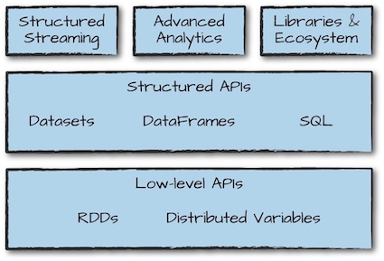
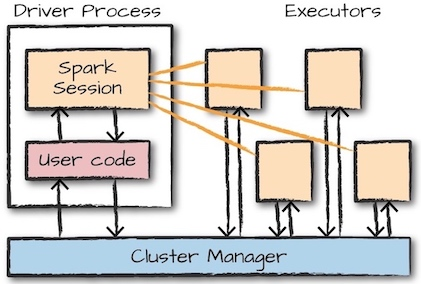
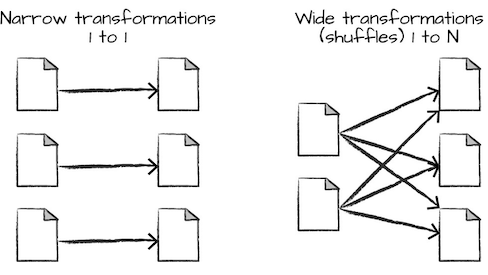

---
title: 1 简介
toc: false
date: 2017-10-30
---     


[Apache Spark](https://spark.apache.org/)<!--是用于大数据处理的集群计算框架。它-->包括一个统一的计算引擎和多个在集群中进行数据并行处理的库。<!--它并没有以MapReduce作为执行引擎，而是使用了自己的分布式运行环境在集群上执行。-->Spark最突出的表现在于它能够将作业和作业之间的大规模的工作数据集存储在内存中，因此迭代算法和交互式分析可以从Spark中获益最大。 




* 统一：Spark支持各种数据分析任务，从数据加载、查询到流处理都可以用相同的计算引擎和一致的API。
* 计算引擎：不同于Hadoop包括一个文件系统(HDFS)和计算引擎(MapReduce)，Spark仅包含计算引擎，但是支持很多外部存储(包括HDFS)，使得数据访问更加方便。
* 库：Spark支持标准库(Spark SQL, MLlib, Spark Streaming, GraphX)和第三方库([列表](http://spark-packages.org))。

!!! note "Hadoop v.s. Spark"

    对于容错(fault-tolerance)，Hadoop在map和reduce步骤之间，为了可以从可能的失败中恢复，混洗了数据并把中间结果写入到硬盘中。而Spark使用函数式编程实现了容错：不可变数据和保存在内存中。所有的数据操作都是函数式转换。


### 1 简介

Spark应用包含一个**driver**进程和多个**executor**进程。driver进程运行`main()`函数，负责三件事情：

* 维持Spark应用程序的相关信息
* 对用户程序或者输入进行响应
* 分析(analyze)、分布(distribute)、调度(schedule)executors之间的任务(work)

executor负责实际上实施driver分配的任务，并向driver报告任务执行状态和结果。

集群管理器(**cluster manager**)负责维护运行Spark应用的集群。Spark现在支持多种集群管理器：内置的standalone cluster manager，Apache Mesos, Hadoop YARN, Kubernetes。




Spark*作业*(job)是由任意的多阶段(stages)有向无环图(DAG)构成。这些阶段(stages)又被分解为多个*任务*(task)，任务运行在分布于集群中分区上。


### SparkSession

`SparkSession`是一个driver进程。`SparkSession`实例是Spark执行用户自定义操作的方式，和Spark应用一一对应。在Scala和Python中，`SparkSession`实例就是`spark`变量。

```scala
scala> spark
res0: org.apache.spark.sql.SparkSession = org.apache.spark.sql.SparkSession@2eb91767
scala> val myRange = spark.range(1000).toDF("number")
myRange: org.apache.spark.sql.DataFrame = [number: bigint]
```

### DataFrames

DataFrame是最常见的结构化API，代表一个表格的数据。定义表格列以及列的类型的list称为schema。不同于spreadsheet, Spark DataFrame分布在多个节点上。


### Partitions

为了允许每一个executor并行处理任务，Spark把数据分块称为**partitions**(分区)。一个分区是集群中一台主机上的多行数据。DataFrame的分区代表了执行期间数据在集群中的物理分布。


### Transformations

在Spark中，数据结构是不可变的，所以创建以后就不能修改。为了改变一个DataFrame，需要采取**转换**(transformations)操作。

```scala
val divisBy2 = myRange.where("number % 2 = 0")
```

一共有两种类型的转换：

* narrow transformations: 输入分区导致一个输出分区
* wide transformations: 输入分区导致多个输出分区，也叫做shuffle



对于narrow transformations, Spark会自动采取pipelining(例如如果在DataFrame上使用多个过滤器，它们都会被在内存中操作)。但是对于shuffle, Spark会把结果写入到硬盘。

转换是惰性求值的，在对RDD执行一个动作之前，不会实际调用任何转换。

### Action

**动作**(Action)指示Spark从一系列转换中计算结果。动作有三种：

* 观察数据
* 收集数据
* 写数据


### 开发和部署Spark应用

运行Spark应用的最简单方法是使用`spark-submit`提交

```bash
./bin/spark-submit \
  --class <main-class> \
  --master <master-url> \
  --deploy-mode <deploy-mode> \
  --conf <key>=<value> \
  ... # other options
  <application-jar> \
  [application-arguments]
```


### Spark UI

通过Spark Web UI可以监视作业(job)。本地模式的地址为[http://localhost:4040](http://localhost:4040)。


