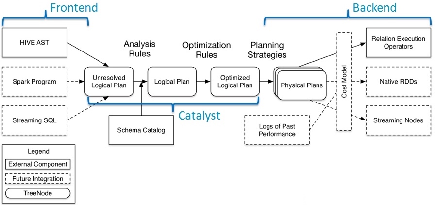
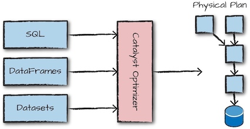

---
title: 2 Structured API
toc: false
date: 2017-10-30
---     


Spark Structured API包括三种核心类型：Datasets, DataFrames, SQL。

数据可以是结构化(structured)、半结构化(semi-structured)和非结构化(unstructured)的。


对于常规的RDDs，Spark不知道其数据的schema，也就是说不知道这些类型的结构。并且由于不知其具体结构，因此无法很好的优化。


!!! note ""DataFrames v.s. Datasets"

    DataFrames和DataSets是分布式的、像表一样有行列的数据集。它们的区别是
    
    * ***untyped*** DataFrames: only checks whether types line up to those specified in the schema at *runtime*
    * ***typed*** DataSets: check whether types conform to the specification at *compile time*
    
    $\rightarrow$ **Datasets: Type-Safe Structured APIs**
    
    对于Spark in Scala来说，DataFrames是`Row`类型的DataSets。
    
    ```scala
    type DataFrame = Dataset[Row]
    ```
    
    可以认为DataSets是RDDs和DataFrames之间的妥协。


### Structured API Execution



简单来说，Spark对代码中Structured API的执行主要有以下几个步骤：

* 编写DataFrame/Dataset/SQL代码
* 如果代码没有错误，Spark会将这些代码转换成逻辑计划(Logical Plan)
* Spark将生成的逻辑计划记过一系列优化(Catalyst Optimizer)，转换为物理计划(Physical Plan)
* Spark在集群上执行物理计划(RDD操作)。





转化为logical plan的第一步是转化为unresolved logical plan: 虽然代码有效，但是它指代的表格或者列可能不存在。随后Spark使用*Catalog*(存储着所有表格和DataFrame信息)去解析表格和列。如果需要的表格和列不存在，会拒绝unresolved logical plan。如果通过的话，就使用Catalyst Optimizer优化logical plan。


优化逻辑计划(Optimized logical plan)根据不同的物理执行策略(physical execution strategies)产生多个physical plans，通过cost model的比较，选择最优physical plan，最后在集群上执行。


除此之外，Spark在运行期间会进一步优化，产生能够移除执行期间的任务和阶段的原生Java字节码。


!!! examples "显示逻辑/物理执行计划"
    
    在Spark-shell中使用`explain extended`命令可以打印出从逻辑计划到物理计划的整个过程。例如
    
    ```sql
    create table t(key string, value string);
    explain extended select a.key*(2+3), b.value from  t a join t b on a.key = b.key and a.key > 3;
    ```
    上述执行结果显示为
    
    ```sql
    == Parsed Logical Plan ==
    'Project [unresolvedalias(('a.key * (2 + 3)), None), 'b.value]
    +- 'Join Inner, (('a.key = 'b.key) && ('a.key > 3))
       :- 'UnresolvedRelation `t`, a
       +- 'UnresolvedRelation `t`, b
    
    == Analyzed Logical Plan ==
    (CAST(key AS DOUBLE) * CAST((2 + 3) AS DOUBLE)): double, value: string
    Project [(cast(key#321 as double) * cast((2 + 3) as double)) AS (CAST(key AS DOUBLE) * CAST((2 + 3) AS DOUBLE))#325, value#324]
    +- Join Inner, ((key#321 = key#323) && (cast(key#321 as double) > cast(3 as double)))
       :- SubqueryAlias a
       :  +- MetastoreRelation default, t
       +- SubqueryAlias b
          +- MetastoreRelation default, t
    
    == Optimized Logical Plan ==
    Project [(cast(key#321 as double) * 5.0) AS (CAST(key AS DOUBLE) * CAST((2 + 3) AS DOUBLE))#325, value#324]
    +- Join Inner, (key#321 = key#323)
       :- Project [key#321]
       :  +- Filter (isnotnull(key#321) && (cast(key#321 as double) > 3.0))
       :     +- MetastoreRelation default, t
       +- Filter (isnotnull(key#323) && (cast(key#323 as double) > 3.0))
          +- MetastoreRelation default, t
    
    == Physical Plan ==
    *Project [(cast(key#321 as double) * 5.0) AS (CAST(key AS DOUBLE) * CAST((2 + 3) AS DOUBLE))#325, value#324]
    +- *SortMergeJoin [key#321], [key#323], Inner
       :- *Sort [key#321 ASC NULLS FIRST], false, 0
       :  +- Exchange hashpartitioning(key#321, 200)
       :     +- *Filter (isnotnull(key#321) && (cast(key#321 as double) > 3.0))
       :        +- HiveTableScan [key#321], MetastoreRelation default, t
       +- *Sort [key#323 ASC NULLS FIRST], false, 0
          +- Exchange hashpartitioning(key#323, 200)
             +- *Filter (isnotnull(key#323) && (cast(key#323 as double) > 3.0))
                +- HiveTableScan [key#323, value#324], MetastoreRelation default, t
    ```

### Spark类型

Spark使用Catalyst维护类型信息，Spark类型与其支持的不同语言(Scala, Python等)中的类型一一对应。当使用Spark时，Spark会将输入语言的表达式转化为对应的Spark类型的表达式，然后再操作。以Scala为例，下面是Scala类型对应的Spark类型：


Spark支持的复杂数据类型


### DataFrames

DataFrames are 

* A **relational** API over Spark's RDDs: because sometimes it is more convenient to use declarative relational APIs than functional APIs for analysis jobs.
* Able to be automatically aggressively **optimized**: Spark SQL applies years of research on relational optimizations in the databases community to Spark.
* **Untyped**!: The elements within DataFrames are `Row`s, which are not parameterized by a type. Therefore, the Scala compiler cannot type check Spark SQL schemas in DataFrames.


#### Schema

Schema定义了DataFrame中列的名称和类型。Schema是`StructType`类型，由`StructField`组成。`StructField`包括名字，类型以及一个布尔值(列是否可以包含null)。例如：

```scala
StructType(StructField(DEST_COUNTRY_NAME,StringType,true), 
        StructField(ORIGIN_COUNTRY_NAME,StringType,true), 
        StructField(count,LongType,true))
```

可以让数据源定义schema(叫做*schema-on-read*)，也可以显示定义schema。Schema-on-read适用于临时分析数据，可能会引起一些数据精度问题(例如`long`设置为`int`)。在ETL时，自定义schema往往更好。

!!! example ""

    ```scala
    /* schema on read */
    scala> val df = spark.read.format("json").load("2015-summary.json")
    scala> df.printSchema()
    root
     |-- DEST_COUNTRY_NAME: string (nullable = true)
     |-- ORIGIN_COUNTRY_NAME: string (nullable = true)
     |-- count: long (nullable = true)
    
    /* 指定schema */
    val myManualSchema = StructType(Array(StructField("DEST_COUNTRY_NAME", StringType, true), 
        StructField("ORIGIN_COUNTRY_NAME", StringType, true), StructField("count", LongType, false,
        Metadata.fromJson("{\"hello\":\"world\"}")) )) 
    val df = spark.read.format("json").schema(myManualSchema).load("2015-summary.json")
    ```


​    
​    
!!! note "RDD转成DataFrame"
​    
    把RDD直接转换成DataFrame需要提供schema。例如：
    
    ```scala
      // log schema
    val logschema: StructType = StructType(Array(
      StructField("url", StringType, nullable=true),
      StructField("ip", StringType, nullable=true),
      StructField("city", StringType, nullable=true),
      StructField("time", StringType, nullable=true),
      StructField("date", StringType, nullable=true),
      StructField("traffic", StringType, nullable=true)
    ))
    val df = spark.createDataFrame(logs, logschema)
    ```

#### 列和表达式

Spark中的列与pandas DataFrame中的列类似。你可以选择(select)，处理(manipulate)，移除(remove)列，这些操作都是表达式(*expressions*)。使用`col`或者`column`函数是最简单使用列的两种方法。另外可以使用`$`或者`'`符号表示列。列不会被解析直到在catalog中比对信息。

```scala
// in scala
import org.apache.spark.sql.functions.{col, column}
col("myColumn")    df.filter(col("age") > 18)
column("myColumn") df.filter(column("age") > 18)
$"myColumn"        df.filter($"age" > 18)
'myColumn          df.filter('age > 18)
```

也可以在特定DataFrame上使用`col`方法，来指定该DataFrame的列，例如`df.col("myColumn")`。注意的是列一直未解析，直到与存储在*catalog*中的列名相比较。

表达式(expression)是DataFrame的记录(record)中的值的一系列转换(transformation)。表达式可以通过`expr`函数创建，它指代的是一个DataFrame列。列属于表达式。`expr("someCol")`相当于`col("SomeCol")`。`expr("someCol - 5")`相当于`col("someCol") - 5`。

复杂的表达式例如`expr("(((someCol + 5) * 200) - 6) < otherCol")`


#### 记录和行

DataFrame中的每一行就是一个记录(record)。Spark用类型`Row`的对象表示记录。Spark使用列表达式(column expressions)操作`Row`对象。`Row`对象内部表示为字节数组(arrays of bytes)。可以手动创建`Row`：

```scala
import org.apache.spark.sql.Row
val myRow = Row("Hello", null, 1, false)
```


#### 转换

DataFrame的API类似于SQL，常见的转换：

``` scala
def select(col: String, cols: String*): DataFrame 
// selects a set of named columns and returns a new DataFrame with these 
// columns as a result.

def withColumn(colName: String, col: Column): DataFrame
// Returns a new Dataset by adding a column or replacing the existing column 
// that has the same name.

def agg(expr: Column, exprs: Column*): DataFrame 
// performs aggregations on a series of columns and returns a new DataFrame 
// with the calculated output.

def groupBy(col1: String, cols: String*): DataFrame // simplified 
// groups the DataFrame using the specified columns. 
// Intended to be used before an aggregation.

def join(right: DataFrame): DataFrame // simplified 
// inner join with another DataFrame
```

<hh>创建DataFrame</hh>

```scala
val df = spark.read.format("json").load(
```


### Spark SQL

Spark SQL是Spark最重要和最强大的功能之一。Spark SQL可以运行SQL语句，其SQL语句遵循ANSI SQL:2003标准。Spark SQL CLI工具(`spark-sql`)可以很方便的使用Spark SQL。也可以使用`spark.sql()`方法运行SQL语句，这将会返回DataFrame。

```scala
scala> val df = spark.read.json("2015-summary.json").createOrReplaceTempView("flight")
scala> spark.sql("""
     | select dest_country_name, sum(count)
     | from flight group by dest_country_name
     | """).where("dest_country_name like 'S%'").
     | where("`sum(count)` > 10").count()
res: Long = 12
```

Spark SQL可以连接Hive metastore。[Hive metastore](../Hadoop权威指南/17 Hive.md)维持着表的信息。若要把Spark SQL连接到一个部署好的Hive上，必须把`hive-site.xml`复制到Spark的配置文件目录(`$SPARK_HOME/conf`)中。

如果没有部署Hive， Spark SQL会在当前工作目录($SPARK_HOME/bin)中创建出自己的Hive元数据仓库(metastore_db文件夹)。创建的表会放在默认的文件系统中的`/user/hive/warehouse`目录中。

#### 运行Spark SQL查询

运行Spark查询有多种方式。如果要使用Hive，则先把相关配置文件(`hive-site.xml`, `core-site.xml`, `hdfs-site.xml`)拷贝到Hive配置目录下。除此之外，如果要使用Hive，需要在启动`spark-shell`时加上`mysql-connector`依赖:

```bash
cp $HIVE_HOME/conf/hive-site.xml $SPARK_HOME/conf
spark-shell --master "local[*]"  \
    --jars $HIVE_HOME/lib/mysql-connector-java-5.1.48.jar
spark-sql --master "local[*]"  \
    --jars $HIVE_HOME/lib/mysql-connector-java-5.1.48.jar
```

Spark还提供了Thrift JDBC/ODBC服务。Spark Thrift Server是基于HiveServer2实现的一个Thrift服务，旨在无缝兼容HiveServer2，从而可以直接使用hive的beeline访问。同样的，需要添加依赖。

```bash
start-thriftserver.sh --master "local[*]" \
    --jars $HIVE_HOME/lib/mysql-connector-java-5.1.48.jar
beeline -u jdbc:hive2://localhost:10000
```

Spark Thrift Server的启动其实是通过spark-submit将HiveThriftServer2提交给集群执行的，所以HiveThriftServer2程序运行起来后就等于是一个长期在集群上运行的spark application。。每次启动Spark-Shell、Spark-sql都是一个Spark Application，但是对于ThriftServer，不管启动多少个客户端，永远都是一个Spark Application，解决了数据共享的问题，多个客户端可以共享数据。


|	 | Hive on Spark |	Spark Thrift Server |
| --- | --- | --- |
|	任务提交模式 |	每个session都会创建一个RemoteDriver，也就是对于一个Application。之后将sql解析成执行的物理计划序列化后发到RemoteDriver执行  |	本身的Server服务就是一个Driver，直接接收sql执行。也就是所有的session都共享一个Application |
|	性能	|	性能一般	|	如果存储格式是orc或者parquet，性能会比hive高几倍，某些语句甚至会高几十倍。其他格式的话，性能相差不是很大，有时hive性能会更好 |
|	并发	|	如果任务执行不是异步的，就是在thrift的worker线程中执行，受worker线程数量的限制。 异步的话则放到线程池执行，并发度受异步线程池大小限制。 |	处理任务的模式和Hive一样。|
|	sql兼容	|	主要支持ANSI SQL 2003，但并不完全遵守，只是大部分支持。并扩展了很多自己的语法 |		Spark SQL也有自己的实现标准，因此和hive不会完全兼容。具体哪些语句会不兼容需要测试才能知道 |
|	HA	|	可以通过zk实现HA	没有内置的HA实现，不过spark社区提了一个issue并带上了patch，可以拿来用：https://issues.apache.org/jira/browse/SPARK-11100 |


### DataSets

DataSets只支持基于JVM的语言(Scala和Java)，可以分别用case class和Java Bean指定DataSets的类型。使用DataSets的场景一般有：当一些操作不能使用DataFrame时、或者需要类型安全且愿意付出降低性能的代价时。

#### Encoder

为了有效的支持特定域对象(domain-specific objects)，DataSets需要使用encoder将特定域类型(domain-specific type)映射为Spark内部类。例如，给定有`name`(string)和`age`(int)字段的类`Person`，encoder指导Spark在运行时产生代码，将`Person`对象序列化为二进制结构(binary structure)。当使用DataFrames时，这个二进制结构就是`Row`。

使用DataSet时，Spark会将`Row`转化为指定的特定域对象。在Scala中，使用`case class`创建特定域对象。这种转换虽然损失了性能，但是提供了更多灵活性。


```java
import org.apache.spark.sql.Encoders;
public class Flight implements Serializable{ 
    String DEST_COUNTRY_NAME; 
    String ORIGIN_COUNTRY_NAME; 
    Long DEST_COUNTRY_NAME; 
}
Dataset<Flight> flights = spark.read.parquet("2010-summary.parquet/") 
    .as(Encoders.bean(Flight.class));
```

#### 创建Datasets

在Scala中，创建Datasets之前，需要定义`case class`。`case class`是一个类，但它具有不可变，模式匹配、便于使用等特点。

!!! example "Flight"

    ```scala
    case class Flight(DEST_COUNTRY_NAME: String, ORIGIN_COUNTRY_NAME: String, count: BigInt)
    val flightsDF = spark.read.parquet("/data/flight-data/parquet/2010-summary.parquet/") 
    val flights = flightsDF.as[Flight]
    ```


由于DataFrame其实是Dataset[Row]，所以Dataset的动作和转换与DataFrame基本相同，不再赘述。


### 外部数据

#### 读取
Spark支持多种文件格式，读取的基本格式为

```scala
spark.read.format(...).option("key", "value").schema(...).load()
/* example */
spark.read.format("csv").option("mode", "FAILFAST") 
    .option("inferSchema", "true") .option("path", "path/to/file(s)") 
    .schema(someSchema) .load()
```

从外部数据读取的时候可能会遇到错误数据，read mode指定了这时Spark会采取的情况(默认`permissive`)：


可以使用`spark.read`后面跟文件格式(`json`/`csv`/`textFile`/`parquet`等)来读取文件。例如

```scala
spark.read.json("path/to/file")
```

Spark支持本地文件系统，但是要求文件在集群中所有节点的相同路径路径下都可以找到，格式为`file://`。默认使用HDFS，格式为`hdfs://master:port/path`。


```scala
val df = spark.read.json("/apps/spark/json/2015-summary.json")
val df = spark.read.json("file:///Users/larry/Documents/json/2015-summary.json")
```

#### 写入

Spark写入数据的基本格式为

```scala
dataframe.write.format(...).option(...).partitionBy(...)
        .bucketBy(...).sortBy(...).save()
/* example */
dataframe.write.format("csv")
    .option("mode", "OVERWRITE")
    .option("dateFormat", "yyyy-MM-dd")
    .option("path", "path/to/files")
    .save()
```

save mode默认是`errorIfExists`:


!!! example "MySQL写入"

    ```scala tab="SQL"
    import java.sql.DriverManager
    val connection = DriverManager.getConnection(url)
    val dbDataFrame = spark.read.format("jdbc").option("url", url
        .option("dbtable", tablename).option("driver", driver).load()
    csvFile.wirte.mode("overwrite").jdbc(newPath, tablename, props)
    ```


