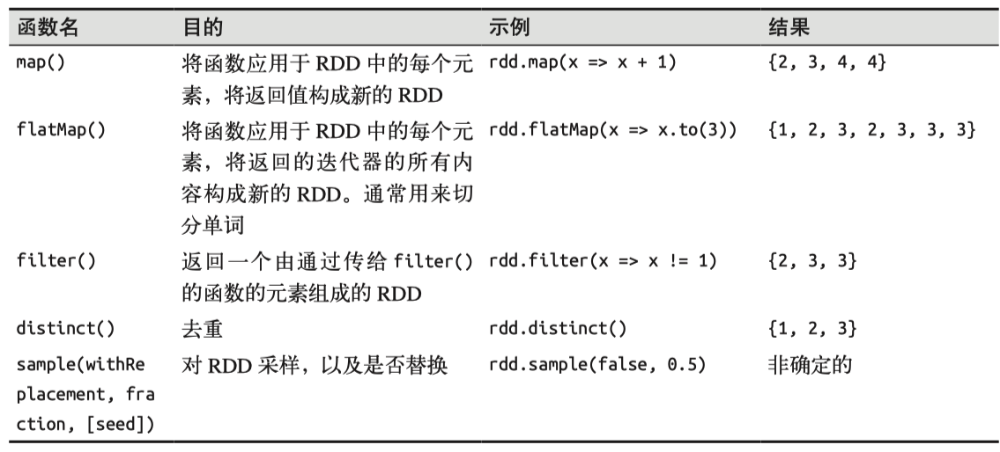
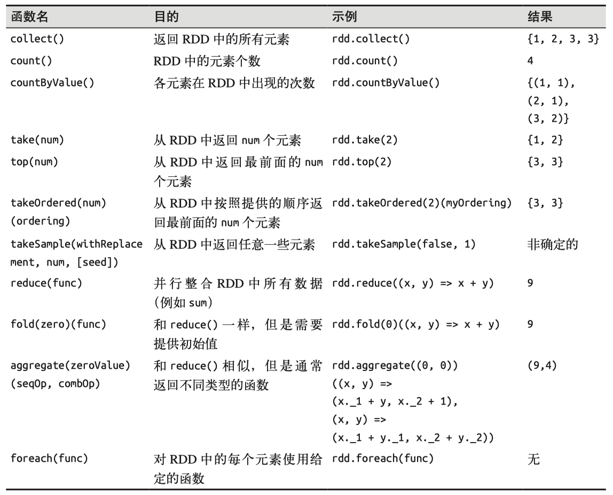
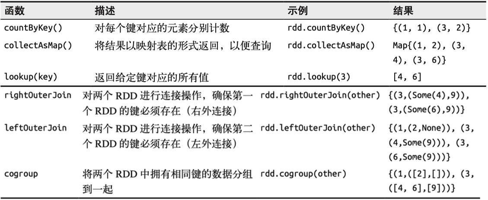
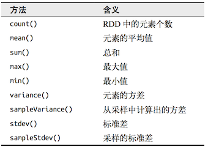

---
title: 3 Low-level APIs
toc: false
date: 2017-10-30
---     


在Spark中，有两类Low-level APIs：一种是操作RDD的，另一种是分布式共享变量(广播变量和累加器)。事实上，几乎所有Spark代码都会转化为这些低级操作：DataFrames和Datasets的操作会变成一系列RDD转换。SparkContext是低级API功能的入口，可以使用`spark.sparkContext`获得SparkContext。

### RDD

**弹性分布式数据集**(Resilient Distributed Dataset, 简称RDD)，是Spark中最核心的概念，它是在集群中跨多个机器分区存储的一个只读对象的集合。在典型的Spark程序中，首先要加载一个或多个RDD，它们作为输入通过一系列转换得到一组目标RDD，然后对这些目标RDD执行一个动作。

除非特别需要，不推荐使用RDD，因为RDD缺少Structured APIs中的优化。对于大多数情况，DataFrames更有效、更稳定、更易表达。RDD的最常见使用场景是对数据物理分布的精确控制(自定义数据分区)。

RDD的创建有多种方法：

1. 来自一个内存中的对象集合(也称为并行化一个集合)
2. 使用外部存储器(例如HDFS)中的数据集
3. 对现有的RDD进行转换
4. 从DataFrame/DataSet转换

!!! Example "创建RDD"
    
    ```scala tab="并行化一个集合"    
    val params = sc.parallelize(1 to 10)
    ```
        
    ```scala tab="使用外部存储器中的数据集"    
    val text: RDD[String] = sc.textFile(inputPath)
    ```
        
    ```scala tab="对现有的RDD进行转换"    
    val text= sc.textFile(inputPath)
    val lower: RDD[String] = text.map(_.toLowerCase())
    ```
    
    ```scala tab="从DataFrame/DataSet转换"
    // converts a Dataset[Long] to RDD[Long]
    val h = spark.range(500).rdd
    ```

#### 转换和动作 

RDD支持distinct, filter, map, flatMap, sortBy等转换，支持reduce, count, first, take, max, min等动作。

对一个数据为{1, 2, 3, 3}的RDD进行基本的RDD转化操作:



对一个数据为{1, 2, 3, 3}的RDD进行基本的RDD行动操作:




#### 持久化

[参考官网](https://spark.apache.org/docs/latest/rdd-programming-guide.html#rdd-persistence)

RDD可以使用`cache()`或者`persist()`方法进行持久化。RDD可以有不同的持久化级别(见下表)。默认情况下，`persist()`会把数据以序列化的形式缓存在JVM的堆空间中(默认`MEMORY_ONLY`)。`cache()`其实就是`persist(StorageLevel.MEMORY_ONLY)`。

```
Level                Space used  CPU time  In memory  On disk  Serialized
-------------------------------------------------------------------------
MEMORY_ONLY          High        Low       Y          N        N
MEMORY_ONLY_SER      Low         High      Y          N        Y
MEMORY_AND_DISK      High        Medium    Some       Some     Some
MEMORY_AND_DISK_SER  Low         High      Some       Some     Y
DISK_ONLY            Low         High      N          Y        Y
```


#### checkpointing

Checkpointing把RDD保存到磁盘，以便后续使用这个RDD时可以直接使用，而不用从头开始计算这个RDD。在迭代计算中，这非常有用。

```scala
spark.sparkContext.setCheckpointDir("/some/path/for/checkpointing")
words.checkpoint()
```


#### Pair RDD

Pair RDD是键值对的RDD(key-value RDD)。Pair RDD的转化操作如下所示：以键值对集合 {(1, 2), (3, 4), (3, 6)} 为例


Pair RDD的行动操作（以键值对集合 {(1, 2), (3, 4), (3, 6)}为例）



#### 数值RDD

Spark 对包含数值数据的RDD(Numeric RDD)提供了一些描述性的统计操作。统计数据都会在调用`stats()`时通过一次遍历数据计算出来, 并以 `StatsCounter`对象返回。




!!! example 
    
    ```scala
    scala> val distance = sc.range(1,1000)
    distance: org.apache.spark.rdd.RDD[Long] = MapPartitionsRDD[26]    
    scala> distance.sum()
    res3: Double = 499500.0
    scala> distance.mean()
    res4: Double = 500.0
    scala> distance.stats()
    res5: org.apache.spark.util.StatCounter = 
        (count: 999, mean: 500.000000, stdev: 288.386315, 
        max: 999.000000, min: 1.000000)
    ```

#### 分区

你可以控制RDD的分区方式，用来减少通信开销、避免数据倾斜。常见的RDD分区有`HashPartitioner`和`RangePartitioner`。常见的分区函数有`coalesce`, `repartition`。

* `coalesce(numpartition, shuffle=false)`: 合并同一个节点上的分区防止数据混洗, 减小分区数到numpartition。
* `repartition(numpartition)`: 对数据重新分区，其实是`coalesce(numpartition, shuffle=true)`的封装。

可以使用`partitionBy`来自定义分区。

!!! example 
    
    用户所订阅的主题的列表保存在RDD[(UserID, UserInfo)]中。过去五分钟发生的事件保存在RDD[(UserID, LinkInfo)]中。两张表会周期性的进行`join()`操作。默认情况下，连接操作会将两个数据集中的所有键的哈希值都求出来，将该哈希值相同的记录通过网络传到同一台机器 上，然后在那台机器上对所有键相同的记录进行连接操作。因为`userData`表比每五分钟出现的访问日志表`events`要大得多，所以要浪费时间做很多额外工作：在每次调用时都对`userData`表进行哈希值计算和跨节点数据混洗，虽然这些数据从来都不会变化。
    
    ```scala
    def processNewLogs(logFileName: String) {
      val events = sc.sequenceFile[UserID, LinkInfo](logFileName)
      val joined = userData.join(events) // RDD of (UserID, (UserInfo, LinkInfo)) pairs
      val offTopicVisits = joined.filter {
        case (userId, (userInfo, linkInfo)) => // Expand the tuple into its components
          !userInfo.topics.contains(linkInfo.topic)
      }.count()
      println("Number of visits to non-subscribed topics: " + offTopicVisits)
    }
    ```
    
    要解决这一问题也很简单：在程序开始时， 对`userData`表使用`partitionBy()`转化操作， 将这张表转为哈希分区。可以通过向 `partitionBy`传递一个`spark.HashPartitioner`对象来实现该操作。由于在构建`userData`时调用了`partitionBy()`，Spark就知道了该RDD是根据键的哈希值来分区的，这样在调用`join()`时，Spark就会利用到这一点。
    
    ```scala
    val userData = sc.sequenceFile[UserID, UserInfo]("hdfs://...")
        .partitionBy(new HashPartitioner(100)) // 构造100个分区 
        .persist()
    ```
    
    如果没有将`partitionBy()`转化操作的结果持久化， 那么后面每次用到这个RDD时都会重复地对数据进行分区操作，`partitionBy()`带来的好处就会被抵消。


​    
​    
自定义分区一般用来避免数据倾斜(数据在集群上的不平衡分布)。

!!! example 
    
    下面一个例子是购物日志。格式为(InvoiceNo, StockCode, Description, Quantity, InvoiceData, UnitPrice, CustomerID, Country)。
    
    ```scala
    val df = spark.read.option("header", "true")
        .option("inferSchema", "true")
        .csv("/data/retail-data/all/")
    val rdd = df.coalesce(10).rdd
    val keyedRDD = rdd.keyBy(row => row(6).asInstanceOf[Int].toDouble)
    
    class DomainPartitioner extends Partitioner {
      def numPartitions = 3
      def getPartition(key: Any): Int = {
        val customerId = key.asInstanceOf[Double].toInt
        if (customerId == 17850.0 || customerId == 12583.0)
          0
        else new java.util.Random().nextInt(2) + 1
      }
    }
    keyedRDD.partitionBy(new DomainPartitioner)
      .map(_._1).glom().map(_.toSet.toSeq.length)
      .take(5).foreach(println)
    }
    ```
#### 基于分区的操作

为了避免对每个元素进行重复的操作，可以使用基于分区的操作(`mapPartitions`, `foreachPartitions`)。

### Distributed Shared Variables

Spark有两种类型的分布式共享变量(distributed shared variables):

* 累加器（accumulators): 把所有任务中的数据一起加到一个共享的结果中(例如调试时记录不能解析的输入记录数目)
* 广播变量(broadcast variables): 向所有节点发送一个较大的只读值，以供多个Spark动作使用而不需要重复发送

#### 广播变量


广播变量可以让程序高效地向所有工作节点发送一个较大的只读值，以供一个或多个Spark操作使用。


!!! example 

    假设Spark程序通过呼号的前缀来查询对应的国家。可以把`singPrefixes`设置为广播变量，在任务中通过对Broadcast对象调用value来获取该对象的值。这个值只会被发送到各节点一次。
    
    ```scala
    // 查询RDD contactCounts中的呼号的对应位置。
    // 将呼号前缀读取为国家代码来进行查询
    val signPrefixes = sc.broadcast(loadCallSignTable()) 
    val countryContactCounts = contactCounts.map{case (sign, count) =>
        val country = lookupInArray(sign, signPrefixes.value)
        (country, count)
    }.reduceByKey((x, y) => x + y)
    countryContactCounts.saveAsTextFile(outputDir + "/countries.txt")
    ```


​    
​    


#### 累加器


累加器可以将工作节点中的值聚合到驱动器程序中，常见用途是在调试时对作业执行过程中的事件进行计数。


!!! example 
    
    假设我们在 从文件中读取呼号列表对应的日志，同时也想知道输入文件中有多少空行（也许不希望在 有效输入中看到很多这样的行）。
    
    ```scala
    val sc = new SparkContext(...) 
    val file = sc.textFile("file.txt")
    val blankLines = sc.accumulator(0) // 创建Accumulator[Int]并初始化为0
    val callSigns = file.flatMap(line => {
        if (line == "") { blankLines += 1 // 累加器加1 
        }
        line.split(" ") 
    })
    callSigns.saveAsTextFile("output.txt")
    println("Blank lines: " + blankLines.value)
    ```


