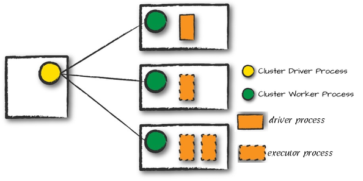
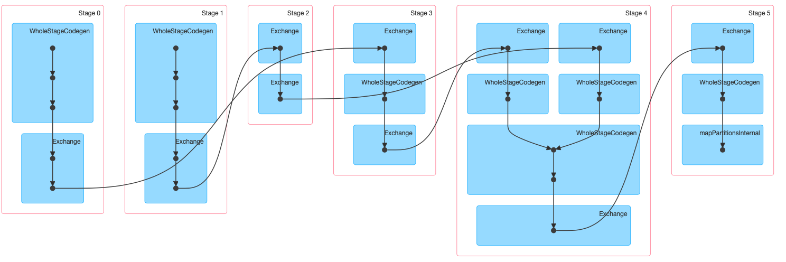
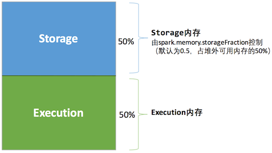
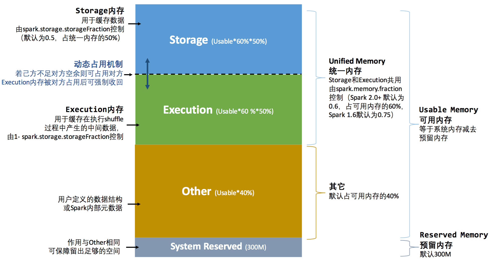
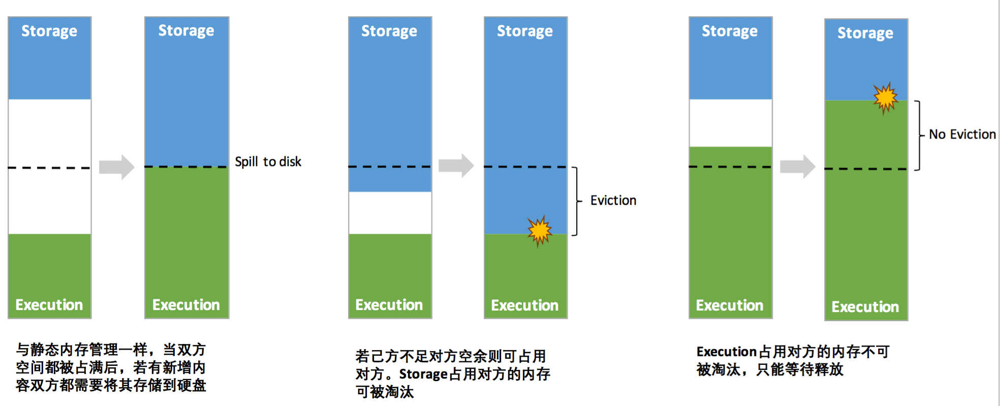
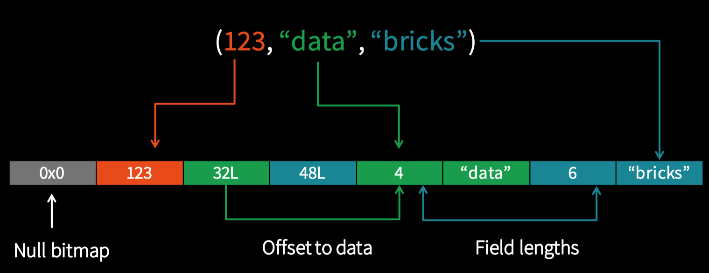
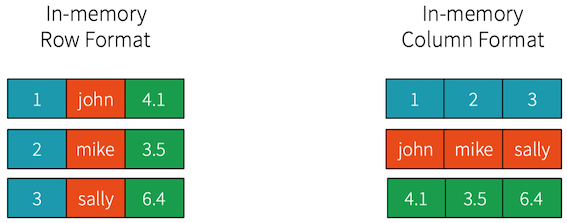

---
title: 4 Spark是如何在集群上运行的
toc: false
date: 2017-10-30
---     


### 运行模式

运行模式(execution mode)包括：

* 集群模式(cluster mode)
* 客户模式(client mode)
* 本地模式(local mode)

在使用`spark-submit`提交时，可以使用`--deploy-mode <deploy-mode>`指定模式(`cluster`或者`client`)。


#### 集群模式

在集群模式(Cluster mode)中，用户提交编译好的JAR、Python脚本到集群管理器。然后集群管理器在集群中的一个工作节点上运行driver进程。也就是说集群管理器(cluster manager)负责维护所有Spark应用相关的进程。



<small>注意这里的Cluster Driver/Worker Process对应的是集群管理器(例如Yarn)</small>

#### 客户模式

客户模式(client mode)几乎与集群模式相同，除了Spark driver在提交应用的客户端机器上。也就是说 _客户端机器负责维持Spark driver进程，集群管理器负责维持executor进程_ 。运行driver进程的机器是不在集群中的。


#### 本地模式

本地模式(local mode)把整个Spark应用都在一台机器上运行，通过*多线程*实现并行。一般使用该模式学习Spark，测试应用。


### 部署模式

Spark支持多种部署模式：Standalone, Spark on Mesos, Spark on YARN。

* Standalone模式：自带完整的服务，可单独部署到一个集群中，无需依赖任何其他资源管理系统。
* Spark on YARN模式：支持yarn-cluster和yarn-client
    * yarn-cluster使用与生产环境
    * yarn-client使用于交互、调试
* Spark on Mesos模式：支持粗粒度和细粒度模式
    * 粗粒度模式(Coarse-grained Mode)
    * 细粒度模式(Fine-grained Mode) 


```bash tab="yarn-client"
spark-submit \
	--master yarn \
	--driver-memory 1g \
	--executor-memory 1g \
	--executor-cores 2 \
	--class org.apache.spark.examples.SparkPi \
	examples/jars/spark-examples_2.11-2.3.4.jar \
	1000
```

```bash tab="yarn-cluster"
spark-submit \
	--master yarn \
	--driver-memory 1g \
	--deploy-mode cluster \
	--executor-memory 1g \
	--executor-cores 2 \
	--class org.apache.spark.examples.SparkPi \
	examples/jars/spark-examples_2.11-2.3.4.jar \
	1000
```


### Spark应用的生命周期(Spark外部)

以使用`spark-submit`命令运行Spark应用为例，说明Spark应用的生命周期：

1. 客户端请求(Client Request)：客户端提交应用(`spark-submit`), 向集群管理器要求spark driver进程的资源；集群管理器接收请求后，在其中一个节点上启动driver进程。
2. 运行(launch): `SparkSession`初始化Spark集群，要求集群管理器在集群上运行executor进程
3. 执行(execution): driver和worker相互联系，执行代码，移动数据
4. 完成(Completion): spark应用执行完毕，driver进程退出，集群管理器关闭对应executors


### Spark应用的生命周期(Spark内部)


#### The SparkSession
Spark应用(Spark Application)的第一步是创建`SparkSession`。通过`SparkSession`，可以访问所有的低级环境和配置。Spark2.0之前的版本使用`SparkContext`。

```scala
// Creating a SparkSession in Scala
import org.apache.spark.sql.SparkSession
val spark = SparkSession.builder().appName("Spark Example")
    .config("spark.sql.warehouse.dir", "/user/hive/warehouse")
    .getOrCreate()
```

!!! note "SparkSession v.s. SparkContext"

    `SparkSession`中的`SparkContext`代表 _与Spark集群的连接_ 。`SparkContext`可以访问低级API，例如RDD，累加器(accumulators)，广播变量(broadcast variables)。可以直接通过`SparkSession.SparkContext`访问`SparkContext`，也可以用`SparkContext.getOrCreate()`得到`SparkContext`。
    
    ```Scala
    scala> spark.sparkContext
    res0: org.apache.spark.SparkContext = org.apache.spark.SparkContext@75c30a4f
    scala> sc
    res1: org.apache.spark.SparkContext = org.apache.spark.SparkContext@75c30a4f
    scala> SparkContext.getOrCreate()
    scala> import org.apache.spark.SparkContext
    import org.apache.spark.SparkContext
    scala> SparkContext.getOrCreate()
    res3: org.apache.spark.SparkContext = org.apache.spark.SparkContext@75c30a4f
    ```


#### The DAG

Spark使用RDD依赖为每个Spark作业构建一个**有向无环图**(Directed Acyclic Graph, DAG)，决定运行每个任务的地址，并传递该信息给`TaskScheduler`。`TaskScheduler`负责在集群上运行任务。

#### A Spark Job


一般来说，一个动作(action)对应一个Spark作业(job)。动作总是返回结果。每个作业(job)分解为多个阶段(stages)，阶段的数量取决于shuffle操作的次数。


#### Stages

阶段(stages)代表了一组在多个机器上可以一起执行相同操作的任务(tasks)。一般来说，Spark会尽力地把多个任务(tasks)组合成一个stage，但是在shuffle之后，计算引擎会开始新的阶段。一个shuffle代表了一次数据的重新分区(a physical repartitioning of the data)。


!!! example "作业示例"
    
    ```scala
    val df1 = spark.range(2, 10000000, 2) 
    val df2 = spark.range(2, 10000000, 4) 
    val step1 = df1.repartition(5) 
    val step12 = df2.repartition(6) 
    val step2 = step1.selectExpr("id * 5 as id") 
    val step3 = step2.join(step12, "id") 
    val step4 = step3.selectExpr("sum(id)")
    step4.collect()
    ```
    
    `step4.explain()`的执行结果如下
    
    ```text
    == Physical Plan ==
    *(7) HashAggregate(keys=[], functions=[sum(id#6L)])
    +- Exchange SinglePartition
       +- *(6) HashAggregate(keys=[], functions=[partial_sum(id#6L)])
          +- *(6) Project [id#6L]
             +- *(6) SortMergeJoin [id#6L], [id#2L], Inner
                :- *(3) Sort [id#6L ASC NULLS FIRST], false, 0
                :  +- Exchange hashpartitioning(id#6L, 200)
                :     +- *(2) Project [(id#0L * 5) AS id#6L]
                :        +- Exchange RoundRobinPartitioning(5)
                :           +- *(1) Range (2, 10000000, step=2, splits=16)
                +- *(5) Sort [id#2L ASC NULLS FIRST], false, 0
                   +- Exchange hashpartitioning(id#2L, 200)
                      +- Exchange RoundRobinPartitioning(6)
                         +- *(4) Range (2, 10000000, step=4, splits=16)
    ```
    通过Spark WebUI查看Stages如下：
    
    
    
    可以看到这个job一共分为6个stage，每个stage分别有16、16、5、6、200、1个任务。stage 0和stage 1对应`spark.range`，有16个分区。stage 3和stage 4对应`repartition`转换，改变分区数为5和6。stage 4对应`join`，200个任务是`spark.sql.shuffle.partitions`的默认值。


​    
    Dag图如下：
    
    


#### Tasks

每一个任务(task)对应在一个executor上的数据块(blocks of data)和转换(transformations)的组合。所以任务是应用到一个数据分区上的计算单元。


### 执行细节

Spark会自动把可以一起执行的stages和tasks流水线化(pipeline)，例如两个连续的map操作。对于所有的shuffle操作，Spark会把数据写入到存储(例如硬盘)，可以在多个作业(jobs)中重复使用。


#### Pipelining

With pipelining, any sequence of operations that feed data directly into each other, without needing to move it across nodes, is collapsed into a single stage of tasks that do all the operations together

#### Shuffle Persistence

Spark执行shuffle：

1. 一个stage把数据写入到本地硬盘中
2. 下一个stage从对应shuffle文件中抓取记录、执行计算

当运行一个数据已经shuffled的作业时，不会再重复计算，而是从shuffle文件中直接抓取。例如重新运行上例中的`step4.collect()`，只有一个task，一个stage。


### 内存管理

<small>
参考：

* [Deep Dive: Memory Management in Apache Spark](https://www.slideshare.net/databricks/deep-dive-memory-management-in-apache-spark?from_action=save)
* [Apache Spark 内存管理详解](https://www.ibm.com/developerworks/cn/analytics/library/ba-cn-apache-spark-memory-management/index.html)
* [Project Tungsten - Bringing Spark Closer to Bare Metal](https://www.slideshare.net/databricks/spark-performance-whats-next?qid=d56739dd-dfc8-48d2-add4-02aea082cdba&v=&b=&from_search=2)

</small>

在Spark中有两类内存：

* Execution：用作shuffle, joins, sorts, aggregations
* Storage: 用作缓存RDD，存放广播变量


Spark最初采用静态内存分配(static assignment)：按比例分配内存给Execution和Storage，当Execution不够时，使用LRU算法溢出到磁盘。但是这种方法Execution只会利用一部分内存，即使Storage为零时。





自从Spark1.6开始，Spark采用了**统一内存管理**(unified memory management): Storage和Execution共享内存空间，可以动态占用对方的空闲区域。





执行内存的空间被对方占用后，可让对方将占用的部分转存到硬盘，然后"归还"借用的空间。存储内存的空间被对方占用后，无法让对方"归还"。




#### Tungsten


Java对象有很大的开销，例如字符串“abcd”

* Native: 4 bytes with UTF-8 encoding
* Java: 48 bytes
    - 12 byte header
    - 2 bytes per character (UTF-16 internal representation)
    - 20 bytes of additional overhead
    - 8 byte hash code

Tungsten通过优化了Spark的CPU和内存使用:

* 二进制存储格式(binary storage format)
* 运行时代码产生(runtime code generation): Reduce virtual function calls and interpretation overhead


Tungsten的二进制编码：





Whole-stage Codegen Fusing operators together so the generated code looks like hand optimized code:

- Identity chains of operators (“stages”)
- Compile each stage into a single function
- Functionality of a general purpose execution engine; performance as if hand built system just to run your query


Columnar in memory format:



1. More efficient: denser storage, regular data access, easier to index into. Enables vectorized processing.
2. More compatible: Most high-performance external systems are already columnar (numpy, TensorFlow, Parquet); zero serialization/ copy to work with them
3. Easier to extend: process encoded data, integrate with columnar cache, delay materialization in parquet, offload to GPU

