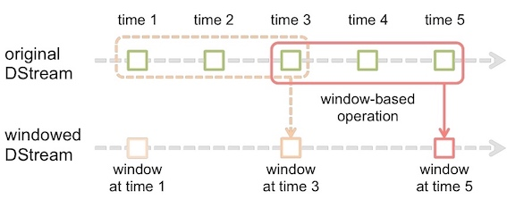
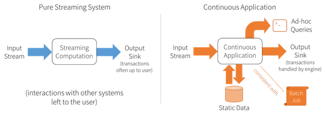

---
title: 5 Spark Streaming
toc: false
date: 2017-10-30
---     

### 基础
类似于RDD和Datasets，Spark对流的的API也分为DStreams、Structrued Streams两类。

What is stream processing?

> **Stream processing** is the act of continuously incorporating new data to compute a result. Batch processing is the computation runs on a fixed-input dataset. 


Although streaming and batch processing sound different, in practice, they often need to work together. For example, streaming applications often need to join input data against a dataset written periodically by a batch job, and the output of streaming jobs is often files or tables that are queried in batch jobs.

Advantages of Stream Processing

1. Stream processing enables lower latency.
2. Stream processing can also be more efficient in updating a result than repeated batch jobs, because it automatically incrementalizes the computation.

#### Stream Processing Design Points

Record-at-a-Time Versus Declarative APIs

* **Record-at-a-Time**: pass each event to the application and let it react using custom code
    * disadvantage: maintaining state, are solely governed by the application. 
    * e.g. Flink, Storm
* **declarative APIs**: application specifies what to compute but not how to compute it in response to each new event and how to recover from failure (which is called processing time).
    * e.g. Spark

Event Time Versus Processing Time

*  **Event time** is the idea of processing data based on timestamps inserted into each record at the source, as opposed to the **Processing time** when the record is received at the streaming application

Continuous Versus Micro-Batch Execution

* In **continuous processing-based systems**, each node in the system is continually listening to messages from other nodes and outputting new updates to its child nodes.
    * advantage: offering the lowest possible *latency*
    * disadvantage: lower maximum *throughput* 
* **Micro-batch systems** wait to accumulate small batches of input data (say, 500 ms’ worth), then process each batch in parallel using a distributed collection of tasks,
    * advantage: high throughput per node 
    * disadvantage: a higher base latency due to waiting to accumulate a micro-batch.


#### Spark's Streaming API


Spark includes two streaming APIs:

* DStream API
    * purely micro-batch oriented
    * has a declarative (functional-based) API but not support for event time
* Structured Streaming API
    * supports continuous processing
    * adds higher-level optimizations, event time

Structured Streaming is a higher-level streaming API built from the ground up on Spark’s Structured APIs.


### Event-Time and Stateful Processing

Stateful processing is only necessary when you need to use or update intermediate information (state) over longer periods of time (in either a microbatch or a record-at-a-time approach). When performing a stateful operation, Spark stores the intermediate information in a *state store*. Spark’s current state store implementation is an in-memory state store that is made fault tolerant by storing intermediate state to the checkpoint directory.

### DStream

[官方文档](https://spark.apache.org/docs/latest/streaming-programming-guide.html)

**DStream**(discretized stream, **离散化流**)是一个RDD序列，每个RDD代表数据流中一个时间片内的数据。


<!--!!! example "DStream例子"

    创建一个流读取本地7777端口的数据。可以使用`nc -lk 7777`发送数据。
    
    ```scala
    // 从SparkConf创建StreamingContext并指定1秒钟的批处理大小 
    val ssc = new StreamingContext(spark.sparkContext, Seconds(1))
    // 连接到本地机器7777端口上后，使用收到的数据创建
    DStream val lines = ssc.socketTextStream("localhost", 7777)
    // 从DStream中筛选出包含字符串"error"的行
    val errorLines = lines.filter(_.contains("error")) 
    // 打印出有"error"的行 errorLines.print()
    errorLines.print()
    // 启动流计算环境StreamingContext并等待它"完成" 
    ssc.start() // 等待作业完成 
    ssc.awaitTermination()
    ```
-->


Spark Streaming为每个输入源启动对应的**接收器**(recevier)。接收器以任务的形式运行在应用的executor进程中，从输入源收集数据并把数据保存在内存中(除了file stream)。 它们收集到输入数据后会把数据复制到另一个executor进程来保障容错性(默认行为)。数据保存在执行器进程的内存中，和缓存RDD的方式一样。驱动器程序中的`StreamingContext`会周期性地运行Spark作业来处理这些数据，把数据与之前时间区间中的RDD进行整合。


Spark Streaming 也提供了**检查点**(checkpoint)机制，可以把状态阶段性地存储到可靠文件系统中(例如HDFS或者S3)。一般来说，需要每处理5-10个批次的数据就保存一次。在恢复数据时, Spark Streaming只需要回溯到上一个检查点即可。

#### 转化操作

DStream的转化操作可以分为**无状态**(stateless)和**有状态**(stateful)两种。

* 在**无状态转化操作**中，每个批次的处理不依赖于之前批次的数据。例如`filter()`和`reducedByKey()`；
* 在**有状态转化操作**中，需要使用之前批次的数据或者是中间结果来计算当前批次的数据。有状态转化操作包括基于滑动窗口的转化操作和追踪状态变化的转化操作。

##### 无状态转化操作
下面是常见的无状态转化操作：


需要记住的是，尽管这些函数看起来像作用在整个流上一样，但事实上每个DStream在内部是由许多RDD(批次)组成，且无状态转化操作是分别应用到每个RDD上的。 例如，`reduceByKey()`会归约每个时间区间中的数据，但不会归约不同区间之间的数据。


除此之外，DStream还提供了一个叫做`transform()`的高级操作符，允许对DStream提供任意一个RDD到RDD的函数。这个函数会在数据流中的每个批次中被调用，生成一个新的流。`transform()`的一个常见应用就是重用你为RDD写的批处理代码。

##### 有状态转换操作

有状态转化操作需要在`StreamingContext`中打开检查点机制来确保容错性。主要的两种类型是滑动窗口和`updateStateByKey()`。有状态转化操作需要在的`StreamingContext`中打开检查点机制来确保容错性。

所有基于窗口的操作都需要两个参数，分别为窗口时长(window duration)以及滑动步长，两者都必须是StreamContext的批次间隔(batch duration)的整数倍。




!!! example "使用window()对窗口进行计数"
    
    ```scala
    val accessLogsWindow = accessLogsDStream.window(Seconds(30), Seconds(10)) 
    val windowCounts = accessLogsWindow.count()
    ```

`reduceByWindow()`和`reduceByKeyAndWindow()`可以对每个窗口更高效地进行归约操作。它们接收一个归约函数，在整个窗口上执行。`updateStateByKey()`可以用来跨批次维护状态。


!!! example "使用updateStateByKey()运行响应代码的计数"
    
    使用`updateStateByKey()`来跟踪日志消息中各 HTTP 响应代码的计数。这里的键是响应代码，状态是代表各响应代码计数的整数，事件则是页面访问。
    
    ```scala
    def updateRunningSum(values: Seq[Long], state: Option[Long]) = { 
        Some(state.getOrElse(0L) + values.size) 
    }
    val responseCodeDStream = accessLogsDStream.map(log => (log.getResponseCode(), 1L)) 
    val responseCodeCountDStream = responseCodeDStream.updateStateByKey(updateRunningSum _)
    ```


#### 输出操作


通用的输出操作`foreachRDD()`， 它用来对DStream中的RDD运行任意计算。 这和`transform()`有些类似， 都可以让我们访问任意RDD。 在`foreachRDD()`中， 可以重用我们在Spark中实现的所有行动操作。 比如， 常见的用例之一是把数据写到诸如MySQL的外部数据库中。用 RDD的`eachPartition()`方法来把它写出去。

```scala tab="Task not serializable"
dstream.foreachRDD { rdd =>
  val connection = createNewConnection()  // executed at the driver
  rdd.foreach { record =>
    connection.send(record) // executed at the worker
  }
}
```

```scala tab="正确"
dstream.foreachRDD { rdd =>
  rdd.foreachPartition { partitionOfRecords =>
    val connection = createNewConnection()
    partitionOfRecords.foreach(record => connection.send(record))
    connection.close()
  }
}
```
#### 输入源
##### 文件流
##### Flume
##### Kafka

请参考官方文档[Spark Streaming + Kafka Integration Guide](https://spark.apache.org/docs/latest/streaming-kafka-0-8-integration.html)

有两种方式使用Spark消费Kafka：

* Receiver-based Approach：使用Receiver接收数据，数据存储在Spark executors中，然后使用Spark Streaming处理数据。机器失效时可能会丢失数据(可以开启预写式日志防止)。Receiver使用Kafka Consumer API构建，将偏移量存储在ZooKeeper中。
* Direct Approach：周期性的消费Kafka数据，偏移量存储在checkpoint中(保证exactly-once)。

```scala tab="KafkaStreaming"
object KafkaStreaming {
  def main(args: Array[String]): Unit = {
    if (args.length != 4) {
      System.err.println("Usage: KafkaStreaming <zkQuorum> " +
        "<topics> <groupId> <numThreads>")
      System.exit(1)
    }

    val Array(zkQuorum, topics, groupId, numThreads) = args
    val config = new SparkConf()
    //config.set("appName", "KafkaStreaming")
    val streamingContext = new StreamingContext(config, Seconds(1))
    val topicMap = topics.split(",").map((_, numThreads.toInt)).toMap
    val kafkaStream = KafkaUtils.createStream(streamingContext,
      zkQuorum, groupId, topicMap)
    kafkaStream.map(_._2).flatMap(_.split("\t"))
    .map((_,1)).reduceByKey(_+_).print()
    streamingContext.start()
    streamingContext.awaitTermination()
  }
}
```

```bash tab="run"
mvn package -DskipTests
scp bigdata-1.0-SNAPSHOT.jar hadoop@centos1:/home/hadoop/lib
spark-submit --class com.zhenhua.bigdata.spark.streaming.KafkaStreaming \
    --master "local[2]" \
    --name KafkaStreaming \
    --packages org.apache.spark:spark-streaming-kafka-0-8_2.11:2.3.4  \
    /home/hadoop/lib/bigdata-1.0-SNAPSHOT.jar  \
    centos3:9092,centos2:9092 test-topic test 1
```


使用0.10.0新KAFKA API的Direct Approach

```scala tab="KafkaStreamingDirect"
object KafkaStreamingDirect {
  def main(args: Array[String]): Unit = {
    if (args.length != 3) {
      System.err.println("Usage: KafkaStreamingDirect <bootstrapServers>" +
        "<topics> <groupId>")
      System.exit(1)
    }
    val Array(bootstrapServers, topics, groupId) = args
    val kafkaParams = Map[String, Object](
      "bootstrap.servers" -> bootstrapServers,
      "key.deserializer" -> classOf[StringDeserializer],
      "value.deserializer" -> classOf[StringDeserializer],
      "group.id" -> groupId,
      "auto.offset.reset" -> "earliest",
      "enable.auto.commit" -> (false: java.lang.Boolean)
    )

    val conf = new SparkConf();
    val streamingContext = new StreamingContext(conf, Seconds(10))
    val topicsArray = topics.split(",").toArray
    val stream = KafkaUtils.createDirectStream[String, String](
      streamingContext,
      PreferConsistent,
      Subscribe[String, String](topicsArray, kafkaParams)
    )
    stream.map(_.value).flatMap(_.split("\t")).map((_,1)).reduceByKey(_+_).print()
    streamingContext.start()
    streamingContext.awaitTermination()
  }
}
```

```bash tab="run"
mvn package -DskipTests
scp bigdata-1.0-SNAPSHOT.jar hadoop@centos1:/home/hadoop/lib
spark-submit --class com.zhenhua.bigdata.spark.streaming.KafkaStreamingDirect \
    --master "local[2]" \
    --name KafkaStreamingDirect \
    --packages org.apache.spark:spark-streaming-kafka-0-10_2.11:2.3.4  \
    /home/hadoop/lib/bigdata-1.0-SNAPSHOT.jar  \
    centos3:9092,centos2:9092 test-topic test
```


#### 24/7不间断运行
##### 检查点机制

检查点机制可以使Spark Streaming阶段性地把应用数据存储到诸如HDFS这样的可靠存储系统中，以供恢复时使用。具体来说，检查点机制主要为以下两个目的服务。

* 控制发生失败时需要重算的状态数。
* 提供驱动器程序容错。


##### 驱动器程序容错

驱动器程序的容错要求我们以`StreamingContext.getOrCreate()`的方式创建`StreamingContext`。

```scala
def createStreamingContext() = { ...

    val sc = new SparkContext(conf) 
    // 以1秒作为批次大小创建StreamingContext 
    val ssc = new StreamingContext(sc, Seconds(1)) 
    ssc.checkpoint(checkpointDir) 
} 
...
val ssc = StreamingContext.getOrCreate(checkpointDir, createStreamingContext _)
```

在驱动器程序失败之后，如果你重启驱动器程序并再次执行代码，`getOrCreate()`会重新从检查点目录中初始化出`StreamingContext`，然后继续处理。


##### 接收器容错

如果节点发生错误， Spark Streaming会在集群中别的节点上重启失败的接收器。然而，这种情况会不会导致数据的丢失取决于数据源的行为（数据源是否会重发数据）以及接收器的实现（接收器是否会向数据源确认收到数据）。
##### 处理保证

Spark Streaming可以为所有的转化操作提供“**恰好一次**”(exactly once)执行的语义，即使一个工作节点在处理部分数据时发生失败，最终的转化结果仍然与数据只被处理一次得到的结果一样。


### Structured Streaming

The main idea behind Structured Streaming is to treat a *stream* of data as a *table* to which data is continuously appended. The job then periodically checks for new input data, process it, updates some internal state located in a state store if needed, and updates its result.


Structured Streaming enables users to build [**continuous applications**](https://databricks.com/blog/2016/07/28/continuous-applications-evolving-streaming-in-apache-spark-2-0.html): an end-to-end application that reacts to data in real time by combining a variety of tools: streaming jobs, batch jobs, joins between streaming and offline data, and interactive ad-hoc queries.



Core Concepts:

* Transformations and Actions
* Input Sources: Kafka, Files on a distributed file system
* Sinks: Kafka, any file format, console sink for testing, memory sink for debugging
* Output Modes: append, update, complete


