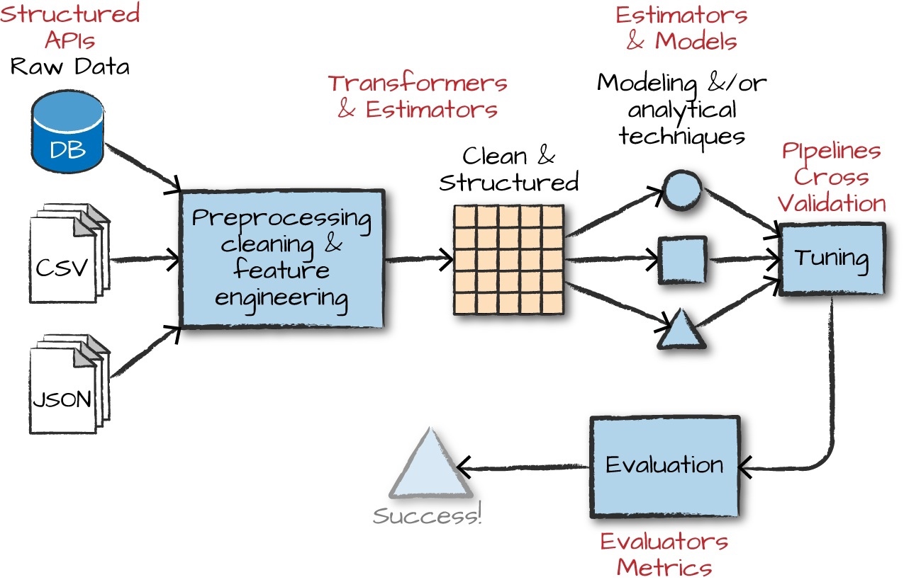
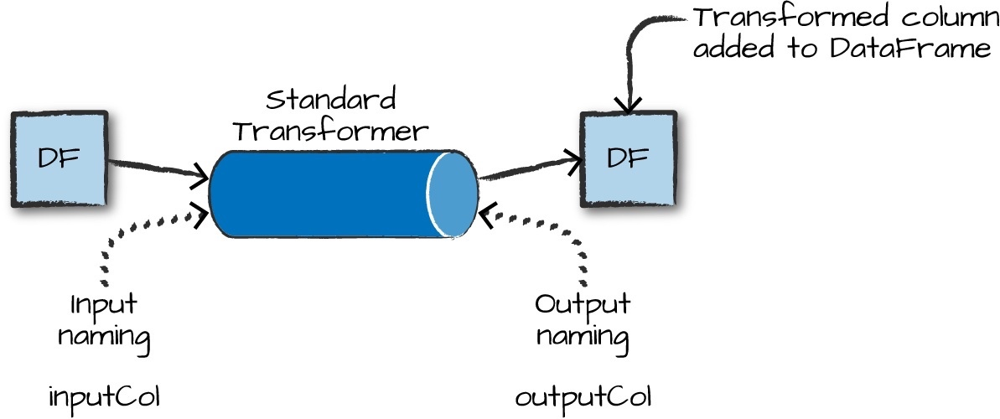

---
title: 6 MLlib
toc: false
date: 2017-10-30
---  

Spark有两个机器学习库Spark MLlib和Spark ML。它们的API差异很大，但是算法类似。

* MLlib支持RDDs，仅提供算法，目前已经进入维护模式。
* ML支持DataFrames和Datasets，提供预处理、清洗、特征工程、算法等功能。

MLlib is a package, built on and included in Spark, that provides interfaces for gathering and cleaning data, feature engineering and feature selection, training and tuning large-scale supervised and unsupervised machine learning models, and using those models in production.

When and why should you use MLlib (versus scikit-learn, TensorFlow, or foo package). This means single-machine tools are usually complementary to MLlib. When you hit those scalability issues, take advantage of Spark’s abilities.

There are two key use cases where you want to leverage Spark’s ability to scale. First, you want to leverage Spark for preprocessing and feature generation to reduce the amount of time it might take to produce training and test sets from a large amount of data. Then you might leverage single-machine learning libraries to train on those given data sets. Second, when your input data or model size become too difficult or inconvenient to put on one machine, use Spark to do the heavy lifting. Spark makes distributed machine learning very simple.

* Transformers are functions that convert raw data in some way. This might be to create a new interaction variable (from two other variables), normalize a column, or simply change an Integer into a Double type to be input into a model.

#### Low-level data types

