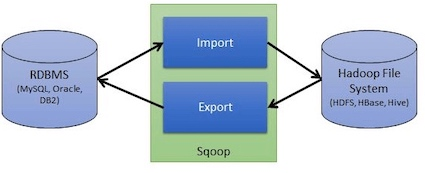
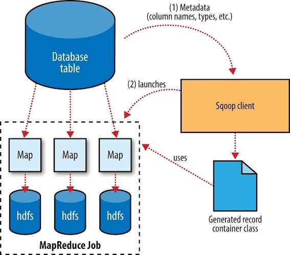

[Apache Sqoop](http://sqoop.apache.org)是Hadoop和关系型数据库之间的数据迁移工具。

* 导入数据：从MySQL、Oracle导入数据到HDFS、Hive、HBASE
* 导出数据：从Hadoop文件系统中导出到关系型数据库



### 1 数据导入

`sqoop import`命令会运行一个MapReduce作业，该作业会连接MySQL数据库并读取表中的数据。默认情况下，作业会

* 并行使用4个map任务来加速导入过程(使用-m自定义)。每个任务都会将其所导入的数据写入到一个单独的文件，且都位于同一个目录中。
* 将导入的数据保存为逗号分隔的文本文件。

!!! example "从MySQL中导入表"

    例子中从MySQL数据库中导入widgets表，该作业会使用1个map任务
    
    ```bash
    sqoop import
    --connect jdbc:mysql://centos1:3306/hadoopguide  # mysql数据库地址
    --table widgets        #  表格名称为widgets
    -m 1                   #  使用一个map任务
    --target-dir /data     # 指定导入目录
    --username root        # 用户名
    --password root        # 密码
    ```



Sqoop的导入过程：

1. Sqoop使用JDBC连接数据库，检索出表中的所有列及其数据类型，并将这些SQL类型映射为Java数据类型。随后，Sqoop的代码生成器(code generator)使用这些信息创建对应表的类(默认保存在当前目录下)，用于保存从表中抽取的记录。
2. 启动MapReduce作业，通过JDBC从数据库表中读取内容。map任务执行查询并且将ResultSet中的数据反序列化生成类的实例后，保存成文件。


#### Hive

在进行导入时，Sqoop可以生成Hive表的定义，然后直接将数据导入Hive表。使用`--hive-import`参数可以从源数据直接将数据载入Hive。它自动根据源数据库中表的模式来推断Hive表的模式。

!!! example "导入Hive"


    ```bash
    sqoop import
    --connect jdbc:mysql://centos1:3306/hadoopguide  # mysql数据库地址
    --table widgets        #  表格名称为widgets
    -m 1                   #  使用一个map任务
    --target-dir /data     # 指定导入目录
    --username root        # 用户名
    --password root        # 密码
    --hive-import          # 导入到Hive中
    ```