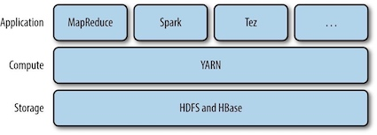
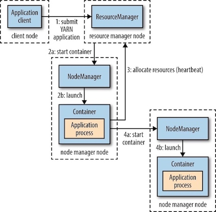
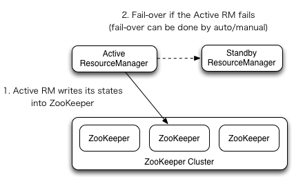

Apache **YARN**(Yet Another Resource Negotiator)是Hadoop的**集群资源管理系统**(cluster resource management system)。 YARN被引入Hadoop2，最初是为了改善MapReduce的实现，但它具有足够的通用性，同样可以支持其他的分布式计算模式。

YARN provides APIs for requesting and working with cluster resources, but these APIs are not typically used directly by user code. Distributed computing frameworks (MapReduce, Spark, and so on) running as YARN applications on the cluster compute layer (YARN) and the cluster storage layer (HDFS and HBase).

Yarn 模式的优点有：

* 资源的统一管理和调度。Yarn 集群中所有节点的资源（内存、CPU、磁盘、网络等）被抽象为 Container。计算框架需要资源进行运算任务时需要向 Resource Manager 申请 Container，Yarn 按照特定的策略对资源进行调度和进行 Container 的分配。Yarn 模式能通过多种任务调度策略来利用提高集群资源利用率。例如 FIFO Scheduler、Capacity Scheduler、Fair Scheduler，并能设置任务优先级。
* 资源隔离。Yarn 使用了轻量级资源隔离机制 Cgroups 进行资源隔离以避免相互干扰，一旦 Container 使用的资源量超过事先定义的上限值，就将其杀死。
* 自动 failover 处理。例如 Yarn NodeManager 监控、Yarn ApplicationManager 异常恢复。

yarn架构

* ResourceManager: 处理客户端请求，启动/监控AppMaster,监控NodeManager,资源的分配和调度
* ApplicationMaster: 负责数据切分，申请资源和分配，任务监控和容错
* NodeManager：单节点资源管理，与AM/RM通信，汇报状态
* Container：资源抽象，包括内存、CPU、磁盘、网络等资源

#### Anatomy of a YARN Application Run

YARN通过两类长期运行的守护进行提供自己的核心服务：

* ***resource manager*** (资源管理器): 每个集群一个，管理集群上的资源使用
* ***node managers***(节点管理器)：每个节点一个，启动和监视容器(container)
    * 容器用于执行特定应用程序的进行，每个容器都有资源限制(内存，CPU等) 

YARN是如何运行一个应用的：

* step1 : Client请求Resource Manager运行一个 Application Master实例；
* steps 2a and 2b: Resource Manager选择一个Node Manager，启动一个Container并在其中运行Application Master实例；
* step 3: Application Master根据实际需要向Resource Manager请求更多的Container资源；
* steps 4a and 4b: Application Master通过获取到的Container资源执行分布式计算；

> The `ApplicationMaster` is an instance of a framework-specific library that negotiates resources from the `ResourceManager` and works with the `NodeManager` to execute and monitor the granted resources (bundled as containers) for a given application. The `ApplicationMaster` runs in a container like any other application.

Application Master

* One per application
* Framework/application specific
* Run in a container

##### Resource Requests

A YARN application can make resource requests at any time while it is running. 

* Spark starts a fixed number of executors on the cluster (i.e. make all of requests up front). 
* MapReduce, has two phases: the map task containers are requested up front, but the reduce task containers are not started until later. (i.e. take a more dynamic approach whereby it requests more resources dynamically to meet the changing needs of the application).

##### Application Lifespan

The lifespan of a YARN application can vary dramatically. Rather than look at how long the application runs for, it’s useful to categorize applications in terms of how they map to the jobs that users run. 

* The simplest case is one application per user job, which is the approach that MapReduce takes.
* The second model is to run one application per workflow or user session of (possibly unrelated) jobs, which is the approach that Spark takes. This approach can be more efficient than the first, since containers can be reused between jobs, and there is also the potential to cache intermediate data between jobs.
* The third model is a long-running application that is shared by different users, which is the approach that Apache Slider takes.

##### Building YARN Applications

Writing a YARN application from scratch is fairly involved, but in many cases is not necessary, as it is often possible to use an existing application that fits the bill.

#### YARN Compared to MapReduce 1

The distributed implementation of MapReduce in the original version of Hadoop is sometimes referred to as “MapReduce 1” to distinguish it from MapReduce 2, the implementation that uses YARN.

A comparison of MapReduce 1 and YARN components:

| MapReduce1 |  YARN |
| --- | --- |
| Jobtracker | Resource manager, application master, timeline server |
| TaskTracker | Node manager |
| Slot | Container |

The Timeline Server addresses the problem of the storage and retrieval of application’s current and historic information in a generic fashion.

#### Scheduling in YARN

The job of the YARN scheduler to allocate resources to applications according to some defined policy. Scheduling in general is a difficult problem and there is ***no one "best" policy***, which is why YARN provides a choice of schedulers and configurable policies.

##### 调度选项

YARN中有三种调度器(scheduler): the FIFO, Capacity, and Fair Schedulers.

* **FIFO Scheduler**(FIFO调度器): places applications in a queue and runs them in the order of submission (first in, first out)
    * Not suitable for shared clusters, because large applications will use all the resources in a cluster, so each application has to wait its turn. 
* **Capacity Scheduler**(容量调度器): a separate dedicated queue allows the small job to start as soon as it is submitted, since the queue capacity is reserved for jobs in that queue.
* **Fair Scheduler**(公平调度器): dynamically balance resources between all running jobs, each job is using its fair share of resources.
    * There is a lag between the time the second job starts and when it receives its fair share, since it has to wait for resources to free up as containers used by the first job complete. After the small job completes and no longer requires resources, the large job goes back to using the full cluster capacity again.

hadoop yarn本身默认使用容量调度器(Capacity)，但是一些分布式项目(如CDH)默认使用公平调度器(Fair)。

### HA
[官方文档](http://hadoop.apache.org/docs/current/hadoop-yarn/hadoop-yarn-site/ResourceManagerHA.html)

* RM挂掉：Active ResourceManager提供服务，一个或多个Standby ResourceManager同步Active的信息，一旦Active挂掉，Standby立即做切换接替进行服务；
* NM挂掉：通过心跳方式通知RM，RM将情况通知对应AM，AM作进一步处理;
* AM挂掉：RM负责重启，其实RM上有一个RMApplicationMaster， 是AM的AM，上面保存已经完成的task，若重启AM，无需重新运行已经完成的task;