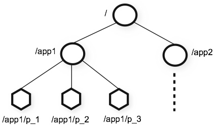

ZooKeeper是Hadoop的**分布式协调服务**(distributed coordination service)，其核心是一个精简的文件系统，可用于分布式队列、分布式锁和领导者选举。

### 1 数据模型

ZooKeeper的层次化命名空间(hierarchical namespace)非常像一个标准的文件系统。ZooKeeper命名空间中的每一个node(被称为znode)都被一个路径(path)所标识。




#### Znode

和文件系统不同的是，ZooKeeper每个节点(znode)可以有关联的数据。ZooKeeper的设计目的是为了存储协调数据：状态信息，配置，位置信息等，所以每个节点的数据通常非常小，从几个字节到几千个字节不等。
 
##### 路径

Znode通过路径被引用，就像Unix中的文件路径一样。路径必须是绝对路径，因此必须由斜杠`/`来开头。除此以外，每条路径只有唯一的一种表示方法，不支持路径解析。在ZooKeeper中，路径由Unicode字符串组成。字符串`zookeeper`是保留词，子树`/zookeeper`用以保存管理信息，例如配额信息。

##### Znode结构

ZooKeeper命名空间中的znode，兼具文件和目录两种特点。既像文件一样维护着数据、元信息、ACL、时间戳等数据结构，又像目录一样可以作为路径标识的一部分。每个znode由3部分组成:

* stat：此为状态信息, 描述该Znode的版本, 权限等信息
* data：与该Znode关联的数据
* children：该Znode下的子节点

Zookeeper每个znode的Stat结构由以下组成：

```text 
# The zxid of the change that caused this znode to be created.
cZxid = 0x28000002fe
# The time in milliseconds from epoch when this znode was created.
ctime = Fri Feb 21 17:42:17 CST 2020
# The zxid of the change that last modified this znode.
mZxid = 0x28000002fe
# The time in milliseconds from epoch when this znode was last modified.
mtime = Fri Feb 21 17:42:17 CST 2020
# The number of changes to the children of this znode.
cversion = 1
# The number of changes to the data of this znode.
dataVersion = 0
# The number of changes to the ACL of this znode.
aclVersion = 0
# The session id of the owner of this znode if the znode is an ephemeral node. 
# If it is not an ephemeral node, it will be zero.
ephemeralOwner = 0x0
# The length of the data field of this znode.
dataLength = 58
# The number of children of this znode.
numChildren = 1
```

致使ZooKeeper节点状态改变的每一个操作都将使节点接收到一个Zxid(ZooKeeper Transaction ID)格式的时间戳，并且这个时间戳全局有序。也就是说，每个对节点的改变都将产生一个唯一的Zxid。如果Zxid1的值小于Zxid2的值，那么Zxid1所对应的事件发生在Zxid2所对应的事件之前。ZooKeeper的每个节点维护者三个Zxid值，为别为：cZxid、mZxid、pZxid。


##### 数据访问

Zookeeper的数据访问具有原子性。客户端在读取一个znode的数据时，要么读到所有的数据，要么读操作失败，不会只读到部分数据。同样的，也不会出现只保存客户端所写部分数据的情况。另外，每一个节点都拥有自己的ACL(访问控制列表)，用于决定谁可以对它执行何种操作。

| ACL权限 | 允许的操作 |
| --- | --- |
| CREATE | create |
| READ | getChildren， getData |
| WRITE | setData |
| DELETE | delete |
| ADMIN | setACL |

##### 顺序节点

顺序节点(Sequential znode)是指名称中包含ZooKeeper指定顺序号的znode。如果在创建znode时设置了顺序标识(例如`create -s /test 123`)，那么该znode名称之后便会附加一个单调递增的值(例如`/test0000000040`)。在一个分布式系统中，顺序号可以被用于为所有的时间进行全局排序，这样客户端就可以通过顺序号来推断事件的顺序。


##### znode类型
znode有两种类型：短暂的(ephemeral)和持久的(persistent)。znode的类型在创建时被确定并且之后不能再修改。

* 短暂znode：在创建短暂znode的客户端会话结束时，ZooKeeper会将该短暂znode删除。短暂znode不可以拥有子节点。
* 持久znode：只有当客户端明确要删除znode时，才会被删除。


#### 操作

ZooKeeper有9种基本的操作。

| 操作 | 描述 |
| --- | --- |
| `create` | 创建一个znode(必须要有父节点) |
| `delete` | 删除一个znode(该znode不能有任何子节点) |
| `exists` | 测试一个znode是否存在并且查询它的元数据 |
| `getAcl`, `setAcl` | 获取/设置一个znode的Acl |
| `getChildren` | 获取一个znode的子节点列表 |
| `getData`, `setData` | 获取/设置一个znode所保存的数据 |
| `sync` | 将客户端的znode视图与ZooKeeper同步 |

* 更新ZooKeeper操作是有限制的。`delete`或`setData`必须明确要更新的znode的版本号(可以调用exists找到)。如果版本号不匹配，更新将会失败。
* 更新ZooKeeper操作是非阻塞式的。因此客户端如果失去了一个更新(由于另一个进程在同时更新这个Znode)，它可以在不阻塞其他进程执行的情况下，选择重新尝试或进行其他操作。
* 尽管ZooKeeper可以被看做是一个文件系统，但是出于便利，有一些文件系统的基本操作被它摒弃了。因为文件非常的小并且使整体读写的，所以不需要打开、关闭或是查找操作。

#### 观察

在`exists`、`getChildren`和`getData`这些读操作上可以设置**观察**(watch)，这些观察可以被写操作`create`、`delete`和`setData`触发。ACL相关的操作不参与触发任何观察。当一个观察被触发时会产生一个观察事件(watch event)，这个观察和触发它的操作共同决定着观察事件的类型。


    
    
### 2 实现

在生产环境中的ZooKeeper通常以**复制模式**(replicated mode)运行在一个计算机集群上，这个计算机集群被称为一个**集合体**(ensemble)。ZooKeeper通过复制来实现高可用，只要集合体中半数以上的机器处于可用状态，它就能够提供服务。

#### Zab协议

Zab协议(Zookeeper Atomic Broadcast Protocol)，包括领导者选举和原子广播两个阶段：

* 领导者选举阶段：集合体中的所有机器选出一个领导者(leader)，其他机器被称为跟随者(follower)。一旦半数以上的跟随者已经将其状态与领导者同步，则表明这个阶段已经完成。
* 原子广播阶段：所有的写请求都会被转发给领导者，再由领导者将更新广播给跟随者。当半数以上的跟随者已经将修改持久化之后，领导者才会提交这个更新，然后客户端才会收到一个更新成功的响应。


#### 一致性

一个follower可能滞后于leader几个更新。可以使用`sync`操作强制所连接的ZooKeeper服务器赶上领导者。在Zookeeper的设计中，以下几点考虑保证了数据的一致性。

* **顺序一致性**(Sequential consistency): 来自任意特定客户端的更新都会按其发送顺序被提交。也就是说，如果一个客户端将znode  的值更新为a，在之后的操作中，它又将z的值更新为b，则没有客户端能够在看到z的值是b之后再看到值a（如果没有其他对于 z 的更新）。
* 原子性: 更新要么成功，要么失败，不会存在部分成功或失败的结果。如果失败了，则不会有客户端看到这个更新的结果。
* 单一系统映像: 一个客户端无论连接到具体哪一台服务器上，它看到的都是同样的系统视图。这意味着，如果一个客户端在同一个会话中连接到一台新的服务器，它所看到的系统状态不会比在之前服务器上所看到的更老。当一台服务器出故障，导致它的一个客户端需要尝试连接集合体中其他的服务器时，所有状态滞后于故障服务器的服务器都不会接受该连接请求，除非这些服务器将状态赶上故障服务器。
* 持久性: 一个更改一旦成功，其结果就会被持久化并且不会被撤销。这表明更新不会受到服务器故障的影响。
* 及时性: 任何客户端所看到的系统视图的滞后都是有限的，不会超过几十秒，这意味着与其允许一个客户端看到非常陈旧的数据，还不如将服务器关闭，强迫该客户端连接到到一个状态较新的服务器。

#### 会话

每个Zookeeper客户端的配置中都包括集合体中服务器的列表。在启动时，客户端会尝试连接到列表中的一台服务器。如果连接失败，它会尝试连接另一台服务器，以此类推，直到成功与一台服务器建立连接或因为所有Zookeeper服务器都不可用而失败。Zookeeper客户端可以自动地进行故障切换，切换至另一台Zookeeper服务器，并且关键的是，在另一台服务器接替故障服务器之后，所有的会话（和相关的短暂znode）仍然是有效的。


### 3 应用

详见[ZooKeeper Recipes and Solutions](https://zookeeper.apache.org/doc/r3.3.2/recipes.html)。

#### 配置服务

配置服务是分布式系统应用所需要的基本服务之一，它可以使集群中的机器共享配置信息中的那些公共部分。也就是说，Zookeeper可以作为一个具有高可用性的配置服务存储器，允许分布式应用的参与者检索和更新配置文件。


#### 锁服务
分布式锁能够在一组进程之间提供互斥机制，使得在任何时刻只有一个进程可以持有锁。思路是

* 指定一个作为锁的znode，通常用它来描述被锁定的实体，称为`/leader`
* 希望获得锁的客户端创建一些短暂顺序znode，作为锁znode的子节点
* 在任何时间点，顺序号最小的客户端将持有锁
* 通过删除znode `/leader/lock-1`即可简单的释放锁；如果客户端进程死亡，对应的短暂znode也会被删除。
* 通过创建一个关于znode删除的观察，可以使客户端在获得锁时得到通知。

下面是申请获取锁的伪代码：

1. 调用`Create()`在锁znode下创建一个名为lock-的短暂顺序znode，并且记住它的实际路径名
2. 调用`getChildren()`查询锁znode的子节点
3. 如果步骤1中所创建的znode在步骤2返回的所有子节点中具有最小的顺序号，则获取到锁，退出
4. 客户端调用`exists()`，并对下一个最小顺序号设置观察
5. 如果`exists()`返回false，则返回第2步。否则，在返回第2步之前等待通知。


### 附录：配置

常规配置文件(`$ZOOKEEPER_HOME/conf/zoo.cfg`)说明：

```text
# zookeeper时间配置中的基本单位 (毫秒)
tickTime=2000
# 允许follower初始化连接到leader最大时长，它表示tickTime时间倍数 即:initLimit*tickTime
initLimit=10
# 允许follower与leader数据同步最大时长,它表示tickTime时间倍数 
syncLimit=5
# zookeper 数据存储目录
dataDir=/home/hadoop/zookeeper/data
# 对客户端提供的端口号
clientPort=2181
# 单个客户端与zookeeper最大并发连接数
maxClientCnxns=60
# 保存的数据快照数量，之外的将会被清除
autopurge.snapRetainCount=3
# 自动触发清除任务时间间隔，小时为单位。默认为0，表示不自动清除。
autopurge.purgeInterval=1
# 集群
server.1=centos1:2888:3888
server.2=centos2:2888:3888
server.3=centos3:2888:3888
server.4=centos4:2888:3888
```

使用命令`zkServer.sh start`启动ZooKeeper集群。