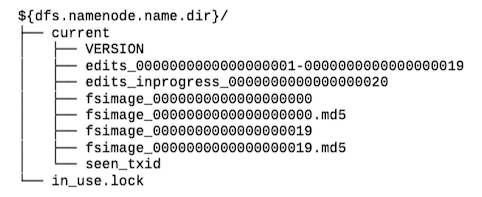

### 1 HDFS

#### 持久性数据结构
##### namenode目录结构
一个运行中的namenode有如下的目录结构

VERSION 文件是一个Java属性文件，该文件一般包含以下内容：

    #Mon Sep 29 09:54:36 BST 2014 
    namespaceID=1342387246 
    clusterID=CID-01b5c398-959c-4ea8-aae6-1e0d9bd8b142 
    cTime=0 
    storageType=NAME_NODE 
    blockpoolID=BP-526805057-127.0.0.1-1411980876842 
    layoutVersion=-57
  

编辑日志为以*edits*为前缀、以事务ID为后缀的多个文件。任一时刻只有一个文件处于打开可写状态(文件名包含*inprogress*)。

`seen_txid`文件中记录的是edits滚动的序号，每次重启namenode时，namenode就知道要将哪些*edits*进行加载。 

`in_use.lock`文件是一个锁文件，可以避免其他namenode实例同时使用同一个存储目录。

 

**Checkpointing**(检查点) is basically a process which involves merging the `fsimage` along with the latest edit log(编辑日志) and creating a new `fsimage` for the namenode to possess the latest configured metadata of HDFS namespace.
    

创建checkpointing的步骤：

* secondary namenode请求primary namenode停止使用正在进行中的*edits*文件，新的编辑操作将记录到新的*edits*文件中。并更新*seen_txid*文件。
* secondary namenode从primary namenode获取最近的*fsimage*和*edits*文件。
* secondary namenode将*fsimage*文件载入内存，逐一执行*edits*文件中的事务，创建新的合并后的*fsimage*文件。
* secondary namenode将新的*fsimage*文件发送回primary namenode, primary namenode将其保存为临时的*.ckpt*文件。
* primary namenode重新命名临时的*fsimage*文件，以便日后使用。
##### datanode目录结构

datanode的关键文件和目录如下：

HDFS块存储在以*blk_*为前缀的文件中。每个块由一个相关的带有*.meta*后缀的元数据文件。

#### 安全模式

namenode启动时，首先将*fsimage*文件载入内存，并执行*edits*文件中的操作。一旦在内存中成功建立文件系统元数据的映像，则创建一个新的*fsimage*文件和一个空的*edits*文件。在这个过程中，namenode运行在安全模式：namenode的文件系统对于客户端来说是只读的。

#### Audit Logging

#### Tools

### 2 Monitoring