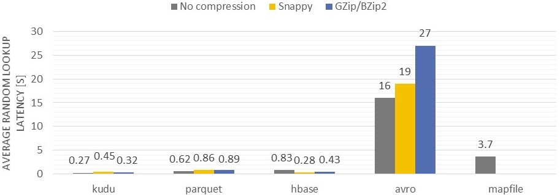
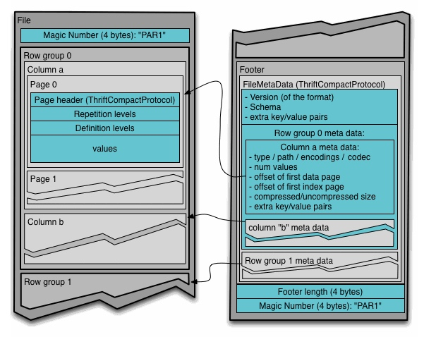

[Parquet](http://parquet.apache.org)是一种能够有效存储嵌套数据的列式存储格式。Parquet脱胎于Google发表的一篇关于Dremel的论文，以扁平的列式存储格式和很小的额外开销来存储嵌套结构，所以它的突出贡献在于能够**以真正的列式存储来保存具有深度嵌套结构的数据**。Spark已经将Parquet设为默认的文件存储格式。如果说HDFS是大数据时代文件系统的事实标准的话，Parquet就是大数据时代存储格式的事实标准。

Parquet**支持高效压缩和编码方式**(encoding scheme)，允许为每列数据指定压缩格式。Parquet-format与语言无关，很多语言(java/C++)有多种实现，大部分数据处理组件(Spark, MapReduce, Pig, Hive)都支持Parquet格式。




#### 列式存储

列式存储和行式存储相比有哪些优势呢？

* 可以跳过不符合条件的数据，只读取需要的数据，降低 IO 数据量。
* 压缩编码可以降低磁盘存储空间。由于同一列的数据类型是一样的，可以使用更高效的压缩编码（例如 Run Length Encoding 和 Delta Encoding）进一步节约存储空间。
* 只读取需要的列，支持向量运算，能够获取更好的扫描性能。


#### 数据模型


Parquet文件可以分成$N$列，$M$行组(row group)。行组由**列块**(column chunk)构成，且一个列块负责存储一列数据。每个列块中的数据以**页**(page)为单位存储。

```text
4-byte magic number "PAR1"
<Column 1 Chunk 1 + Column Metadata>
<Column 2 Chunk 1 + Column Metadata>
...
<Column N Chunk 1 + Column Metadata>
<Column 1 Chunk 2 + Column Metadata>
<Column 2 Chunk 2 + Column Metadata>
...
<Column N Chunk 2 + Column Metadata>
...
<Column 1 Chunk M + Column Metadata>
<Column 2 Chunk M + Column Metadata>
...
<Column N Chunk M + Column Metadata>
File Metadata
4-byte length in bytes of file metadata (little endian)
4-byte magic number "PAR1"
```

文件元信息(file metadata)包含各个列的元信息的开始地址。由于读取文件尾可以定位文件块，因此Parquet文件是可分割且可并行处理的。由于每页所包含的值都来自于同一列，因此极有可能这些值之间的差别并不大，那么使用页作为压缩单位是非常合适的。在写文件时，Parquet会根据列的类型自动选择适当的编码方式，一般带有压缩效果，例如查分编码、游程长度编码等。除此之外，Parquet支持以页为单位对编码后的数据进行二次压缩，例如Snappy, gzip和LZO。


