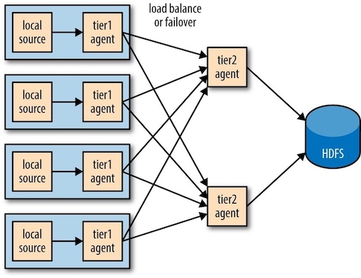
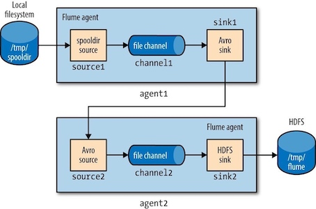

[Apache Flume](http://flume.apache.org/)是一个分布式、高可靠和高可用的服务，用来高效地收集、聚合和移动大量的日志数据。一个典型的例子是利用Flume从一组Web服务器中收集日志文件，然后把这些文件中的日志事件转移到一个新的HDFS汇总文件中做进一步处理，其终点通常是HDFS。

要想使用Flume，就需要运行一个Flume agent。Flume agent是由一个持续运行的Java进程，由source、sink以及连接它们的channel一起组成。source产生事件，并将其传送给channel，channel存储这些事件直至转发给sink。


!!! example "示例"

    为了演示Flume是如何工作的，首先从以下设置出发：

    1. 监视新增文本文件所在的本地目录
    2. 每当有新增文件时，文件中的每一行都将被发往控制台


    Flume配置使用一个spooling directory source和一个logger sink。属性名称构成了一个分级结构，顶级为agent的名称，下一级为agent中不同组件的名称(sources, channels, sinks)，再下一级是组件的属性。
    
    ```text
    agent1.sources = source1 
    agent1.sinks = sink1 
    agent1.channels = channel1
    

    
    agent1.sources.source1.type = spooldir
    agent1.sources.source1.spoolDir = /tmp/spooldir
    agent1.sinks.sink1.type = logger
    agent1.channels.channel1.type = file
    
    agent1.sources.source1.channels = channel1 
    agent1.sinks.sink1.channel = channel1
    ```


    

    ```bash
    # 创建一个缓冲目录
    $ mkdir /tmp/spooldir
    # 使用 flume-ng 命令启动flume agent:
    $ flume-ng agent \
    > --conf-file spool-to-logger.properties \
    > --name agent1 \
    > --conf $FLUME_HOME/conf \
    > -Dflume.root.logger=INFO, console
    ```
    在新终端中，写入字符串到新的缓冲文件。
    ```
    $ echo "Hello Flume" > /tmp/spooldir/.file1.txt
    $  ~ mv /tmp/spooldir/.file1.txt /tmp/spooldir/file1.txt
    ```

### 2 事务和可靠性

Flume使用两个独立的**事务**分别负责从source到channel以及从channel到sink的事件传递。例如上面的例子中，spooling directory source为文件的每一行创建一个事件。一旦事务中的所有事件全部传递到channel且全部成功，那么source就将该文件标记为完成。如果由于原因导致事件无法记录，那么事务将会回滚。

每个事件到达sink至少一次(**at least once**)。也就是说同一事件有可能会重复到达。例如，即使代理重启之前有部份或者全部事件已经被提交到channel，但是在代理重启之后，spooling directory source还是会为所有未完成的文件重新传递事件，logger sink也会重新记录那些已经记录但未被提交的事件。

为了提交效率，Flume在有可能的情况下尽量以事务为单位来批量处理事件，而不是逐个事件地处理。

### 3 Sink
#### The HDFS Sink

Events may delivered to the HDFS sink and written to a file. Files in the process of being written to have a `.tmp` in-use suffix (default, set by <C>hdfs.inUsePrefix</C>, see below) added to their name to indicate that they are not yet complete.

Flume configuration using a spooling directory source and an HDFS sink:

```
agent1.sources = source1 
agent1.sinks = sink1 
agent1.channels = channel1
agent1.sources.source1.channels = channel1
agent1.sinks.sink1.channel = channel1
agent1.sources.source1.type = spooldir
agent1.sources.source1.spoolDir = /tmp/spooldir
agent1.sinks.sink1.type = hdfs
agent1.sinks.sink1.hdfs.path = /tmp/flume
agent1.sinks.sink1.hdfs.filePrefix = events
agent1.sinks.sink1.hdfs.fileSuffix = .log 
agent1.sinks.sink1.hdfs.inUsePrefix = _ 
agent1.sinks.sink1.hdfs.fileType = DataStream
agent1.channels.channel1.type = file
```

##### Partitioning and Interceptors

#### Kafka Sink

### 4 Fan Out

*Fan out* is the term for delivering events from one source to multiple channels, so they reach multiple sinks.

Flume configuration using a spooling directory source, fanning out to an HDFS sink and a logger sink:

```
agent1.sources = source1 
agent1.sinks = sink1a sink1b 
agent1.channels = channel1a channel1b
agent1.sources.source1.channels = channel1a channel1b 
agent1.sinks.sink1a.channel = channel1a 
agent1.sinks.sink1b.channel = channel1b
agent1.sources.source1.type = spooldir 
agent1.sources.source1.spoolDir = /tmp/spooldir
agent1.sinks.sink1a.type = hdfs 
agent1.sinks.sink1a.hdfs.path = /tmp/flume 
agent1.sinks.sink1a.hdfs.filePrefix = events 
agent1.sinks.sink1a.hdfs.fileSuffix = .log 
agent1.sinks.sink1a.hdfs.fileType = DataStream
agent1.sinks.sink1b.type = logger
agent1.channels.channel1a.type = file agent1.channels.channel1b.type = memory
```


#### Delivery Guarantees

Flume uses a separate transaction to deliver each batch of events from the spooling directory source to each channel. If either of these transactions fails (if a channel is full, for example), then the events will not be removed from the source, and will be retried later.


### 3 Distribution: Agent Tiers

Aggregating Flume events is achieved by having tiers of Flume agents. 

The first tier collects events from the original sources (such as web servers) and sends them to a smaller set of agents in the second tier, which aggregate events from the first tier before writing them to HDFS. Further tiers may be warranted for very large numbers of source nodes.


### 4 Sink Groups

A **sink group** allows multiple sinks to be treated as one, for failover(故障转移) or load-balancing purposes. If a second-tier agent is unavailable, then events will be delivered to another second-tier agent and on to HDFS without disruption.



### 6 通过代理层分发

要构建分层结构，需要使用某种特殊的sink来通过网络发送事件，再加上相应的source来接收事件。Avro sink可通过Avro RPC将事件发送给运行在另一个Flume代理上的其他的Avro。

!!! example "将一台服务器上的文件发送给另一台服务器"

    
    
    ```text
    # First-tier agent
    agent1.sources = source1 agent1.sinks = sink1 
    agent1.channels = channel1
    agent1.sources.source1.channels = channel1 
    agent1.sinks.sink1.channel = channel1
    agent1.sources.source1.type = spooldir 
    agent1.sources.source1.spoolDir = /tmp/spooldir
    agent1.sinks.sink1.type = avro 
    agent1.sinks.sink1.hostname = localhost 
    agent1.sinks.sink1.port = 10000
    agent1.channels.channel1.type = file 
    agent1.channels.channel1.checkpointDir=/tmp/agent1/file-channel/checkpoint 
    agent1.channels.channel1.dataDirs=/tmp/agent1/file-channel/data
    
    # Second-tier agent
    agent2.sources = source2 agent2.sinks = sink2 
    agent2.channels = channel2
    agent2.sources.source2.channels = channel2 
    agent2.sinks.sink2.channel = channel2
    agent2.sources.source2.type = avro 
    agent2.sources.source2.bind = localhost 
    agent2.sources.source2.port = 10000
    agent2.sinks.sink2.type = hdfs 
    agent2.sinks.sink2.hdfs.path = /tmp/flume 
    agent2.sinks.sink2.hdfs.filePrefix = events 
    agent2.sinks.sink2.hdfs.fileSuffix = .log 
    agent2.sinks.sink2.hdfs.fileType = DataStream
    agent2.channels.channel2.type = file 
    agent2.channels.channel2.checkpointDir=/tmp/agent2/file-channel/checkpoint 
    agent2.channels.channel2.dataDirs=/tmp/agent2/file-channel/data
    ```

