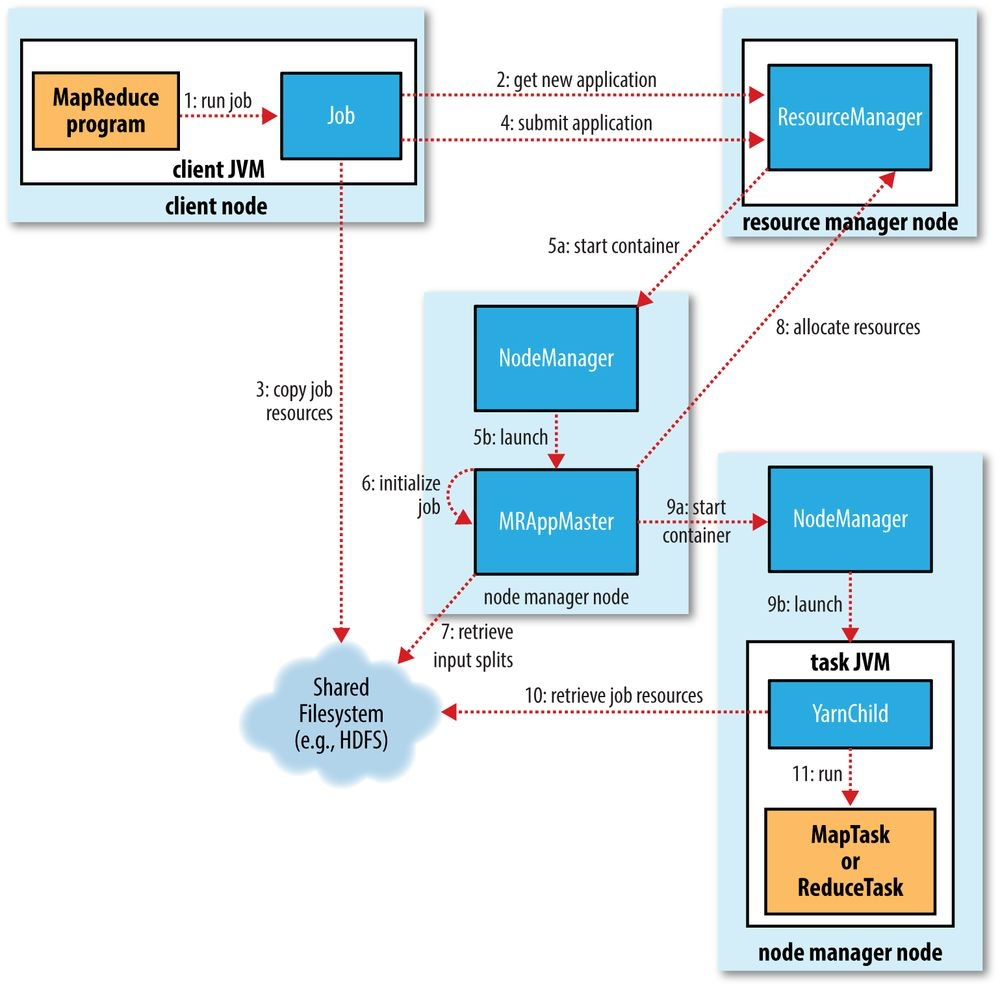
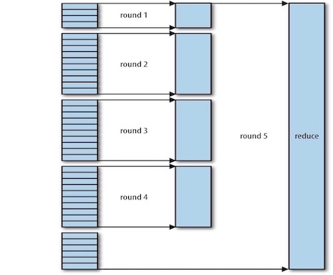

### 1 Anatomy of a MapReduce Job Run

At the highest level, there are five independent entities:

* The client: submits the MapReduce job.
* The YARN resource manager: coordinates the allocation of compute resources on the cluster.
* The YARN node managers: launch and monitor the compute containers on machines in the cluster.
* The MapReduce application master: coordinates the tasks running the MapReduce job. The application master and the MapReduce tasks run in containers that are scheduled by the resource manager and managed by the node managers. 
* HDFS: sharing job files between the other entities.

* Step 1: The `submit()` method on `Job` creates an internal `JobSubmitter` instance and calls `submitJobInternal()` on it.
* Step 2: Ask the resource manager for a new application ID, used for MapReduce job ID.
* Step 3: Copies the resources needed to run the job, including the job JAR file, the configuration file, and the computed input splits, to the shared filesystem in a directory named after the job ID.
* Step 4:  Submits the job by calling `submitApplication()` on the resource manager.
* Step 5: The YARN scheduler allocates a container, and the resource manager then launches the application master's process there, under the the node manager's management.
* Step 6: The application master (`MRAppMaster`) initializes the job by creating a number of bookkeeping objects to keep track of the job's progress, as it will receive progress and completion reports from the tasks.
* Step 7: The application master retrieves the input splits computed in the client from the shared filesystem, and then creates a map task object for each split, as well as a number of reduce task objects. Then it must decide how to run the tasks: run as an *uber task*(run the tasks in the same JVM)?
* Step 8: If the job does not qualify for running as uber task, then the application master requests container for all the map and reduce tasks in the job from the resource manager. Requests also specify memory requirements and CPUs for tasks.
* Step 9: The application master starts the container.
* Step 10: The task is executed by a Java application whose main class is `YarnChild`. It localizes the resources that the task needs (job configuration and JAR file, etc).
* Step 11: Finally, `YarnChild` runs the map or reduce task.

### 2 Shuffle and Sort

[ref](https://blog.csdn.net/aijiudu/article/details/72353510)

MapReduce makes the guarantee that the input to every reducer is **sorted by key**. The process by which the ==system performs the sort  and transfers the map outputs to the reducers as inputs==, is known as the **shuffle**.

#### The Map Side

* Each map task has ==a circular memory buffer==(环形缓冲区) that it writes the output to. 
* When the contents of the buffer reach a certain threshold size, a background thread will start to ==*spill* the contents to disk==.
* Before it writes to disk, the thread first ==divides the data into *partitions*(分区)== corresponding to the reducers that they will ultimately be sent to. 
* Within each partition, the background thread performs an ==in-memory sort by key==, and if there is a combiner function, it is run on the output of the sort.
* Before the task is finished, ==the spill files are merged into a single partitioned and sorted output file==.
* It is often a good idea to compress the map output as it is written to disk, because doing so makes it faster to write to disk, saves disk space, and reduces the amount of data to transfer to the reducer.

#### The Reduce Side

* ***copy phase***: the reduce task starts copying outputs as soon as the tasks completes.
    * Map outputs are copied to the reduce task JVM’s *memory* if they are small enough; otherwise, they are copied to *disk*.
    * As the copies accumulate on disk, a background thread merges them into larger, sorted files. This saves some time merging later on.
* ***merge phase***: merges the map outputs, maintaining their sort ordering, When all the map outputs have been copied. It is done in rounds.(Figure below) .
* **reduce phase**: directly feeding the reduce function.
* The output of the reduce phase is written directly to the output filesystem, typically HDFS.

<small>Efficiently Merging 40 File Segments With A Merge Factor Of 10</small>

#### Configuration Tuning

### 4 Task Execution