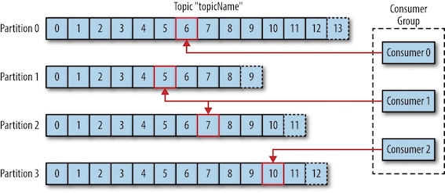
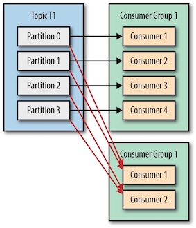

[Kafka](http://kafka.apache.org)是一款基于分布和订阅的消息系统(message system)，一般被称为”分布式提交日志"(distributed commit log)或者“分布式流平台"(distributing streaming platform)。

#### 0 简介

Kafka的数据单元被称为**消息**(message)。为了提高效率，消息被分批次(batch)写入Kafka。消息通过**主题**(topic)进行分类。主题可以被分为若干个**分区**(partition)，一个分区就是一个**提交日志**(commit log)。消息以追加的方式写入分区，然后以先入先出的顺序读取。分区可以分布在不同的服务器上，一个主题可以横跨多个服务器。


Kafka的客户端分为两种基本类型：生产者(producers)和消费者(customers)。

* 生产者创建消息。一般情况下，一个消息会被发布到一个特定的主题上。默认情况下会把消息均衡地分布到主题的所有分区上。
* 消费者读取消息。消费者订阅一个或者多个主题，并按照消息生成的顺序读取。消费者通过检查消息的**偏移量**(offset)来区分已经读过的消息。消费者把每个分区最后读取的消息偏移量保存在Zookeeper上。会有一个或多个消费者(**消费者群组**, consumer group)共同读取一个主题。群组保证每个分区只能被一个消费者使用。如果⼀个消费者失效，群组⾥的其他消费者可以接管失效消费者的⼯作。



Kafka使⽤Zookeeper保存集群的元数据信息和消费者信息。


一个独立的Kafka服务器被称为**broker**，其主要作用为：

* 接收来自生产者的消息，为消息设置偏移量，并提交消息到磁盘保存。
* 为消费者提供服务，对读取分区的请求作出响应，返回已经提交到磁盘上的消息

每个集群中都有一个broker同时充当了集群**控制器**(cluster controller)的角色。控制器负责管理工作，包括将分区分配给broker和监控broker。在集群中，⼀个分区从属于⼀个broker，该broker被称为分区的**⾸领**(leader)。⼀个分区可以分配给多个broker，这个时候会发⽣分区复制。这种复制机制为分区提供了消息冗余，如果有⼀个broker失效，其他broker可以接管领导权。


消息**保留**(retention)是Kafka的一个重要特性，它是指在一段时间内持久化存储消息。Kafka broker默认的消息保留策略是要么保留⼀段时间(⽐如7天)，要么保留到消息达到⼀定⼤⼩的字节数(⽐如1GB）。

基于发布与订阅的消息系统那么多，为什么选择Kafka？Kafka的优势在于：

* 支持多个生产者和消费者
* 基于磁盘的数据存储，允许消费者⾮实时地读取消息
* 具有灵活的伸缩性，从单个broker到上百个broker
* 高性能


Kafka在大数据基础设施的各个组件之间传递消息，为所有客户端提供一致的接口。当与提供消息模式的系统集成时，⽣产者和消费者之间不再有紧密的耦合，也不需要在它们之间建⽴任何类型的直连。


Kafka的使用场景有跟踪用户活动，传递消息，收集应⽤程序和系统度量指标以及⽇志，提交⽇志，流处理等。


### 1 生产者


生产者向Kafka发送消息的主要步骤：

* 创建`ProducerRecord`对象，包含目标主题和发送的内容，还可以指定键和分区
* 把建和值对象序列化为字节数组
* 分区器(partitioner)根据`ProducerRecord`对象指定的分区或者键选择分区
* 记录被添加到一个记录批次里，这个批次里的所有消息会被发送到相应的主题和分区上
* 有⼀个独⽴的线程负责把这些记录批次发送到相应的broker上。
* 服务器在收到这些消息时会返回⼀个响应。如果消息成功写⼊Kafka，就返回⼀个`RecordMetaData`对象，它包含了主题和分区信息，以及记录在分区⾥的偏移量。如果写⼊失败，则会返回⼀个错误
* ⽣产者在收到错误之后会尝试重新发送消息，⼏次之后如果还是失败，就返回错误信息。

要往Kafka写⼊消息，⾸先要创建⼀个⽣产者对象`ProducerRecord`，并设置⼀些属性。 Kafka⽣产者有3个必选的属性:

* `bootstrap.servers`: 指定broker的地址清单，地址的格式为host:port
* `key.serializer`: 键的序列化器
* `value.serializer`: 值的序列化器

```java
private Properties kafkaProps = new Properties(); 
kafkaProps.put("bootstrap.servers", "broker1:9092,broker2:9092");
kafkaProps.put("key.serializer",
        "org.apache.kafka.common.serialization.StringSerializer"); 
kafkaProps.put("value.serializer", 
        "org.apache.kafka.common.serialization.StringSerializer");
producer = new KafkaProducer<String, String>(kafkaProps);
```


发送消息主要有三种方式：

1. 发送并忘记(fire-and-forget): 把消息发送给服务器，但并不担心它是否正常到达。有时会丢失一些信息。
2. 同步发送(Synchronous send): 使用`send()`方法发送消息，返回一个`Future`对象，调用`get()`方法进行等待，就可以知道消息是否发送成功
3. 异步发送(Asynchronous send): 使用`send()`方法发送消息，并指定一个回调函数(callback function)，服务器在返回响应时调用该函数

```java
ProducerRecord<String, String> record = 
    new ProducerRecord<>("CustomerCountry", "Precision Products", "France"); 
// 同步发送
producer.send(record).get(); 

// 异步发送
private class DemoProducerCallback implements Callback { 
    @Override 
    public void onCompletion(RecordMetadata recordMetadata, Exception e) { 
        if (e != null)  e.printStackTrace(); 
    } 
}
producer.send(record, new DemoProducerCallback());
```


### 2 消费者

消费者从属于**消费者群组**(consumer group)。一个群组里的消费者订阅的是同一个主题，每个消费者接收主题一部分分区的消息。往群组⾥增加消费者是横向伸缩消费能⼒的主要⽅式。不过要注意，不要让消费者的数量超过主题分区的数量，多余的消费者只会被闲置。



当⼀个消费者被关闭或发⽣崩溃时，它就离开了消费者群组，原本由它读取的分区将由群组⾥的其他消费者来读取。在主题发⽣变化时，⽐如管理员添加了新的分区，会发⽣分区重分配。分区的所有权从⼀个消费者转移到另⼀个消费者，这样的⾏为被称为**再均衡**(rebalance)。在再均衡期间，消费者⽆法读取消息，造成整个群组⼀⼩段时间的不可⽤。

消费者通过向被指派为**群组协调器**(group coordinator)的broker(不同的群组可以有不同的协调器)发送**⼼跳**(heatbeats)来维持它们和群组的从属关系以及它们对分区的所有权关系。消费者会在轮询消息(为了获取消息)或提交偏移量时发送⼼跳。如果消费者停⽌发送⼼跳的时间⾜够长，会话就会过期，群组协调器认为它已经死亡，就会触发⼀次再均衡。

创建消费者与创建生产者类似：

```java
Properties props = new Properties(); 
props.put("bootstrap.servers", "broker1:9092,broker2:9092");
props.put("key.deserializer", 
        "org.apache.kafka.common.serialization.StringDeserializer"); 
props.put("value.deserializer",
        "org.apache.kafka.common.serialization.StringDeserializer");
KafkaConsumer<String, String> consumer = new KafkaConsumer<>(props);
```


消费者API的核心是消息轮询(pull loop)：

```java
try {
    // 无限循环，持续轮询向Kafka请求数据
    while (true) { 
        //返回⼀个记录列表, 100是超时参数，会在指定的毫秒数内⼀直等待broker返回数据
        ConsumerRecords<String, String> records = consumer.poll(100);  
        for (ConsumerRecord<String, String> record : records) { 
            int updatedCount = 1; 
            // 把结果保存起来或者对已有的记录进⾏更新
            if (custCountryMap.countainsValue(record.value())) 
                    updatedCount = custCountryMap.get(record.value()) + 1; 
            custCountryMap.put(record.value(), updatedCount)
        JSONObject json = new JSONObject(custCountryMap); 
        System.out.println(json.toString(4))
        }
    } 
} finally {
    // 关闭消费者
    consumer.close(); 
}
```

#### 提交和偏移量

更新分区当前位置的操作叫做**提交**(commit)。那么消费者是如何提交偏移量的呢？消费者往一个叫做`_consumer_offset`的特殊主题发送消息，消息里包含每个分区的偏移量。如果消费者发⽣崩溃或者有新的消费者加⼊群组，就会触发再均衡，完成再均衡之后，每个消费者可能分配到新的分区，⽽不是之前处理的那个。为了能够继续之前的⼯作，消费者需要读取每个分区最后⼀次提交的偏移量，然后从偏移量指定的地⽅继续处理。

如果提交的偏移量⼩于客户端处理的最后⼀个消息的偏移量，那么处于 两个偏移量之间的消息就会被重复处理。如果提交的偏移量⼤于客户端处理的最后⼀个消息的偏移量，那么处于两个偏移量之间的消息将会丢失。

KafkaConsumer API 提供了很多种⽅式来提交偏移量。

* 自动提交：消费者自动提交偏移量。如果`enable.auto.commit`为true，那么每过5s，消费者会自动把从`poll()`方法接收到的最大偏移量提交上去。消费者每次在进⾏轮询时会检查是否该提交偏移量了，如果是，那么就会提交从上⼀次轮询返回的偏移量。
    * 有丢失消息的可能性，并且在发⽣再均衡时会重复消息。 
* 同步提交当前偏移量： 把`auto.commit.offset`设为false，让应⽤程序决定何时提交偏移量。一般使⽤`commitSync()`提交偏移量。`commitSync()`提交由`poll()`⽅法返回的最新偏移量，提交成功后马上返回，如果提交失败就抛出异常。
    * 在broker对提交请求作出回应之前，应⽤程序会⼀直阻塞，这样会限制应⽤程序的吞吐量。 
* 异步提交当前偏移量：使用`commitAsync()`提交偏移量
* 提交特定的偏移量：使用`commitSync(offset)`提交偏移量

### 3 深入Kafka

#### 集群成员关系

Kafka组件订阅Zookeeper的`/brokers/ids`路径(broker在Zookeeper上的注册路径)，当有broker加⼊集群或退出集群时，这些组件就可以获得通知。在broker停机、出现⽹络分区或长时间垃圾回收停顿时，broker会从Zookeeper上断开连接，此时broker在启动时创建的临时节点会⾃动从Zookeeper上移除。监听broker列表的Kafka组件会被告知该broker已移除。

#### 控制器

控制器(controller)其实就是⼀个broker，只不过它除了具有⼀般broker的功能之外，还负责分区⾸领(leader)的选举。集群⾥第⼀个启动的 broker通过在Zookeeper⾥创建⼀个临时节点`/controller`让⾃⼰成为控制器。其他broker在启动时也会尝试创建这个节点，不过它们会收到⼀个“节点已存在”的异常，然后“意识”到控制器节点已存在，也就是说集群⾥已经有⼀个控制器了。其他broker会在控制器节点上创建 Zookeeper `watch`对象，这样它们就可以收到这个节点的变更通知。这种⽅式可以确保集群⾥⼀次只有⼀个控制器存在。如果控制器被关闭或者与Zookeeper断开连接，Zookeeper上的临时节点就会消失。集群⾥的其他broker通过`watch`对象得到控制器节点消失的通知，它们会尝试让⾃⼰成为新的控制器。

当控制器发现⼀个broker加⼊集群时，它会使⽤broker ID来检查新加⼊的broker是否包含现有分区的副本。如果有，控制器就把变更通知发送给新加⼊的broker和其他broker，新broker上的副本开始从⾸领那⾥复制消息。

#### 复制

复制(Replication)是Kafka架构的核⼼，它可以在个别节点失效时仍能保证Kafka的可⽤性和持久性。

每个分区有多个副本，副本有两种类型：

* 首领副本(leader replica): 每个分区都有⼀个⾸领副本。为了保证⼀致性，所有⽣产者请求和消费者请求都会经过这个副本。
* 跟随者副本(follower replica): ⾸领以外的副本都是跟随者副本。跟随者副本不处理来⾃客户端的请求，它们唯⼀的任务就是从⾸领那⾥复制消息，保持与⾸领⼀致的状态。如果⾸领发⽣崩溃，其中的⼀个跟随者会被提升为新⾸领。

#### 处理请求

### 9 管理Kafka

#### 主题

使用`kafka-topics.sh`可以执行创建、修改、删除和查看集群里的主题。

```bash
# 创建主题
kafka-topics.sh --zookeeper <zookeeper connect> --create --topic <str> 
    --replication-factor <integer> --partitions <integer>
# 删除主题
kafka-topics.sh --zookeeper <zookeeper connect> --delete --topic <str>
# 列出所有主题
kafka-topics.sh --zookeeper <zookeeper connect> --list
# 列出主题详细信息
kafka-topics.sh --zookeeper <zookeeper connect> --describe --topic <str>
```


#### 消费者群组

使用`kafka-consumer-groups.sh`可以列出、描述、删除消费者群组和偏移量信息。

```bash
kafka-consumer-groups.sh --zookeeper <zookeeper connect> --list
```

通过 shell 消费消息

```bash
kafka-console-consumer.sh --zookeeper <zookeeper connect> 
        --from-beginning --topic <topic name>
```

#### 监控

[Kafka-Eagle](https://www.kafka-eagle.org)是Kafka集群的一个管理工具。