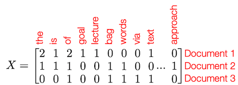
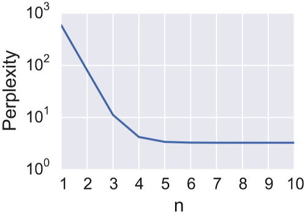

#### Bag of words and TFIDF

**Bag of words**(词袋): Represent each document as a vector of word frequencies.

!!! example "bag of words"

    * “The goal of this lecture is to explain the basics of free text processing”
    * “The bag of words model is one such approach”
    * “Text processing via bag of words”

    

##### Term frequency

**Term frequency**(词频) just refers to the counts of each word in a document. Denoted $\text{tf}_{i,j} =$ frequency of word $j$ in document $i$。 


Often (as in the previous slide), this just means the raw count, but there are also other possibilities.

1. $\text{tf}_{i, j}\in {0,1}$ – does word occur in document or not

2. $\log(1 + \text{tf}_{i, j})$ – log scaling of counts

3. $\text{tf}_{i, j} / \max_j \text{tf}_{i, j}$ – scale by document’s most frequent word


##### TFIDF

Term frequencies tend to be "overloaded" with very common words (“the”, “is”, “of”, etc). Idea if *inverse document frequency*(逆文档频率) weight words negatively in proportion to how often they occur in the entire set of documents.

$\text{idf}_j = \log (\frac{\text{# documents}}{\text{# documents with word }j}  )$

Term frequency inverse document frequency(TFIDF) = $\text{tf}_{i,j} \times \text{idf}_j$


Given two documents $x,y$ represented by TFIDF vectors (or jest term frequency vectors), cosine similarity is just 

$$\text{Cosine_Similarity}(x,y)=\frac{x^Ty}{||x||^2\cdot ||y||^2}$$

Between zero and one, higher numbers mean documents more similar.


#### Word embeddings and word2vec

We can create “bag of words” from word embedding vectors instead of term frequency vectors (see also, doc2vec model):


$$x_{\text{doc}}=\sum_{\text{word}\in \text{doc}}w_{\text{word}}$$


The good news is that you don’t need to create these models yourself, there exist publicly-available "pretrained" models that have just hardcoded the embeddings for a large number of words.

The "original" word2vec model, trained on 100 billion words from Google News documents, with vocabulary size of 3 million unique words:** https://code.google.com/archive/p/word2vec/


#### Language models and N-grams


A (probabilistic) **language model**(语言模型) aims at providing a probability distribution over every word, given all the words before it


$$P(\text{word}_i|\text{word}_i,...,\text{word}_{i-1})$$

$𝒏$-gram model: the probability of a word depends only on the $𝑛 − 1$ word preceding it

$$P(\text{word}_i|\text{word}_i,...,\text{word}_{i-1})\approx P(\text{word}_i|\text{word}_{i-n+1},...,\text{word}_{i-1})$$


A simple way (but *not* the only way) to estimate the conditional probabilities is simply by counting

$$P(\text{word}_i|\text{word}_i,...,\text{word}_{i-1})
    =\frac{\text{#(word}_{i-n+1},...,\text{word}_i)}{\text{#(word}_{i-n+1},...,\text{word}_{i-1})}$$

Estimating language models with raw counts tends to estimate a lot of zero probabilities (especially if estimating the probability of some new text that was not used to build the model)

Simple solution: allow for any word to appear with some small probability

$$P(\text{word}_i|\text{word}_i,...,\text{word}_{i-1})
    =\frac{\text{#(word}_{i-n+1},...,\text{word}_i)+\alpha}{\text{#(word}_{i-n+1},...,\text{word}_{i-1})+\alpha D}$$

where $\alpha$ is some number and $D$ is total size of dictionary.

How do we pick $𝑛$?

* Lower $𝑛$: less context, but more samples of each possible $𝑛$-gram 
* Higher $𝑛$: more context, but less samples “Correct” 
* choice is to use some measure of held-out cross-validation 
* In practice: use $𝑛 = 3$ for large datasets (i.e., triplets), $𝑛 = 2$ for small ones

##### Perplexity

Evaluating language models: Common strategy is to estimate the probability of some held out portion of data, and evaluate *perplexity*:


where we can evaluate the probability using


Perplexity on the corpus used to build the model will always decrease using higher $𝑛$ (fewer choices of what comes next means higher probability of observed data)

<small>Note: this is only strictly true when 𝛼 = 0</small>




#### Libraries for handling free text

The NLTK (natural language toolkit) library (http://www.nltk.org) is a standard Python library for handling text and natural language data.

```python
# Load nltk and download necessary files:
import nltk 
import nltk.corpus 
#nltk.download() # just run this once
# Tokenize a document
sentence = "The goal of this lecture isn't to explain complex free text processing" 
tokens = nltk.word_tokenize(sentence) 
> ['The', 'goal', 'of', 'this', 'lecture', 'is', "n't", 'to', 
  'explain', 'complex', 'free', 'text', 'processing']
# Tag parts of speech
pos = nltk.pos_tag(tokens) 
> [('The', 'DT'), ('goal', 'NN'), ('of', 'IN'), ('this', 'DT'), ('lecture', 'NN'),
 ('is', 'VBZ'), ("n't", 'RB'), ('to', 'TO'), ('explain', 'VB'), ('complex', 'JJ'), 
 ('free', 'JJ'), ('text', 'NN'), ('processing', 'NN')]
```

Get list of English stop words (common words)

```pyton
stopwords = nltk.corpus.stopwords.words("English")
```

Generate n-grams from document

```python
list(nltk.ngrams(tokens, 3)) 
> [('The', 'goal', 'of'), ('goal', 'of', 'this'), ('of', 'this', 'lecture'), ('this', 'lecture', 'is'), ('lecture', 'is', "n't"), ('is', "n't", 'to'), ("n't", 'to', 'explain'), ('to', 'explain', 'complex'), ('explain', 'complex', 'free'), ('complex', 'free', 'text'), ('free', 'text', 'processing')]
```