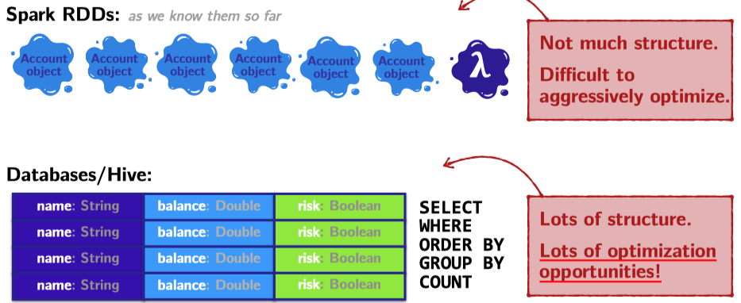
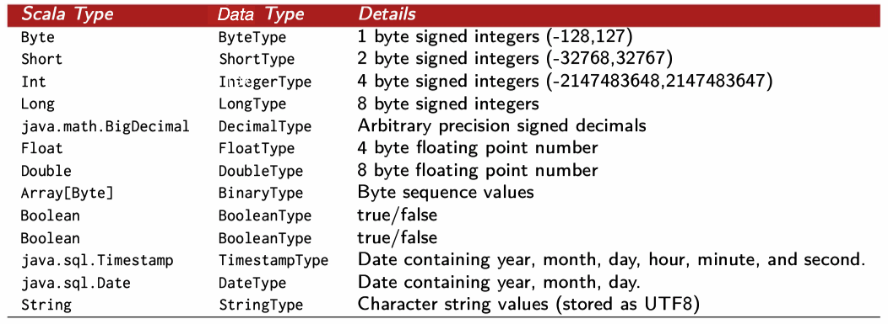
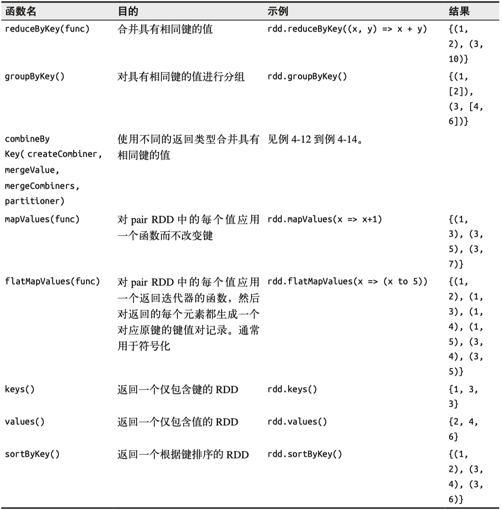
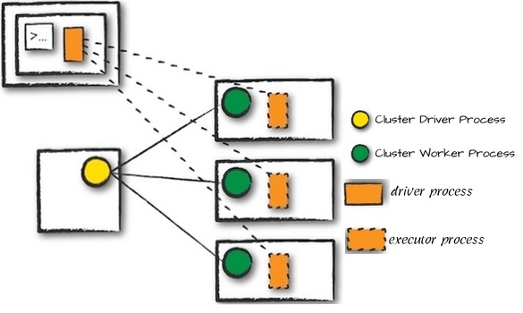
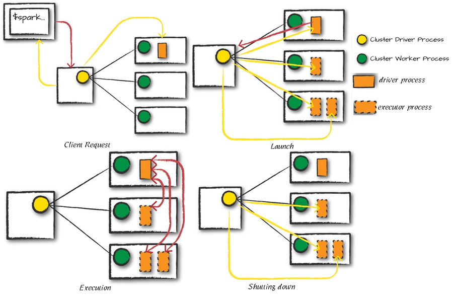
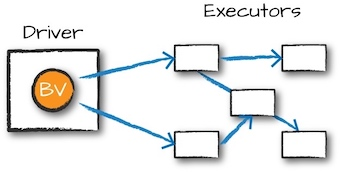
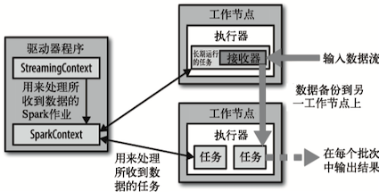
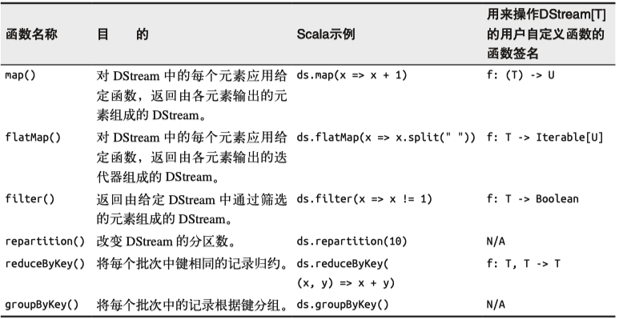
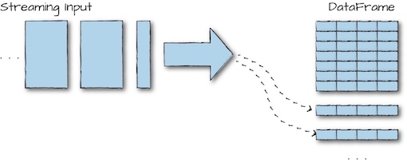

---
title: Spark权威指南
toc: false
date: 2017-10-30
---              

[Apache Spark](https://spark.apache.org/)<!--是用于大数据处理的集群计算框架。它-->包括一个统一的计算引擎和多个在集群中进行数据并行处理的库。<!--它并没有以MapReduce作为执行引擎，而是使用了自己的分布式运行环境在集群上执行。-->Spark最突出的表现在于它能够将作业和作业之间的大规模的工作数据集存储在内存中，因此迭代算法和交互式分析可以从Spark中获益最大。 


* 统一：Spark支持各种数据分析任务，从数据加载、查询到流处理都可以用相同的计算引擎和一致的API。
* 计算引擎：不同于Hadoop包括一个文件系统(HDFS)和计算引擎(MapReduce)，Spark仅包含计算引擎，但是支持很多外部存储(包括HDFS)，使得数据访问更加方便。
* 库：Spark支持标准库(Spark SQL, MLlib, Spark Streaming, GraphX)和第三方库([列表](http://spark-packages.org))。

!!! note "Hadoop v.s. Spark"

    对于容错(fault-tolerance)，Hadoop在map和reduce步骤之间，为了可以从可能的失败中恢复，混洗了数据并把中间结果写入到硬盘中。而Spark使用函数式编程实现了容错：不可变数据和保存在内存中。所有的数据操作都是函数式转换。


### 1 简介

Spark应用包含一个**driver**进程和多个**executor**进程。driver进程运行`main()`函数，负责三件事情：

* 维持Spark应用程序的相关信息
* 对用户程序或者输入进行响应
* 分析(analyze)、分布(distribute)、调度(schedule)executors之间的任务(work)

executor负责实际上实施driver分配的任务，并向driver报告任务执行状态和结果。

集群管理器(**cluster manager**)负责维护运行Spark应用的集群。Spark现在支持三种集群管理器：内置的standalone cluster manager，Apache Mesos, Hadoop YARN。


Spark*作业*(job)是由任意的多阶段(stages)有向无环图(DAG)构成。这些阶段(stages)又被分解为多个*任务*(task)，任务运行在分布于集群中分区上。


#### SparkSession

`SparkSession`是一个driver进程。`SparkSession`实例是Spark执行用户自定义操作的方式，和Spark应用一一对应。在Scala和Python中，`SparkSession`实例就是`spark`变量。

```scala
scala> spark
res0: org.apache.spark.sql.SparkSession = org.apache.spark.sql.SparkSession@2eb91767
scala> val myRange = spark.range(1000).toDF("number")
myRange: org.apache.spark.sql.DataFrame = [number: bigint]
```

#### DataFrames

DataFrame是最常见的结构化API，代表一个表格的数据。定义表格列以及列的类型的list称为schema。不同于spreadsheet, Spark DataFrame分布在多个节点上。


#### Partitions

为了允许每一个executor并行处理任务，Spark把数据分块称为**partitions**(分区)。一个分区是集群中一台主机上的多行数据。DataFrame的分区代表了执行期间数据在集群中的物理分布。


#### Transformations

在Spark中，数据结构是不可变的，所以创建以后就不能修改。为了改变一个DataFrame，需要采取**转换**(transformations)操作。

```scala
val divisBy2 = myRange.where("number % 2 = 0")
```

一共有两种类型的转换：

* narrow transformations: 输入分区导致一个输出分区
* wide transformations: 输入分区导致多个输出分区，也叫做shuffle


对于narrow transformations, Spark会自动采取pipelining(例如如果在DataFrame上使用多个过滤器，它们都会被在内存中操作)。但是对于shuffle, Spark会把结果写入到硬盘。

转换是惰性求值的，在对RDD执行一个动作之前，不会实际调用任何转换。

#### Action

**动作**(Action)指示Spark从一系列转换中计算结果。动作有三种：

* 观察数据
* 收集数据
* 写数据


#### 开发和部署Spark应用

运行Spark应用的最简单方法是使用`spark-submit`提交

```bash
./bin/spark-submit \
  --class <main-class> \
  --master <master-url> \
  --deploy-mode <deploy-mode> \
  --conf <key>=<value> \
  ... # other options
  <application-jar> \
  [application-arguments]
```


#### Spark UI

通过Spark Web UI可以监视作业(job)。本地模式的地址为[http://localhost:4040](http://localhost:4040)。


### 2 Structured API

Spark Structured API包括三种核心类型：Datasets, DataFrames, SQL。

数据可以是结构化(structured)、半结构化(semi-structured)和非结构化(unstructured)的。


对于常规的RDDs，Spark不知道其数据的schema，也就是说不知道这些类型的结构。并且由于不知其具体结构，因此无法很好的优化。




!!! note ""DataFrames v.s. Datasets"

    DataFrames和DataSets是分布式的、像表一样有行列的数据集。它们的区别是
    
    * ***untyped*** DataFrames: only checks whether types line up to those specified in the schema at *runtime*
    * ***typed*** DataSets: check whether types conform to the specification at *compile time*

    $\rightarrow$ **Datasets: Type-Safe Structured APIs**

    对于Spark in Scala来说，DataFrames是`Row`类型的DataSets。
    
    ```scala
    type DataFrame = Dataset[Row]
    ```
    
    可以认为DataSets是RDDs和DataFrames之间的妥协。


#### Structured API Execution

简单来说，Spark对代码中Structured API的执行主要有以下几个步骤：

* 编写DataFrame/Dataset/SQL代码
* 如果代码没有错误，Spark会将这些代码转换成逻辑计划(Logical Plan)
* Spark将生成的逻辑计划记过一系列优化(Catalyst Optimizer)，转换为物理计划(Physical Plan)
* Spark在集群上执行物理计划(RDD操作)。


转化为logical plan的第一步是转化为unresolved logical plan: 虽然代码有效，但是它指代的表格或者列可能不存在。随后Spark使用*Catalog*(存储着所有表格和DataFrame信息)去解析表格和列。如果需要的表格和列不存在，会拒绝unresolved logical plan。如果通过的话，就使用Catalyst Optimizer优化logical plan。


优化逻辑计划(Optimized logical plan)根据不同的物理执行策略(physical execution strategies)产生多个physical plans，通过cost model的比较，选择最优physical plan，最后在集群上执行。


除此之外，Spark在运行期间会进一步优化，产生能够移除执行期间的任务和阶段的原生Java字节码。


!!! examples "显示逻辑/物理执行计划"
    
    在Spark-shell中使用`explain extended`命令可以打印出从逻辑计划到物理计划的整个过程。例如
    
    ```sql
    create table t(key string, value string);
    explain extended select a.key*(2+3), b.value from  t a join t b on a.key = b.key and a.key > 3;
    ```
    上述执行结果显示为
    
    ```sql
    == Parsed Logical Plan ==
    'Project [unresolvedalias(('a.key * (2 + 3)), None), 'b.value]
    +- 'Join Inner, (('a.key = 'b.key) && ('a.key > 3))
       :- 'UnresolvedRelation `t`, a
       +- 'UnresolvedRelation `t`, b
    
    == Analyzed Logical Plan ==
    (CAST(key AS DOUBLE) * CAST((2 + 3) AS DOUBLE)): double, value: string
    Project [(cast(key#321 as double) * cast((2 + 3) as double)) AS (CAST(key AS DOUBLE) * CAST((2 + 3) AS DOUBLE))#325, value#324]
    +- Join Inner, ((key#321 = key#323) && (cast(key#321 as double) > cast(3 as double)))
       :- SubqueryAlias a
       :  +- MetastoreRelation default, t
       +- SubqueryAlias b
          +- MetastoreRelation default, t
    
    == Optimized Logical Plan ==
    Project [(cast(key#321 as double) * 5.0) AS (CAST(key AS DOUBLE) * CAST((2 + 3) AS DOUBLE))#325, value#324]
    +- Join Inner, (key#321 = key#323)
       :- Project [key#321]
       :  +- Filter (isnotnull(key#321) && (cast(key#321 as double) > 3.0))
       :     +- MetastoreRelation default, t
       +- Filter (isnotnull(key#323) && (cast(key#323 as double) > 3.0))
          +- MetastoreRelation default, t
    
    == Physical Plan ==
    *Project [(cast(key#321 as double) * 5.0) AS (CAST(key AS DOUBLE) * CAST((2 + 3) AS DOUBLE))#325, value#324]
    +- *SortMergeJoin [key#321], [key#323], Inner
       :- *Sort [key#321 ASC NULLS FIRST], false, 0
       :  +- Exchange hashpartitioning(key#321, 200)
       :     +- *Filter (isnotnull(key#321) && (cast(key#321 as double) > 3.0))
       :        +- HiveTableScan [key#321], MetastoreRelation default, t
       +- *Sort [key#323 ASC NULLS FIRST], false, 0
          +- Exchange hashpartitioning(key#323, 200)
             +- *Filter (isnotnull(key#323) && (cast(key#323 as double) > 3.0))
                +- HiveTableScan [key#323, value#324], MetastoreRelation default, t
    ```

#### Spark类型

Spark使用Catalyst维护类型信息，Spark类型与其支持的不同语言(Scala, Python等)中的类型一一对应。当使用Spark时，Spark会将输入语言的表达式转化为对应的Spark类型的表达式，然后再操作。以Scala为例，下面是Scala类型对应的Spark类型：



Spark支持的复杂数据类型


#### DataFrames

DataFrames are 

* A **relational** API over Spark's RDDs: because sometimes it is more convenient to use declarative relational APIs than functional APIs for analysis jobs.
* Able to be automatically aggressively **optimized**: Spark SQL applies years of research on relational optimizations in the databases community to Spark.
* **Untyped**!: The elements within DataFrames are `Row`s, which are not parameterized by a type. Therefore, the Scala compiler cannot type check Spark SQL schemas in DataFrames.


##### Schema

Schema定义了DataFrame中列的名称和类型。Schema是`StructType`类型，由`StructField`组成。`StructField`包括名字，类型以及一个布尔值(列是否可以包含null)。例如：

```scala
StructType(StructField(DEST_COUNTRY_NAME,StringType,true), 
        StructField(ORIGIN_COUNTRY_NAME,StringType,true), 
        StructField(count,LongType,true))
```

可以让数据源定义schema(叫做*schema-on-read*)，也可以显示定义schema。Schema-on-read适用于临时分析数据，可能会引起一些数据精度问题(例如`long`设置为`int`)。在ETL时，自定义schema往往更好。

!!! example ""

    ```scala
    /* schema on read */
    scala> val df = spark.read.format("json").load("2015-summary.json")
    scala> df.printSchema()
    root
     |-- DEST_COUNTRY_NAME: string (nullable = true)
     |-- ORIGIN_COUNTRY_NAME: string (nullable = true)
     |-- count: long (nullable = true)
    
    /* 指定schema */
    val myManualSchema = StructType(Array(StructField("DEST_COUNTRY_NAME", StringType, true), 
        StructField("ORIGIN_COUNTRY_NAME", StringType, true), StructField("count", LongType, false,
        Metadata.fromJson("{\"hello\":\"world\"}")) )) 
    val df = spark.read.format("json").schema(myManualSchema).load("2015-summary.json")
    ```
    
    
    
!!! note "RDD转成DataFrame"
    
    把RDD直接转换成DataFrame需要提供schema。例如：
    
    ```scala
      // log schema
    val logschema: StructType = StructType(Array(
      StructField("url", StringType, nullable=true),
      StructField("ip", StringType, nullable=true),
      StructField("city", StringType, nullable=true),
      StructField("time", StringType, nullable=true),
      StructField("date", StringType, nullable=true),
      StructField("traffic", StringType, nullable=true)
    ))
    val df = spark.createDataFrame(logs, logschema)
    ```

##### 列和表达式

Spark中的列与pandas DataFrame中的列类似。你可以选择(select)，处理(manipulate)，移除(remove)列，这些操作都是表达式(*expressions*)。使用`col`或者`column`函数是最简单使用列的两种方法。另外可以使用`$`或者`'`符号表示列。列不会被解析直到在catalog中比对信息。

```scala
// in scala
import org.apache.spark.sql.functions.{col, column}
col("myColumn")    df.filter(col("age") > 18)
column("myColumn") df.filter(column("age") > 18)
$"myColumn"        df.filter($"age" > 18)
'myColumn          df.filter('age > 18)
```

也可以在特定DataFrame上使用`col`方法，来指定该DataFrame的列，例如`df.col("myColumn")`。注意的是列一直未解析，直到与存储在*catalog*中的列名相比较。

表达式(expression)是DataFrame的记录(record)中的值的一系列转换(transformation)。表达式可以通过`expr`函数创建，它指代的是一个DataFrame列。列属于表达式。`expr("someCol")`相当于`col("SomeCol")`。`expr("someCol - 5")`相当于`col("someCol") - 5`。

复杂的表达式例如`expr("(((someCol + 5) * 200) - 6) < otherCol")`


##### 记录和行

DataFrame中的每一行就是一个记录(record)。Spark用类型`Row`的对象表示记录。Spark使用列表达式(column expressions)操作`Row`对象。`Row`对象内部表示为字节数组(arrays of bytes)。可以手动创建`Row`：

```scala
import org.apache.spark.sql.Row
val myRow = Row("Hello", null, 1, false)
```


##### 转换

DataFrame的API类似于SQL，常见的转换：

``` scala
def select(col: String, cols: String*): DataFrame 
// selects a set of named columns and returns a new DataFrame with these 
// columns as a result.

def withColumn(colName: String, col: Column): DataFrame
// Returns a new Dataset by adding a column or replacing the existing column 
// that has the same name.

def agg(expr: Column, exprs: Column*): DataFrame 
// performs aggregations on a series of columns and returns a new DataFrame 
// with the calculated output.

def groupBy(col1: String, cols: String*): DataFrame // simplified 
// groups the DataFrame using the specified columns. 
// Intended to be used before an aggregation.

def join(right: DataFrame): DataFrame // simplified 
// inner join with another DataFrame
```

<hh>创建DataFrame</hh>

```scala
val df = spark.read.format("json").load(
```


#### Spark SQL

Spark SQL是Spark最重要和最强大的功能之一。Spark SQL可以运行SQL语句，其SQL语句遵循ANSI SQL:2003标准。Spark SQL CLI工具(`spark-sql`)可以很方便的使用Spark SQL。也可以使用`spark.sql()`方法运行SQL语句，这将会返回DataFrame。

```scala
scala> val df = spark.read.json("2015-summary.json").createOrReplaceTempView("flight")
scala> spark.sql("""
     | select dest_country_name, sum(count)
     | from flight group by dest_country_name
     | """).where("dest_country_name like 'S%'").
     | where("`sum(count)` > 10").count()
res: Long = 12
```

Spark SQL可以连接Hive metastore。[Hive metastore](../Hadoop权威指南/17 Hive.md)维持着表的信息。若要把Spark SQL连接到一个部署好的Hive上，必须把`hive-site.xml`复制到Spark的配置文件目录(`$SPARK_HOME/conf`)中。

如果没有部署Hive， Spark SQL会在当前工作目录($SPARK_HOME/bin)中创建出自己的Hive元数据仓库(metastore_db文件夹)。创建的表会放在默认的文件系统中的`/user/hive/warehouse`目录中。

#### DataSets

DataSets只支持基于JVM的语言(Scala和Java)，可以分别用case class和Java Bean指定DataSets的类型。使用DataSets的场景一般有：当一些操作不能使用DataFrame时、或者需要类型安全且愿意付出降低性能的代价时。

##### Encoder

为了有效的支持特定域对象(domain-specific objects)，DataSets需要使用encoder将特定域类型(domain-specific type)映射为Spark内部类。例如，给定有`name`(string)和`age`(int)字段的类`Person`，encoder指导Spark在运行时产生代码，将`Person`对象序列化为二进制结构(binary structure)。当使用DataFrames时，这个二进制结构就是`Row`。

使用DataSet时，Spark会将`Row`转化为指定的特定域对象。在Scala中，使用`case class`创建特定域对象。这种转换虽然损失了性能，但是提供了更多灵活性。


```java
import org.apache.spark.sql.Encoders;
public class Flight implements Serializable{ 
    String DEST_COUNTRY_NAME; 
    String ORIGIN_COUNTRY_NAME; 
    Long DEST_COUNTRY_NAME; 
}
Dataset<Flight> flights = spark.read.parquet("2010-summary.parquet/") 
    .as(Encoders.bean(Flight.class));
```

##### 创建Datasets

在Scala中，创建Datasets之前，需要定义`case class`。`case class`是一个类，但它具有不可变，模式匹配、便于使用等特点。

!!! example "Flight"

    ```scala
    case class Flight(DEST_COUNTRY_NAME: String, ORIGIN_COUNTRY_NAME: String, count: BigInt)
    val flightsDF = spark.read.parquet("/data/flight-data/parquet/2010-summary.parquet/") 
    val flights = flightsDF.as[Flight]
    ```


由于DataFrame其实是Dataset[Row]，所以Dataset的动作和转换与DataFrame基本相同，不再赘述。


#### 外部数据

##### 读取
Spark支持多种文件格式，读取的基本格式为

```scala
spark.read.format(...).option("key", "value").schema(...).load()
/* example */
spark.read.format("csv").option("mode", "FAILFAST") 
    .option("inferSchema", "true") .option("path", "path/to/file(s)") 
    .schema(someSchema) .load()
```

从外部数据读取的时候可能会遇到错误数据，read mode指定了这时Spark会采取的情况(默认`permissive`)：


可以使用`spark.read`后面跟文件格式(`json`/`csv`/`textFile`/`parquet`等)来读取文件。例如

```scala
spark.read.json("path/to/file")
```

Spark支持本地文件系统，但是要求文件在集群中所有节点的相同路径路径下都可以找到，格式为`file://`。默认使用HDFS，格式为`hdfs://master:port/path`。


```scala
val df = spark.read.json("/apps/spark/json/2015-summary.json")
val df = spark.read.json("file:///Users/larry/Documents/json/2015-summary.json")
```

##### 写入

Spark写入数据的基本格式为

```scala
dataframe.write.format(...).option(...).partitionBy(...)
        .bucketBy(...).sortBy(...).save()
/* example */
dataframe.write.format("csv")
    .option("mode", "OVERWRITE")
    .option("dateFormat", "yyyy-MM-dd")
    .option("path", "path/to/files")
    .save()
```

save mode默认是`errorIfExists`:


!!! example "MySQL写入"

    ```scala tab="SQL"
    import java.sql.DriverManager
    val connection = DriverManager.getConnection(url)
    val dbDataFrame = spark.read.format("jdbc").option("url", url
        .option("dbtable", tablename).option("driver", driver).load()
    csvFile.wirte.mode("overwrite").jdbc(newPath, tablename, props)
    ```
    


#### Hive on Spark


### 3 Low-level APIs

在Spark中，有两类Low-level APIs：一种是操作RDD的，另一种是分布式共享变量(广播变量和累加器)。事实上，几乎所有Spark代码都会转化为这些低级操作：DataFrames和Datasets的操作会变成一系列RDD转换。SparkContext是低级API功能的入口，可以使用`spark.sparkContext`获得SparkContext。

#### RDD

**弹性分布式数据集**(Resilient Distributed Dataset, 简称RDD)，是Spark中最核心的概念，它是在集群中跨多个机器分区存储的一个只读对象的集合。在典型的Spark程序中，首先要加载一个或多个RDD，它们作为输入通过一系列转换得到一组目标RDD，然后对这些目标RDD执行一个动作。

除非特别需要，不推荐使用RDD，因为RDD缺少Structured APIs中的优化。对于大多数情况，DataFrames更有效、更稳定、更易表达。RDD的最常见使用场景是对数据物理分布的精确控制(自定义数据分区)。

RDD的创建有多种方法：

1. 来自一个内存中的对象集合(也称为并行化一个集合)
2. 使用外部存储器(例如HDFS)中的数据集
3. 对现有的RDD进行转换
4. 从DataFrame/DataSet转换

!!! Example "创建RDD"
    
    ```scala tab="并行化一个集合"    
    val params = sc.parallelize(1 to 10)
    ```
        
    ```scala tab="使用外部存储器中的数据集"    
    val text: RDD[String] = sc.textFile(inputPath)
    ```
        
    ```scala tab="对现有的RDD进行转换"    
    val text= sc.textFile(inputPath)
    val lower: RDD[String] = text.map(_.toLowerCase())
    ```
    
    ```scala tab="从DataFrame/DataSet转换"
    // converts a Dataset[Long] to RDD[Long]
    val h = spark.range(500).rdd
    ```
    
##### 转换和动作 

RDD支持distinct, filter, map, flatMap, sortBy等转换，支持reduce, count, first, take, max, min等动作。

对一个数据为{1, 2, 3, 3}的RDD进行基本的RDD转化操作:


对一个数据为{1, 2, 3, 3}的RDD进行基本的RDD行动操作:


##### 持久化

RDD可以使用`cache()`或者`persist()`方法进行持久化。RDD可以有不同的持久化级别(见下表)。默认情况下，`persist()`会把数据以序列化的形式换存在JVM的堆空间中(默认`MEMORY_ONLY`)。`cache()`其实就是`persist(StorageLevel.MEMORY_ONLY)`。

```
Level                Space used  CPU time  In memory  On disk  Serialized
-------------------------------------------------------------------------
MEMORY_ONLY          High        Low       Y          N        N
MEMORY_ONLY_SER      Low         High      Y          N        Y
MEMORY_AND_DISK      High        Medium    Some       Some     Some
MEMORY_AND_DISK_SER  Low         High      Some       Some     Y
DISK_ONLY            Low         High      N          Y        Y
```


##### checkpointing

Checkpointing把RDD保存到磁盘，以便后续使用这个RDD时可以直接使用，而不用从头开始计算这个RDD。在迭代计算中，这非常有用。

```scala
spark.sparkContext.setCheckpointDir("/some/path/for/checkpointing")
words.checkpoint()
```


##### Pair RDD

Pair RDD)是键值对的RDD

Pair RDD的转化操作（以键值对集合 {(1, 2), (3, 4), (3, 6)} 为例.




Pair RDD的行动操作（以键值对集合 {(1, 2), (3, 4), (3, 6)}为例）


##### 数据分区


#### 共享变量


### 4 Spark是如何在集群上运行的

#### 运行模式

运行模式(execution mode)包括：

* 集群模式(cluster mode)
* 客户模式(client mode)
* 本地模式(local mode)

在使用`spark-submit`提交时，可以使用`--deploy-mode <deploy-mode>`指定模式(`cluster`或者`client`)。


##### 集群模式

在集群模式(Cluster mode)中，用户提交编译好的JAR、Python脚本到集群管理器。然后集群管理器在集群中的一个工作节点上运行driver进程。也就是说集群管理器(cluster manager)负责维护所有Spark应用相关的进程。


<small>注意这里的Cluster Driver/Worker Process对应的是集群管理器(例如Yarn)</small>

##### 客户模式

客户模式(client mode)几乎与集群模式相同，除了Spark driver在提交应用的客户端机器上。也就是说 _客户端机器负责维持Spark driver进程，集群管理器负责维持executor进程_ 。运行driver进程的机器是不在集群中的。




##### 本地模式

本地模式(local mode)把整个Spark应用都在一台机器上运行，通过*多线程*实现并行。一般使用该模式学习Spark，测试应用。

#### Spark应用的生命周期(Spark外部)

以使用`spark-submit`命令运行Spark应用为例，说明Spark应用的生命周期：

1. 客户端请求(Client Request)：客户端提交应用(`spark-submit`), 向集群管理器要求spark driver进程的资源；集群管理器接收请求后，在其中一个节点上启动driver进程。
2. 运行(launch): `SparkSession`初始化Spark集群，要求集群管理器在集群上运行executor进程
3. 执行(execution): driver和worker相互联系，执行代码，移动数据
4. 完成(Completion): spark应用执行完毕，driver进程退出，集群管理器关闭对应executors




#### Spark应用的生命周期(Spark内部)

##### The SparkSession
Spark应用(Spark Application)的第一步是创建`SparkSession`。通过`SparkSession`，可以访问所有的低级环境和配置。Spark2.0之前的版本使用`SparkContext`。

```scala
// Creating a SparkSession in Scala
import org.apache.spark.sql.SparkSession
val spark = SparkSession.builder().appName("Spark Example")
    .config("spark.sql.warehouse.dir", "/user/hive/warehouse")
    .getOrCreate()
```

!!! note "SparkSession v.s. SparkContext"

    `SparkSession`中的`SparkContext`代表 _与Spark集群的连接_ 。`SparkContext`可以访问低级API，例如RDD，累加器(accumulators)，广播变量(broadcast variables)。可以直接通过`SparkSession.SparkContext`访问`SparkContext`，也可以用`SparkContext.getOrCreate()`得到`SparkContext`。
    
    ```Scala
    scala> spark.sparkContext
    res0: org.apache.spark.SparkContext = org.apache.spark.SparkContext@75c30a4f
    scala> sc
    res1: org.apache.spark.SparkContext = org.apache.spark.SparkContext@75c30a4f
    scala> SparkContext.getOrCreate()
    scala> import org.apache.spark.SparkContext
    import org.apache.spark.SparkContext
    scala> SparkContext.getOrCreate()
    res3: org.apache.spark.SparkContext = org.apache.spark.SparkContext@75c30a4f
    ```


##### A Spark Job


一般来说，一个动作(action)对应一个Spark作业(job)。动作总是返回结果。每个作业(job)分解为多个阶段(stages)，阶段的数量取决于shuffle操作的次数。


##### Stages

阶段(stages)代表了一组在多个机器上可以一起执行相同操作的任务(tasks)。一般来说，Spark会尽力地把多个任务(tasks)组合成一个stage，但是在shuffle之后，计算引擎会开始新的阶段。一个shuffle代表了一次数据的重新分区(a physical repartitioning of the data)。


!!! example "作业示例"
    
    ```scala
    val df1 = spark.range(2, 10000000, 2) 
    val df2 = spark.range(2, 10000000, 4) 
    val step1 = df1.repartition(5) 
    val step12 = df2.repartition(6) 
    val step2 = step1.selectExpr("id * 5 as id") 
    val step3 = step2.join(step12, "id") 
    val step4 = step3.selectExpr("sum(id)")
    step4.collect()
    ```
    
    `step4.explain()`的执行结果如下
    
    ```text
    == Physical Plan ==
    *(7) HashAggregate(keys=[], functions=[sum(id#6L)])
    +- Exchange SinglePartition
       +- *(6) HashAggregate(keys=[], functions=[partial_sum(id#6L)])
          +- *(6) Project [id#6L]
             +- *(6) SortMergeJoin [id#6L], [id#2L], Inner
                :- *(3) Sort [id#6L ASC NULLS FIRST], false, 0
                :  +- Exchange hashpartitioning(id#6L, 200)
                :     +- *(2) Project [(id#0L * 5) AS id#6L]
                :        +- Exchange RoundRobinPartitioning(5)
                :           +- *(1) Range (2, 10000000, step=2, splits=16)
                +- *(5) Sort [id#2L ASC NULLS FIRST], false, 0
                   +- Exchange hashpartitioning(id#2L, 200)
                      +- Exchange RoundRobinPartitioning(6)
                         +- *(4) Range (2, 10000000, step=4, splits=16)
    ```
    通过Spark WebUI查看Stages如下：

    
    
    可以看到这个job一共分为6个stage，每个stage分别有16、16、5、6、200、1个任务。stage 0和stage 1对应`spark.range`，有16个分区。stage 3和stage 4对应`repartition`转换，改变分区数为5和6。stage 4对应`join`，200个任务是`spark.sql.shuffle.partitions`的默认值。
    


##### Tasks

每一个任务(task)对应在一个executor上的数据块(blocks of data)和转换(transformations)的组合。所以任务是应用到一个数据分区上的计算单元。


#### 执行细节

Spark会自动把可以一起执行的stages和tasks流水线化(pipeline)，例如两个连续的map操作。对于所有的shuffle操作，Spark会把数据写入到存储(例如硬盘)，可以在多个作业(jobs)中重复使用。


##### Pipelining

With pipelining, any sequence of operations that feed data directly into each other, without needing to move it across nodes, is collapsed into a single stage of tasks that do all the operations together

##### Shuffle Persistence

Spark执行shuffle：

1. 一个stage把数据写入到本地硬盘中
2. 下一个stage从对应shuffle文件中抓取记录、执行计算

当运行一个数据已经shuffled的作业时，不会再重复计算，而是从shuffle文件中直接抓取。例如重新运行上例中的`step4.collect()`，只有一个task，一个stage。


### 4 Distributed Shared Variables

Spark有两种类型的分布式共享变量(distributed shared variables):

* 累加器（accumulators): 把所有任务中的数据一起加到一个共享的结果中(例如调试时记录不能解析的输入记录数目)
* 广播变量(broadcast variables): 向所有节点发送一个较大的只读值，以供多个Spark动作使用而不需要重复发送

#### 广播变量


#### Accumulators


### 5 Spark Streaming


#### fundamentals
类似于RDD和Datasets，Spark对流的的API也分为DStreams、Structrued Streams

What is stream processing?

> **Stream processing** is the act of continuously incorporating new data to compute a result. Batch processing is the computation runs on a fixed-input dataset. 


Although streaming and batch processing sound different, in practice, they often need to work together. For example, streaming applications often need to join input data against a dataset written periodically by a batch job, and the output of streaming jobs is often files or tables that are queried in batch jobs.

Advantages of Stream Processing

1. Stream processing enables lower latency.
2. Stream processing can also be more efficient in updating a result than repeated batch jobs, because it automatically incrementalizes the computation.

##### Stream Processing Design Points

Record-at-a-Time Versus Declarative APIs

* **Record-at-a-Time**: pass each event to the application and let it react using custom code
    * disadvantage: maintaining state, are solely governed by the application. 
    * e.g. Flink, Storm
* **declarative APIs**: application specifies what to compute but not how to compute it in response to each new event and how to recover from failure (which is called processing time).
    * e.g. Spark

Event Time Versus Processing Time

*  **Event time** is the idea of processing data based on timestamps inserted into each record at the source, as opposed to the **Processing time** when the record is received at the streaming application

Continuous Versus Micro-Batch Execution

* In **continuous processing-based systems**, each node in the system is continually listening to messages from other nodes and outputting new updates to its child nodes.
    * advantage: offering the lowest possible *latency*
    * disadvantage: lower maximum *throughput* 
* **Micro-batch systems** wait to accumulate small batches of input data (say, 500 ms’ worth), then process each batch in parallel using a distributed collection of tasks,
    * advantage: high throughput per node 
    * disadvantage: a higher base latency due to waiting to accumulate a micro-batch.


##### Spark's Streaming API


Spark includes two streaming APIs:

* DStream API
    * purely micro-batch oriented
    * has a declarative (functional-based) API but not support for event time
* Structured Streaming API
    * supports continuous processing
    * adds higher-level optimizations, event time

Structured Streaming is a higher-level streaming API built from the ground up on Spark’s Structured APIs.

#### DStream

离散化流(discretized stream, **DStream**)是随时间推移而收到的数据序列。在内部，每个时间区间收到的数据都作为RDD存在，而DStream是由这些RDD所组成的序列(因此得名为离散化)。


!!! example ""

    ```scala
    // 从SparkConf创建StreamingContext并指定1秒钟的批处理大小 
    val ssc = new StreamingContext(spark.sparkContext, Seconds(1))
    // 连接到本地机器7777端口上后，使用收到的数据创建
    DStream val lines = ssc.socketTextStream("localhost", 7777)
    // 从DStream中筛选出包含字符串"error"的行
    val errorLines = lines.filter(_.contains("error")) 
    // 打印出有"error"的行 errorLines.print()
    errorLines.print()
    // 启动流计算环境StreamingContext并等待它"完成" 
    ssc.start() // 等待作业完成 
    ssc.awaitTermination()
    ```


Spark Streaming为每个输入源启动对应的接收器(recevier)。接收器以任务的形式运行在应用的执行器进程中，从输入源收集数据并保存为 RDD。 它们收集到输入数据后会把数据复制到另一个执行器(executor)进程来保障容错性(默认行为)。数据保存在执行器进程的内存中，和缓存RDD的方式一样。驱动器程序中的StreamingContext会周期性地运行Spark作业来处理这些数据，把数据与之前时间区间中的RDD进行整合。



Spark Streaming 也提供了 检查点 机制，可以把状态阶段 性地存储到可靠文件系统中(例如HDFS或者S3)。一般来说，你需要每处理5-10个批次的数据就保存一次。在恢复数据时, Spark Streaming只需要回溯到上一个检查点即可。


DStream的转化操作可以分为**无状态**(stateless)和**有状态**(stateful)两种。

* 在**无状态转化操作**中，每个批次的处理不依赖于之前批次的数据。例如`filter()`和`reducedByKey()`
* 在**有状态转化操作**中，需要使用之前批次的数据或者是中间结果来计算当前批次的数据。有状态转化操作包括基于滑动窗口的转化操作和追踪状态变化的转化操作。

下面是常见的无状态转化操作：



除此之外，DStream还提供了一个叫做`transform()`的高级操作符，允许对DStream提供任意一个RDD到RDD的函数。这个函数会在数据流中的每个批次中被调用，生成一个新的流。


有状态转化操作需要在`StreamingContext`中打开检查点机制来确保容错性。主要的两种类型是滑动窗口和`updateStateByKey()`。所有基于窗口的操作都需要两个参数，分别为窗口时长(window duration)以及滑动步长，两者都必须是StreamContext的批次间隔(batch duration)的整数倍。

!!! example ""
    
    ```scala
    val accessLogsWindow = accessLogsDStream.window(Seconds(30), Seconds(10)) 
    val windowCounts = accessLogsWindow.count()
    ```


#### Structured Streaming

The main idea behind Structured Streaming is to treat a *stream* of data as a *table* to which data is continuously appended. The job then periodically checks for new input data, process it, updates some internal state located in a state store if needed, and updates its result.


Structured Streaming enables users to build [**continuous applications**](https://databricks.com/blog/2016/07/28/continuous-applications-evolving-streaming-in-apache-spark-2-0.html): an end-to-end application that reacts to data in real time by combining a variety of tools: streaming jobs, batch jobs, joins between streaming and offline data, and interactive ad-hoc queries.


Core Concepts:

* Transformations and Actions
* Input Sources: Kafka, Files on a distributed file system
* Sinks: Kafka, any file format, console sink for testing, memory sink for debugging
* Output Modes: append, update, complete


#### Event-Time and Stateful Processing

Stateful processing is only necessary when you need to use or update intermediate information (state) over longer periods of time (in either a microbatch or a record-at-a-time approach). When performing a stateful operation, Spark stores the intermediate information in a *state store*. Spark’s current state store implementation is an in-memory state store that is made fault tolerant by storing intermediate state to the checkpoint directory.

### 6 MLlib


MLlib is a package, built on and included in Spark, that provides interfaces for gathering and cleaning data, feature engineering and feature selection, training and tuning large-scale supervised and unsupervised machine learning models, and using those models in production.


When and why should you use MLlib (versus scikit-learn, TensorFlow, or foo package). This means single-machine tools are usually complementary to MLlib. When you hit those scalability issues, take advantage of Spark’s abilities.

There are two key use cases where you want to leverage Spark’s ability to scale. First, you want to leverage Spark for preprocessing and feature generation to reduce the amount of time it might take to produce training and test sets from a large amount of data. Then you might leverage single-machine learning libraries to train on those given data sets. Second, when your input data or model size become too difficult or inconvenient to put on one machine, use Spark to do the heavy lifting. Spark makes distributed machine learning very simple.


* Transformers are functions that convert raw data in some way. This might be to create a new interaction variable (from two other variables), normalize a column, or simply change an Integer into a Double type to be input into a model.


#### Low-level data types


### 附录
#### 安装Spark集群

在[官网](http://spark.apache.org/downloads.html)下载对应版本Spark以后，编辑配置文件`conf/spark-env.sh`和`conf/slaves`。

```text
# conf/spark-env.sh
export JAVA_HOME=/opt/jdk1.8.0_201
export HADOOP_HOME=/opt/hadoop-2.7.7
export HADOOP_CONF_DIR=$HADOOP_HOME/etc/hadoop
SAPRK_MASTER_IP=centos1
SPARK_DRIVER_MEMORY=1G

# conf/slaves
centos1
centos2
centos3
centos4
```

将配置好的spark发送给其他slaves之后，就可以用命令`sbin/start-all.sh`启动spark集群。 查看spark管理界面，在浏览器中输入：`http://centos1:8080`

#### 调优


Spark core优化配置参数

| 应用属性 | 描述 | 
| --- | --- |
| spark.driver.cores | 在集群模式下管理资源时，用于driver程序的CPU内核数量。默认为1。在生产环境的硬件上，这个值可能最少要上调到8或16。 | 
| spark.driver.maxResultSize | 如果应用频繁用此driver程序，建议对这个值的设置高于其默认值“1g”。0表示没有限制。这个值反映了Spark action的全部分区中最大的结果集的大小。 | 
| spark.driver.memony | driver进程使用的总内存数。和内核数一样，建议根据你的应用及硬件情况，把这个值设置为“16g”或“32g”。默认”1g”。 | 
| spark.executor.memory | 每个executor进程所使用的内存数。默认值为“1g”。根据集群的硬件情况，应该把这个值设置为“4g”、“8g”、“16g”或者更高。 | 
| spark.local.dir	 | 这是Spark原生写本地文件，包括在磁盘上存储RDD的地方。默认是/tmp。强烈推荐把它设置在快速存储（首选SSD）上，分配大量的空间。在序列化对象到磁盘时，就会落入这个位置，如果这个路径下没有空间，将会出现不确定的行为 | 

运行时环境参数

| 应用属性	| 描述 | 
| --- | --- |
| spark.executor.logs.rolling.* | 有四个属性用于设定及维护spark日志的滚动。当spark应用长周期运行时（超过24小时），应该设置这个属性 |
| spark.python.worker.memory | 如果使用python开发spark应用，这个属性将为每个python worker进程分配总内存数。默认值512m
shuffle行为参数 |

| 应用参数 | 描述 | 
| --- | --- |
| spark.shuffle.manager	| 这是Spark里shuffle数据的实现方法，默认为“sort”。这里提到它是因为，如果应用使用Tungsten，应该把这个属性值设置为“Tungsten-sort”。 | 
| spark.shuffle.memoryFraction | 这个是shuffle操作溢写到磁盘时java堆占总内存的比例。默认值为0.2。如果该应用经常溢出，或者多个shuffle操作同时发生，应该把这个值设置的更高。通常。可以从0.2升到0.4，然后再到0.6，确保一切保持稳定。这个值建议不要超过0.6，否则它可能会碍事，与其他对象竞争堆空间 | 
| spark.shuffle.service.enabled | 在Spark内开启外部的shuffle服务。如果需要调度动态分配，就必须设置这个属性。默认为false | 

压缩及序列化参数

| 应用属性 | 描述 | 
| --- | --- |
| spark.kryo.classToRegister | 当使用Kryo做对象序列化时，需要注册这些类。对于Kryo将序列化的应用所用的所有自定义对象，必须设置这些属性 | 
| spark.kryo.register | 当自定义类需要扩展“KryoRegister”类接口时，用它代替上面的属性。 | 
| spark.rdd.compress | 设置是否应当压缩序列化的RDD，默认false。但是和前面说过的一样，如果硬件充足，应该启用这个功能，因为这时的CPU性能损失可以忽略不计 | 
| spark.serializer | 如果设置这个值，将使用Kryo序列化，而不是使用java的默认序列化方法。强烈推荐配置成Kryo序列化，因为这样可以获得最佳的性能，并改善程序的稳定性 | 

执行行为参数

| 应用属性 | 描述 | 
| --- | --- |
| spark.cleaner.ttl	Spark | 记录任何对象的元数据的持续时间（按照秒来计算）。默认值设为“infinite”（无限），对长时间运行的job来说，可能会造成内存泄漏。适当地进行调整，最好先设置为3600，然后监控性能。 | 
| spark.executor.cores | 每个executor的CPU核数。这个默认值基于选择的资源调度器。如果使用YARN或者Standalone集群模式，应该调整这个值 | 

网络参数

| 应用属性 | 描述 | 
| --- | --- |
| spark.akka.frameSize | Spark集群通信中最大消息的大小。当程序在带有上千个map及reduce任务的大数据集上运行时，应该把这个值从128调为512，或者更高。 | 
| spark.akka.threads | 用于通信的Akka的线程数。对于运行多核的driver应用，推荐将这个属性值从4提高为16、32或更高调度参数 | 

| 应用属性 | 描述 | 
| --- | --- |
| spark.cores.max | 设置应用程序从集群所有节点请求的最大CPU内核数。如果程序在资源有限的环境下运行，应该把这个属性设置最大为集群中spark可用的CPU核数 | 


