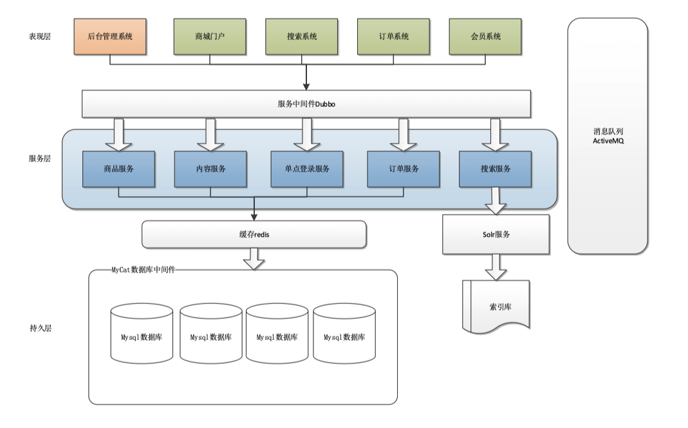
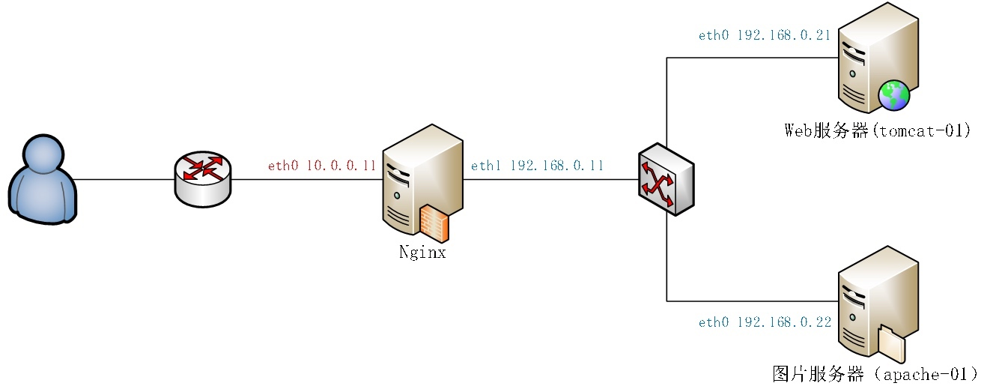

 

#### 利用 Nginx 实现负载均衡

反向代理（Reverse Proxy）方式是指以代理服务器来接受 internet 上的连接请求，然后将请 求转发给内部网络上的服务器，并将从服务器上得到的结果返回给 internet 上请求连接的客 户端，此时代理服务器对外就表现为一个服务器。

负载均衡，英文名称为 Load Balance，是指建立在现有网络结构之上，并提供了一种廉价有 效透明的方法扩展网络设备和服务器的带宽、增加吞吐量、加强网络数据处理能力、提高网 络的灵活性和可用性。其原理就是数据流量分摊到多个服务器上执行，减轻每台服务器的压 力，多台服务器共同完成工作任务，从而提高了数据的吞吐量。

#### 利用 keepalived 实现高可靠（ HA ）

HA(High Available), 高可用性集群，是保证业务连续性的有效解决方案，一般有两个或两个 以上的节点，且分为活动节点及备用节点。keepalive 是一款可以实现高可靠的软件， 通常部署在 2 台服务器上， 分为一主一备。 Keepalived 可以对本机上的进程进行检测，一旦 Master 检测出某个进程出现问题，将自己 切换成 Backup 状态，然后通知另外一个节点切换成 Master 状态。