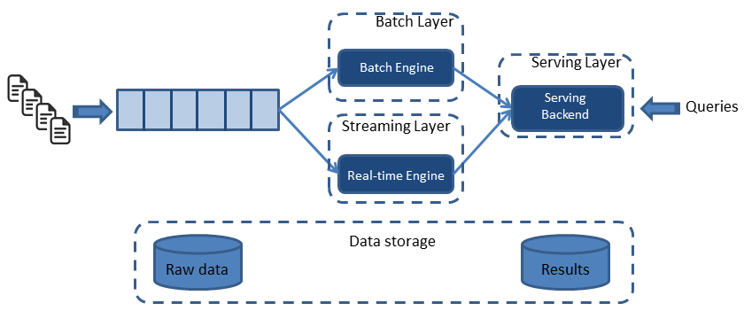
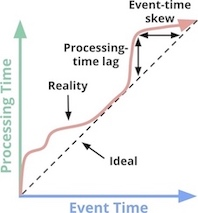
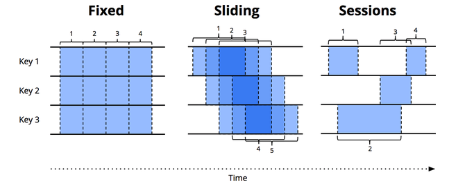
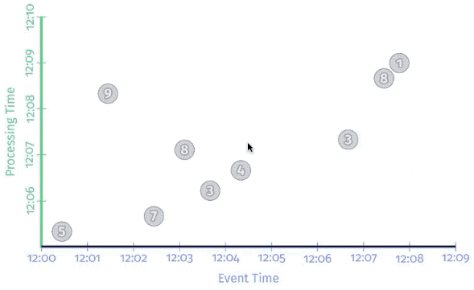
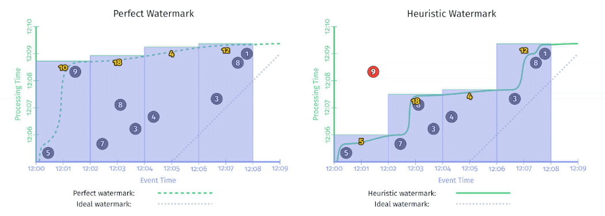
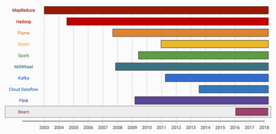
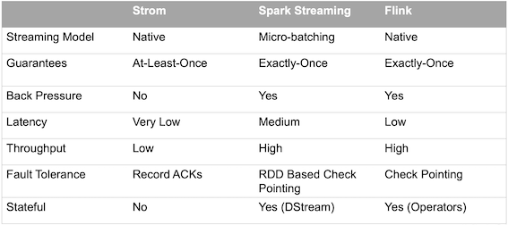

---
title: 流式系统
toc: false
date: 2017-10-30
---  
  
### 1 Basics

> **Streaming System**: A type of data processing engine that is designed with infinite datasets.
Two important dimensions that define the shape of a given dataset: cardinality and constitution。

#### data processing architectures

##### Lambda Architecture

    
The streaming system provides low-latency, inaccurate results (either because of the use of an approximation algorithm, or because the streaming system itself does not provide correctness), and some time later a batch system rolls along and provides you with correct output. Originally proposed by Twitter’s [Nathan Marz](http://nathanmarz.com/blog/how-to-beat-the-cap-theorem.html) (creator  of Storm).
    
Here’s how it looks like, from a high-level perspective[[ref](http://lambda-architecture.net/)]:

   
1. All data entering the system is dispatched to both the batch layer and the stream layer for processing.
2. The batch layer has two functions: (i) managing the master dataset (an immutable, append-only set of raw data), and (ii) to pre-compute the batch views.
3. The serving layer indexes the batch views so that they can be queried in low-latency, ad-hoc way.
4. The streaming layer compensates for the high latency of updates to the serving layer and deals with recent data only.
5. Any incoming query can be answered by merging results from batch views and real-time views.

##### Kappa architecture

The Kappa architecture simplifies the Lambda architecture by removing the batch layer and replacing it with a streaming layer. To understand how this is possible, one must first understand that a batch is a data set with a start and an end (bounded), while a stream has no start or end and is infinite (unbounded). Because a batch is a bounded stream, one can conclude that batch processing is a subset of stream processing.  Hence, the Lambda batch layer results can also be obtained by using a streaming engine. This simplification reduces the architecture to a single streaming engine capable of ingesting the needed volumes of data to handle both batch and real-time processing.

!!! note "Event time v.s. Processing time"
    
    * Event time: the time at which events actually occurred
    * Processing time: the time at which events are observed in the system

    

#### Data Processing Patterns

* Bounded Data(有界数据）: run it through some data processing engine (e.g. MapReduce)
* Unbounded Data(无界数据), Batch: slice up the unbounded data into a collection of bounded datasets appropriate for batch processing
    * Fixed windows: window the input data into fixed-size windows and then processing each of those windows as a separate, bounded data source
    * Sessions: sessions are typically defined as periods of activity (e.g. for a specific user) terminated by a gap of inactivity
* Unbounded Data, Streaming
    * Time-agnostic: used for cases in which time is essentially irrelevant
        * Filtering
        * Inner joins 
    * Approximation algorithms: e.g. approximate Top-N, streaming k-means
    * Windowing: taking a data source (either unbounded or bounded), and chopping it up along temporal boundaries into finite chunks for processing.
        * fixed windows(aka tumbling windows): slice time into segments with a fixed-size temporal length
        * sliding windows(aka hopping windows)
        * sessions
        * 

### 2 The <brown>What</brown>, <blue>Where</blue>, <green>When</green>, and <red>How</red> of Data Processing

* <em><brown>What</brown></em> results are calculated? This question is answered by the types of transformations within the pipeline. This includes things like computing sums, building histograms, training machine learning models, and so on. It’s also essentially the question answered by classic batch processing
* <em><blue>Where</blue></em> in event time are results calculated? This question is answered by the use of event-time windowing within the pipeline. This includes the common examples of windowing (fixed, sliding, and sessions); use cases that seem to have no notion of windowing (e.g., time-agnostic processing; classic batch processing also generally falls into this category); and other, more complex types of windowing, such as time-limited auctions. Also note that it can include processing-time windowing, as well, if you assign ingress times as event times for records as they arrive at the system.
* <em><green>When</green></em> in processing time are results materialized? This question is answered by the use of triggers and (optionally) watermarks. There are infinite variations on this theme, but the most common patterns are those involving repeated updates (i.e., materialized view semantics), those that utilize a watermark to provide a single output per window only after the corresponding input is believed to be complete (i.e., classic batch processing semantics applied on a per-window basis), or some combination of the two.
* <em><red>How</red></em> do refinements of results relate? This question is answered by the type of accumulation used: discarding (in which results are all independent and distinct), accumulating (in which later results build upon prior ones), or accumulating and retracting (in which both the accumulating value plus a retraction for the previously triggered value(s) are emitted).

!!! Definition

    * **Triggers**(触发器) : A trigger is a mechanism for declaring when the output for a window should be materialized relative to some external signal.”  Triggers provide flexibility in choosing when outputs should be emitted.
    * **Watermarks**(水印):  “A watermark with value of time X makes the statement: “all input data with event times less than X have been observed.”
    * **Accumulation**(累加): “An accumulation mode specifies the relationship between multiple results that are observed for the same window.”

#### <em><brown>When</brown></em>

Conceptually there are only two generally useful types of triggers, and practical applications almost always boil down using either one or a combination of both:

* Repeated update triggers: periodically generate updated panes for a window as its contents evolve
* Completeness triggers: materialize a pane for a window only after the input for that window is believed to be complete to some threshold

!!! example "Per-record triggering on a streaming engine"
    
    The figure below shows a trigger that fires with every new record. You can see how we now get multiple outputs (panes) for each window: once per corresponding input.
    
    

Conceptually, you can think of the watermark as a function, $F(P) \rightarrow E$, which takes a point in processing time and returns a point in event time.

* Perfect watermarks: there is no such thing as late data; all data are early or on time.
* Heuristic watermarks: for many distributed input sources, perfect knowledge of the input data is impractical. Heuristic watermarks use whatever information is available about the inputs, to provide an estimate of progress that is as accurate as possible.!

!!! example "perfect v.s. heuristic watermark"

    

#### <em><red>How</em></red>: Accumulation

There are three different modes of accumulation:

* Discarding: every time a pane is materialized, any stored state is discarded
* Accumulating: any stored state is retained, and future inputs are accumulated into the existing state.
* Accumulating and retracting: when producing a new pane, it also produces independent retractions for the previous panes. (aka, "I previously told you the result was X, but I was wrong. Get rid of the X I told you last time, and replace it with Y).

### 3 Watermarks

### 10 The Evolution of Large-Scale Data Processing

