### 1 File-System Structure

To improve I/O efficiency, I/O transfers between memory and mass storage are performed in units of **blocks**. A file system poses two quite different design problems:

1. define how the file system should look to the user
    * define a file and its attributes, the operations allowed on a file, and the directory structure for organizing files
2. create algorithms and data structures to map the logical file system onto the physical secondary-storage devices

The file system itself is generally composed of many different levels[^1]:

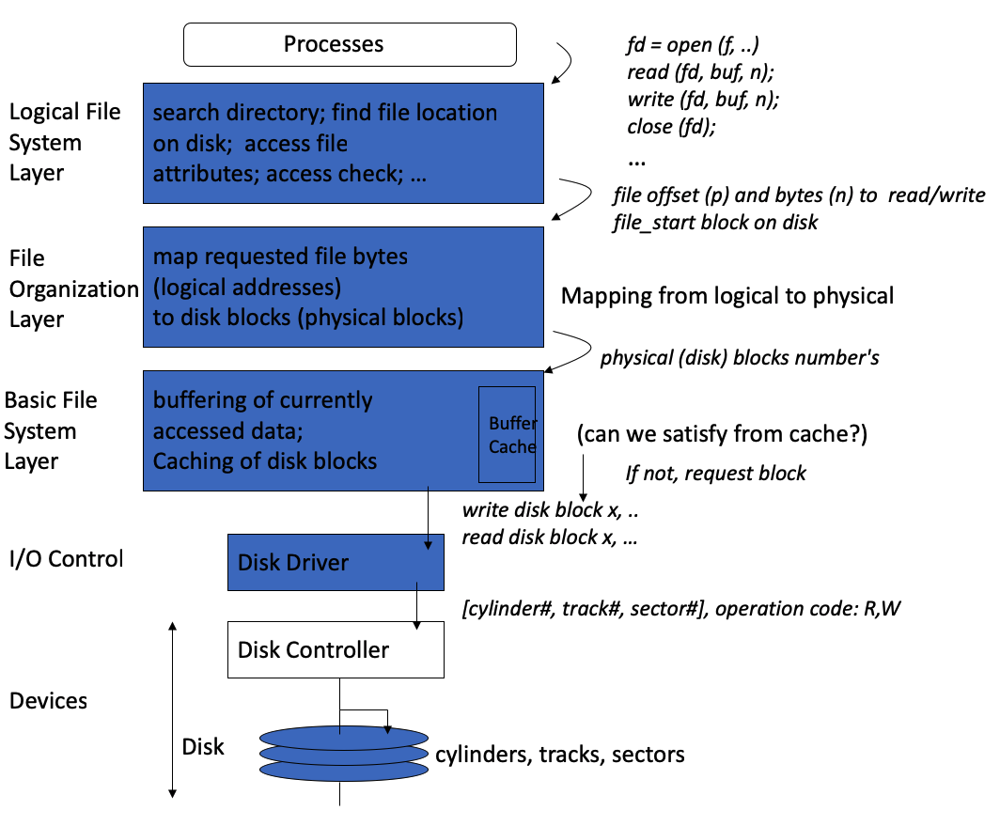

* **logical file system**: manages metadata information.
    * e.g. A file control block (FCB) (an inode in UNIX file systems) contains information about the file, including ownership, permissions, and location of the file contents.
* **file organization module**: knows about files and their logical blocks, and also includes the free-space manager.
* **basic file system**: needs only to issue generic commands to the appropriate device driver to read and write blocks on the storage device; also manages the memory buffers and caches that hold various filesystem, directory, and data blocks. 
* **I/O Control**: consists of **device drivers**, and interrupt handlers to transfer information between the main memory and the disk system.
* **physical devices**: consisting of disks, NVM devices, etc. To improve I/O efficiency, I/O transfers between memory and mass storage are performed in units of blocks.
    * Each block(usually 4kb) on a hard disk drive has one or more sectors(usually bytes).
    * NVM devices usually have blocks of 4kb.
    

### 2 File-System Operations

Major On-disk Structures (information): 

* **Boot control block** contains info needed by system to boot OS from that volume
* **Volume control block** contains volume details
    * called superblock in Unix
* Directory structure organizes the files
* Per-file **File Control Block**(FCB) contains many details about the file

### 3 Directory Implementation

#### Linear List

The simplest method of implementing a directory is to use a linear list of file names with pointers to the data blocks. This method is simple to program but time-consuming to execute.

* To create a new file, we must first search the directory to be sure that no existing file has the same name. Then, we add a new entry at the end of the directory.
* To delete a file, we search the directory for the named file and then release the space allocated to it.

Problems: finding a file requires a linear search.

#### Hash Table

The hash table takes a value computed from the file name and returns a pointer to the file name in the linear list. Hash table can greatly decrease the directory search time.

Problems: collisions – situations where two file names hash to the same location

### 4 Allocation Methods
#### Continuous Allocation

Contiguous allocation requires that each file occupy a set of contiguous blocks on the device. Device addresses define a linear ordering on the device.

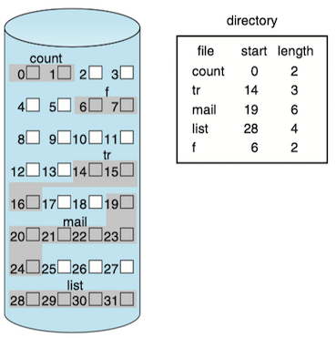

* For HDDs, the number of disk seeks required for accessing contiguously allocated files is minimal.
* easy to implement
* problems
    * finding free space for a new file: suffer from the problem of **external fragmentation**: the free storage space is broken into little pieces.
    * determining how much space is needed for a file: the size of an output file may be difficult to estimate
* not used in modern file systems.

#### Linked Allocation

With linked allocation, each file is a linked list of storage blocks; the blocks may be scattered anywhere on the device. The directory contains a pointer to the first and last blocks of the file. Each block contains a pointer to the next block.

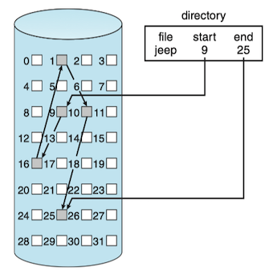

* create a new file : 
    * create a new entry in the directory
    * each directory entry has a pointer to the first block of the file
    * find a free block, and this new block is written to and is linked to the end of the file
* read a file:
    * read blocks by following the pointers from block to block
* problem:
    * used effectively only for sequential-access files: need $i$ times of block read to  find the $i$th block of a file, 
    * the space required for the pointers
    * reliability: a pointer may lost or damaged.
* possible solution:
    * collect blocks into multiples, called clusters, and to allocate clusters rather than blocks.
        * less storage for points and less seek time
        * HOWEVER: increase in **internal fragmentation**, because more space is wasted when a cluster is partially full than when a block is partially full.

!!! example "FAT"

    FAT(File Allocation Table)
    
    * The table has one entry for each block and is indexed by block number.
    * An unused block is indicated by a table value of 0.

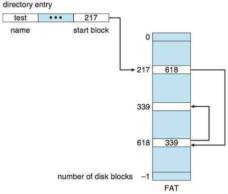

#### Indexed Allocation
**Indexed Allocation** brings all pointers together into the index block

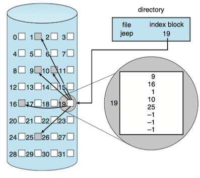

Indexed allocation does suffer from wasted space, however. The pointer overhead of the index block is generally greater than the pointer overhead of linked allocation.

!!! example "Unix inode"
    
    * 15 pointers of the index block in the file’s inode. 
    * The first 12 of these pointers point to direct blocks.
    * The next three pointers point to indirect blocks.
        * The first points to a single indirect block, which is an index block containing not data but the addresses of blocks that do contain data. 
        * The second points to a double indirect block
        * The last pointer contains the address of a triple indirect block.
    
    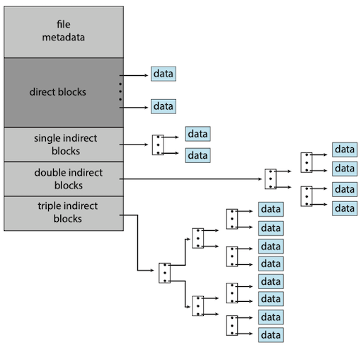

#### 5 Free-Space Management

To keep track of free disk space, the system maintains a free-space list. The free-space list records all free device blocks—those not allocated to some file or directory.

#### Bit Vector

Frequently, the free-space list is implemented as a **bitmap** or **bit vector**. Each block is represented by 1 bit. If the block is free, the bit is 1; if the block is allocated, the bit is 0[^1].

The main advantage of this approach is its relative simplicity and its efficiency in finding the first free block or $n$ consecutive free blocks on the disk.

Unfortunately, bit vectors are inefficient unless the entire vector is kept in main memory. Keeping it in main memory is possible for smaller devices but not necessarily for larger ones.

#### Linked List

Another approach to free-space management is to link together all the free blocks, keeping a pointer to the first free block in a special location in the file system and caching it in memory.

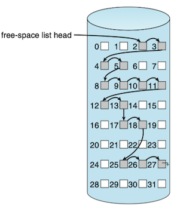

This scheme is not efficient to traverse the list. Fortunately, however, traversing the free list is not a frequent action. Usually, the operating system simply needs a free block so that it can allocate that block to a file, so the first block in the free list is used.

#### Grouping

A modification of the free-list approach stores the addresses of $n$ free blocks in the first free block. The first $n−1$ of these blocks are actually free. The last block contains the addresses of another $n$ free blocks, and so on. The addresses of a large number of free blocks can now be found quickly, unlike the situation when the standard linked-list approach is used.

#### Counting

Besides the free block pointer, keep a counter saying how many block are free contiguously after that free block[^1].

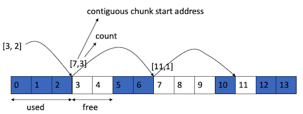

### 7 Recovery
Log-based transaction-oriented (or **journaling**) file systems use log-based recovery algorithms. It is now common on many file systems including ext3, ext4, ZFS, and NTFS. 

Fundamentally, all metadata changes are written sequentially to a log. Each set of operations for performing a specific task is a transaction. Once the changes are written to this log, they are considered to be committed, and the system call can return to the user process, allowing it to continue execution. Meanwhile, these log entries are replayed across the actual filesystem structures. As the changes are made, a pointer is updated to indicate which actions have completed and which are still incomplete.

The log file is is actually a circular buffer. A circular buffer writes to the end of its space and then continues at the beginning, overwriting older values as it goes.

If the system crashes, the log file will contain zero or more transactions. Any transactions it contains were not completed to the file system, even though they were committed by the operating system, so they must now be completed. The transactions can be executed from the pointer until the work is complete so that the file-system structures remain consistent. The only problem occurs when a transaction was aborted—that is, was not committed before the system crashed. Any changes from such a transaction that were applied to the file system must be undone, again preserving the consistency of the file system. This recovery is all that is needed after a crash, eliminating any problems with consistency checking.

#### Snapshot

A **snapshot** is a read-only, point-in-time copy of the filesystem state. The file systems never overwrite blocks with new data. Rather, a transaction writes all data and metadata changes to new blocks. When the transaction is complete, the metadata structures that pointed to the old versions of these blocks are updated to point to the new blocks. The file system can then remove the old pointers and the old blocks and make them available for reuse. If the old pointers and blocks are kept, a snapshot is created.

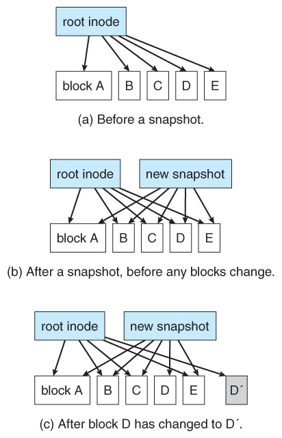

### Example: Ext2/3

Linux ext2 file system is extended file system 2. The ext3 file system is fully compatible with ext2. The added new feature is Journaling. So it can recover better from failures. The disk data structures used by  ext2 and ext3 is the same[^1]. 

A disk partition before installing ext3 file system: just a sequence of blocks

Ext3 considers the partition to be divided into logical groups. Each group has equal number of blocks; lets say $M$ blocks/group.

What do we have in a group: 

- Assume block is size if 4 KB.
- The first block of each group contains a superblock (i.e. superblock info) that is 1024 bytes long. 
- Superblock keeps some general info about the filesystem
- After the first block in a group, a few blocks keeps info about all groups. It means a few blocks store group descriptors table (GDT). Some of these block may be empty and reserved. 
- After that comes bitmap that occupies one block. It is a bitmap for the group. Each group has it own bitmap. 
- Then comes an inode bitmap; showing which inodes are free. 
- After that comes the inodes (inode table). Each group stores a set of nodes. The number of inodes stored in a group is the same for all groups. So the inode table of the partition is divided into groups: each group stores a portion of the table.

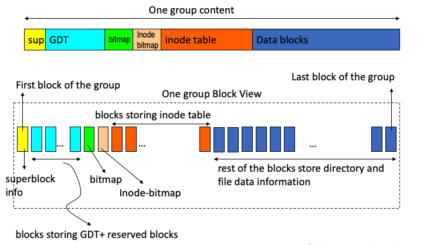

In group 0, superblock info starts at offset 1024 of the first block of the group (i.e. block 0 of the disk). In all other groups, superblock info starts at offset 0 of the first block of the group. 

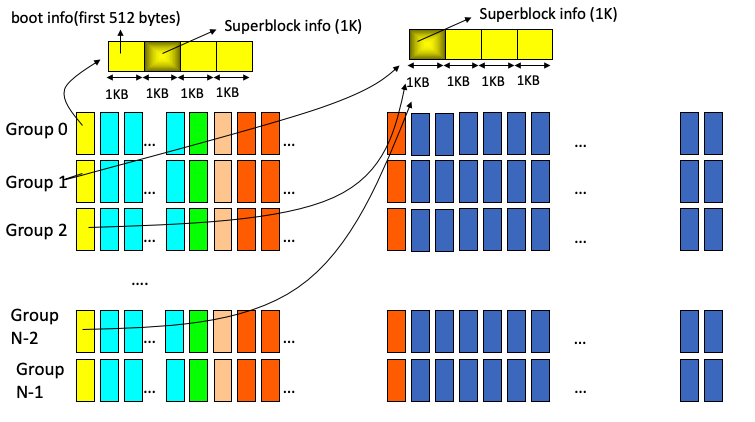

[^1]: CS 342 Operating Systems - Spring 2019, http://www.cs.bilkent.edu.tr/~korpe/courses/cs342spring2019/

