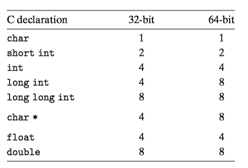
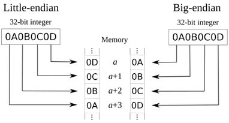
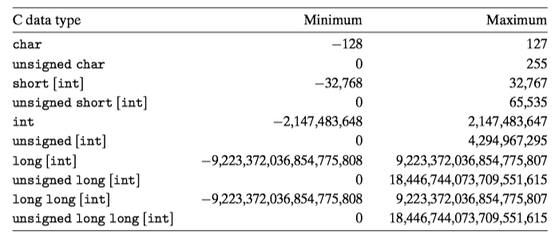
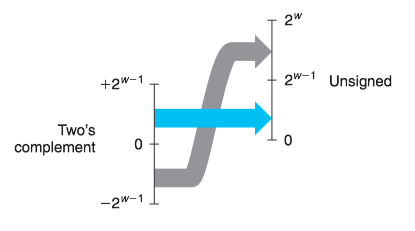
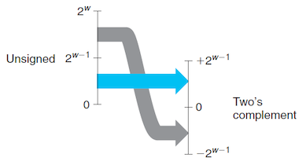
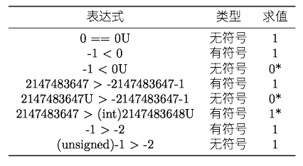
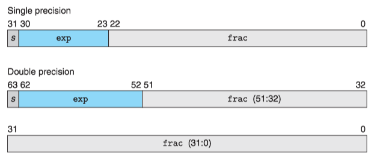
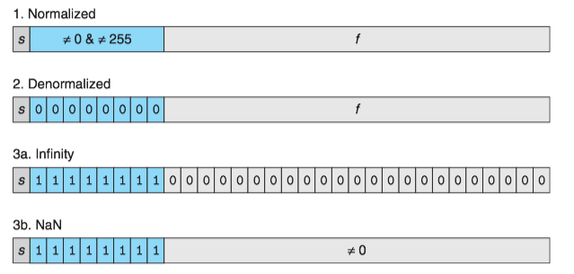

### 1 信息存储

大多数计算机使用8位的块，或者字节(byte),作为*最小的可寻址的内存单位*，而不是访问内存中单独的位。内存的每个字节都有一个唯一的数字来标识，称为它的**地址**(address)。

#### 十六进制表示法

一个字节由8位组成。在二进制表示法中，它的值域是$00000000_2\sim 11111111_2$。如果看成十进制数，它的值域是$0_{10}\sim 255_{10}$。

这两种符号表述法对于描述位模式来说都不是非常方便。

* 二进制表示法太冗长；
* 十进制表示法与位模式的相互转化很麻烦。

替代的方法是，以16基数，以十六进制(hexiademical)数来表示位模式。

#### 字和数据大小

每台计算机都有⼀个**字⻓**(word size)，标明指针数据的**标称大小**(norminal size)。字⻓决定的最重要的系统参数就是虚拟空间的⼤⼩。对于⼀个字⻓为$w$位的机器⽽⾔，虚拟地址的范围为$0\sim 2^w−1$。

C语言支持整数和浮点数的多种数据格式。下表为C语言各种数据类型分配的字节数。

#### 寻址和字节顺序

考虑一个$w$位的整数，其位表示为$[x_{w-1}, x_{w-2}, x_1, x_0]$，其中$x_{w-1}$是**最高有效位**(the most significant bit)，而$x_0$是**最低有效位**(the least significant bit).

假设$w$是8的倍数，这些位就能被分组成字节，其中**最高有效字节**(the most significant byte)包含位$[x_{w-1}, x_{w-2},..., x_{w-8}]$，而**最低有效字节**(the least significant byte)包含位$[x_7, x_6,..., x_0]$，其他字节包含中间的位。

有些机器选在在内存中按照从最低有效字节到最高有效字节的顺序存储对象，这种方式称为**小端法**(little endian)。 最高有效字节在前面的方式，称为**大端法**(big endian).

!!! Note
    大多数Intel兼容机都只用小端模式。

### 2 整数表示

#### 整数数据类型

C语言支持多种整数数据类型。下图给出了典型的64位机器的取值范围。每种类型用关键字来制定大小，这些关键字包括<C>char</C>，<C>short</C>，<C>long</C>，同时还可以指示被表示的数是非负数(<C>unsigned</C>)，或者可能是负数(默认)。

#### 无符号数的编码

假设有一个整数数据类型有$w$位。我们可以将位向量写成$\vec{x}$，表示整个向量，或者写成$[x_{w-1}, x_{w-2},..., x_0]$，表示向量中的每一位。把$\vec{x}$看作一个二进制表示的数，就获得了$\vec{x}$的无符号表示。用函数$B2U_w$(Binary to Unsigned，长度为$w$)来表示：

$$B2U_w(\vec{x})=\sum ^{w-1}_{i=0}x_i2^i$$

#### 补码

最常见的有符号数的计算机表示方式是**补码**(two's complement)。它将字的最高有效位解释为负权(negative weight)。用函数$B2T_w$(Binary to Two's complement，长度为$w$)来表示：

$$B2T_w(\vec{x})=-x_{w-1}2^{w-1}+\sum ^{w-2}_{i=0}x_i2^i$$

最高有效位$x_{w-1}$也称为符号位，它的权重是$-2^{w-1}$。

补码的范围是不对称的: $|TMin| = |TMax| + 1$

#### 有符号数和无符号数之间的转换

补码转换为无符号数：对满足 $TMin_w \le x \le TMax_w$的$x$有：

$$
T2U_w(x)=
\begin{cases}
x+2^w& x<0\\
x& x\ge 0
\end{cases}
$$

无符号数转换为补码：对满足 $0 \le u \le UMax_w$的$u$有：

$$
U2T_w(u)=
\begin{cases}
u& u\le TMax_w\\
u-2^w& u> TMax_w
\end{cases}
$$

!!! note

    补码(two's compliment)，原码(signed magnitude)，反码(one's compliment)。原码的编码方式最接近人类的习惯，但并不适合在计算机中使用。于是反码就出现了，但反码有循环进位和和正负0的问题。所以现在最终都使用补码。
    
    * 原码： 正数：  0_xxxxxxx, 负数：  1_xxxxxxx
    * 反码： 正数： 反码 = 原码， 负数： 反码 = 符号位不变，其他位取反
    * 补码： 正数： 补码 = 原码， 负数： 反码 + 1
    
#### C语⾔中的有符号数和⽆符号数

如果⼀个运算的⼀个运算数是⽆符号的⽽另外⼀个是有符号的, C语⾔会隐式的将有符号数转换为⽆符号数。

### 3 浮点数
#### IEEE浮点表示

IEEE浮点标准⽤$V=(−1)^s\times  2^E\times M$的⽅法来表⽰浮点数

* 符号(sign) $s$: $s$决定这数是负数($s=1$)还是正数$s=0$，而对于数值0的符号位解释作为特殊情况处理。
* 阶码(exponent) $E$: $E$的作用是对浮点数加权，这个权重是2的E次幂。
* 尾数(significand) $M$: $M$是一个二进制小数，它的范围是$1\sim 2-\varepsilon$，或者是 $0\sim 1-\varepsilon$

将浮点数的位表示划分为三个字端，分别对这些值进行编码：

* 一个单独的符号位$s$直接编码符号$s$
* $k$位的阶码字段$\text{exp} = e_{k-1}\cdot\cdot\cdot e_1e_0$编码阶码$E$。
* $n$位的小数字段$\text{frac} = f_{n-1}\cdot\cdot\cdot f_1f_0$编码尾数$M$。

根据$exp$的值，被编码的值可以分成三种不同的情况。下图对应的是单精度格式的情况：

