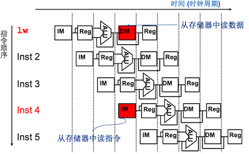
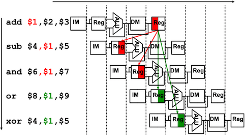
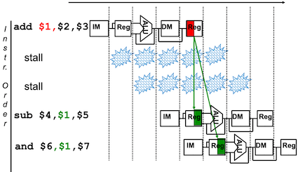
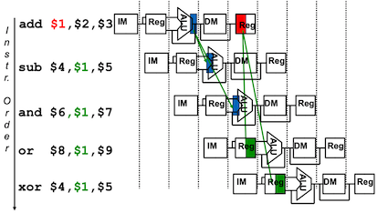
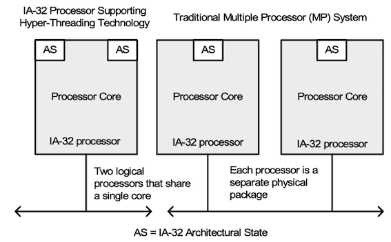

### 1 计算机概要与技术

#### 处理器制造

集成电路的制造是从*硅锭*(silicon crystal ingot)开始的，经切片机切成厚度不超过0.1英寸的晶圆(wafer)。空白的晶圆经过大约20～40步的加工，产生图样化的晶圆。这些图样化的晶圆由晶圆测试器进行测试，进一步切成芯片。合格芯片被封装起来并且在发布给用户之前经过多次测试。不合格的封装会在最终测试中被发现。晶圆中或是在图样化的几十个步骤中出现一个细微的瑕疵就会使其附近的电路损坏，这些*瑕疵*(defect)使得制成一个完美的晶圆几乎是不可能的。最常见的策略是把晶圆切成许多独立的晶圆，即*芯片*(die，或者更正式的chip)，而只淘汰那些有瑕疵的芯片。当芯片尺寸增大时，集成电路的价格会快速上升，因为成品率和晶圆中芯片的总数都下降了。

#### 性能

就像飞机一样，可以用不同指标例如巡航速度、乘客吞吐量来定义飞机的性能。*响应时间*(response time)、*吞吐率*(thoughput)可以作为计算机的性能度量标准：

* **响应时间**：也叫执行时间(execution time)，是计算机完成某任务所需的总时间，包括硬盘访问、内存访问、I/O活动、操作系统开销和CPU执行时间等。
* **吞吐率**：单位时间内完成的任务数量。 <red>注意和吞吐量的区别</red>

一个程序的**CPU执行时间**(CPU execution time)，简称CPU时间，表示在CPU上花费的时间，而不包括等待I/O或运行其他程序的时间。需要注意的是，用户所感受的是程序的响应时间，而不是CPU时间。CPU时间包括用于用户程序的CPU时间(用户CPU时间)和操作系统为用户服务花去的CPU时间(系统CPU时间)。

几乎所有计算机都用时钟来驱动硬件中发生的各种时间。时钟间隔的时间称为**时钟周期**(clock cycle或cycle)，其倒数为**时钟频率**(clock rate)。

$$\text{一个程序的CPU执行时间} = \text{一个程序的CPU时钟周期数} \times \text{时钟周期时间}$$

如果考虑程序中的指令数，一个程序需要的时钟周期数为：

$$\text{一个程序的CPU时钟周期数} = \text{程序的指令数} \times \text{每条指令的平均时钟周期数}$$

其中每条指令的平均时钟周期数倍称为**CPI**(clock cycle per instruction)。

经典的CPU性能公式用指令数(instruction count)、CPI和时钟周期时间来表示：

$$\text{CPU时间} = \text{指令数} \times \text{CPI} \times \text{时钟周期时间}$$

#### 功耗墙

现在CPU功耗已经达到了极限，无法再冷却下来。占统治地位的集成电路技术是CMOS(互补型金属氧化半导体)，其主要的能耗来源是在晶体管开关过程中产生的能耗，即晶体管的状态从0翻转到1或从1翻转到0消耗的能量。这个动态能耗取决于每个晶体管的负载电容和工作电压：

$$能耗 \propto 1/2 \times 负载电容\times 电压^2 $$

每个晶体管需要的功耗是一个翻转需要的能耗和开关频率的乘积：

$$功耗 \propto 1/2 \times 负载电容\times 电压^2 \times{开关频率}$$

开关频率是时钟频率的函数，负载电容是连接到输出上的晶体管数量和工艺的函数，该函数决定了导线和晶体管的电容。每次工艺更新换代都会降低电压，所以虽然20多年来时钟频率增长了1000倍，但是功耗只增长了30倍。

随着芯片制程进步，晶体管越来越小。这意味着单位面积内可以有更多的晶体管，也就是更强的性能。并且随着晶体管变小，晶体管所需的能耗也降低了。

### 4 处理器

#### 流水线

**流水线**(pipeling)是一种实现多条指令重叠执行的技术。洗衣店就使用了流水线，清洗、烘干、折叠、收拾这些步骤是重叠执行的。如果所有的步骤所需的时间一样，并且有足够的工作可做，那么流水线得到的速度提高倍数等于流水线中步骤的数目。处理器采用流水线方式执行指令，通常一个MIPS指令包括如下5个处理步骤：

* Ifetch: 取指令，PC+4： 指令存储器、加法器
* Reg/Dec : 读寄存器、指令译码：寄存器读、译码器
* Exec: 计算存储器地址：立即数扩展、运算单元（ALU）
* Mem : 读数据存储器：数据存储器
* Wr: 写寄存器：寄存器写

下图是Load指令的执行流水线：

#### 冒险和阻塞

指令之间往往不是独立的，有些指令会用到其他指令的计算结果。出现下一个时钟周期中下一条指令不能执行的情况称为**冒险**(hazard)。冒险分为多种：

* 结构冒险(structural hazard): 因缺乏硬件支持而导致指令不能在预定的时钟周期内执行的情况
    * e.g.所需的硬件部件正在为之前的指令工作，例如假如只有一个存储器，指令1的DM和指令3的IM不能同时执行
    * 
    * 解决方法：在指令3和指令4之间插入一条空指令，或者将指令存储器和数据存储器相互独立，写寄存器和读寄存器分别在时钟周期的前后半段执行
    
* 数据冒险(data hazard):因无法提供指令执行所需数据而导致指令不能在预定的时钟周期内执行的情况
    *  e.g. 第二条、第三条指令在读取寄存器时，第一次指令还没有将数据写入寄存器
    * 
    * 解决方法：
        * 流水线停顿 
        * 
        * 前向传递：不等写回寄存器，就将产生的结果直接传送到当前周期需要结果的功能单元
        * 

       

* 控制冒险(control hazard)，也称为分支冒险(branch hazard): 因为取到的指令并不是所需要的而导致指令不能在预定的时钟周期内执行

#### 指令级并行

指令间的并行性称为**指令级并行**(instruction-level parallelism)。有两种方法可以增加潜在的指令级并行程度：

* 增加流水线深度以重叠更多的指令。更多的操作被重叠，有更多的并行性被挖掘出来。
* **多发射**(multiple issue): 单时钟周期内发射多条指令。通过复制计算机内部部件的数量，使得每个流水级可以启动多条指令。类似于用多台洗衣机和烘干机替代原来的单台洗衣机和烘干机，雇佣更多的洗衣工来折叠、收拾衣服。

实现一个多发射处理器主要有两种方式，其区别是将主要工作分给编译器来做，还是硬件来做：

* **静态多发射**(static multiple issue): 决策是在执行前的编译阶段做出的
* **动态多发射**(dynamic multiple issue): 决策是由处理器在执行阶段做出的

动态多发射处理器(也称为超标量处理器,superscalar)使用**动态流水线调度**(dynamic pipeline scheduling)选择某个时钟周期内将执行的指令(指令重排序)，以避免冒险和阻塞。

#### 超线程

超线程(hpyer-threading)技术允许一个物理处理器并行执行两个分别的代码流(称为线程)，从而实现线程级并行。通常在单线程执行中，只用到了35%的执行资源，所以为了提高其利用率，超线程技术并行执行两个线程，指令吞吐率至少可以提高30%。

在上电和初始化之后，每个逻辑处理器可以被分别独立地暂停、中断或直接执行特定的线程，而与芯片上另一个逻辑处理器无关。逻辑处理器共享执行资源，包括执行引擎、缓存、系统总线接口和固件。

超线程运行机制：

* 使两个线程同时运行在一个处理器核上，只要不同时执行同一个执行单元。
* 处理器核利用无序指令调度并行执行该两个线程，以期望尽可能多的执行单元在每个时钟周期处于忙碌状态。
* 共享数据和指令缓存。

超线程与多核处理器的区别：多核处理器复制执行资源，超线程技术共享资源。