### 1 简介

为了防止信息泄漏、实现机密数据的传输，出现了各种各样的加密技术。加密技术分布与OSI参考模型的各个层一样，相互协同保证通信。加密技术可以根据各层分类为：

| 分层 | 加密技术 |
| --- | --- |
| 应用层 | SSH、SSL-Telnet |
| 运输层 | SSL/TLS、SOCKS V5加密 |
| 网络层 | IPsec |
| 链路层 | Ethernet、WAN加密装置 |


加密是指利用**密钥**(key)对**明文**(plaintext, cleartext)通过**加密算法**(encryption algorithm)生成**密文**(ciphertext)的过程。它的逆反过程叫做**解密**(decryption)。加密和解密使用相同的密钥叫做**对称加密方式**。反之，如果在加密和解密过程中分别使用不同的密钥(公钥和私钥)则叫做**公钥加密方式**。


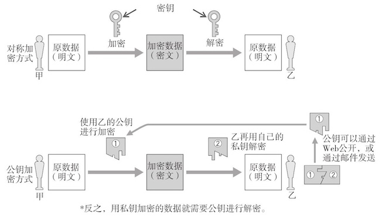

#### 历史上的密码

介绍历史上几种著名的密码

##### 凯撒密码 

凯撒密码(Caesar cipher)通过将明文中所使用的字母在字母表上向后(或向前)偏移固定数目后被替换成密文。

例如下图中，ROT13密码，加密过程向后偏移13位，HELLO被加密成URYYB。


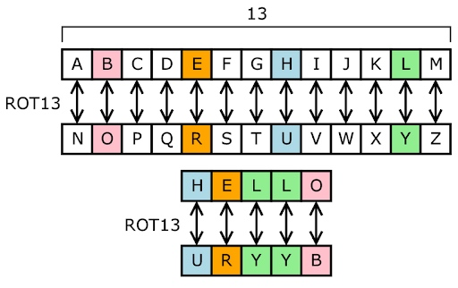


凯撒密码非常容易被暴力破解，而且在实际应用中也无法保证通信安全。

##### 简单替换密码

简单替换密码(simple substitution cipher)是将明文中所使用的字母表替换为另一套字母表的密码。

如将字母表`ABCDEFGHIJKLMNOPQRSTUVWXYZ`改变顺序为`ZEBRASCDFGHIJKLMNOPQTUVWXY`即可把明文`flee at once. we are discovered!`加密并省略掉标点成`SIAA ZQ LKBA VA ZOA RFPBLUAOAR`

简单替换加密一般不容易被暴力破解但可通过频率分析进行破解。

#### 对称密码

对称密码(symmetric cryptography)是一种用相同的密钥进行加密和解密的技术，用于确保消息的机密性。

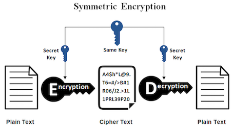


##### DES

DES(Data Encryption Standard)是1988年美国联邦信息处理标准中所采用的一种对称密码(FIPS 46-3)。现在DES已经能被暴力破解。DES是以64比特的明文为一个单位来加密的，对于超过64比特的明文，通过迭代的方式进行。


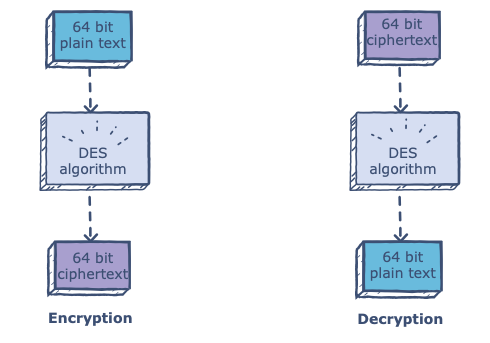

##### 三重DES

三重DES(triple-DES)是为了增加DES的强度，将DES重复3次所得到的一种密码算法，通常缩写为3DES。目前三重DES仅被银行等机构使用，因为其处理速度不高，所以很少有其他用途。

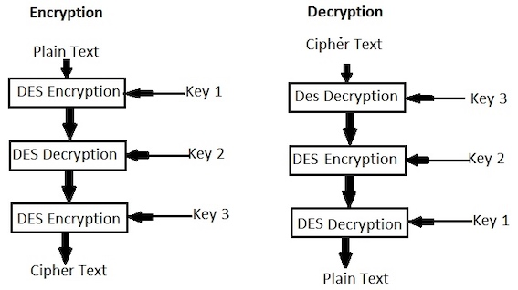

三重DES并不是进行三次DES加密(加密-->加密-->加密)，而是加密-->*解密*-->加密的过程。在加密算法中加入解密操作是为了能够兼容普通的DES：当三重DES中的所有的密钥都相同时，三重DES就等同于普通的DES。三重DES的解密过程和加密正好相反，是以密钥3、密钥2、密钥1的顺序执行解密-->加密-->解密的操作。


##### AES

AES(Advanced Encryption Standard)是取代DES而成为新标准的一种对称密码算法。2000年，Rijndael被美国国家标准技术研究所选定为AES标准。


#### 公钥密码

使用对称密码时，会遇到**密钥配送问题**(key distribution problem)。明文加密后，发送方必须将密钥发送给接收方。但是密钥非常容易被第三方窃听。使用**公钥密码**(public-key cryptography)可以解决密钥配送问题。

在对称密码中，加密密钥和解密密钥是相同的。但公钥密码中，加密密钥和解密密钥却是不相同的。只要拥有加密密钥，任何人都可以进行加密，但没有解密密钥是无法解密的。接收者事先将加密密钥发送给发送着，这个加密密钥即使被窃听者获取也没有问题。发送者使用加密密钥对通信内容进行加密并发送给接收者，而只有拥有解密密钥的人才能够进行解密。这样一来，就不用将解密密钥配送给接收者了。

* 发送者只需要加密密钥
* 接收者只需要解密密钥
* 加密密钥被窃听者获取也没有问题
* 加密密钥一般是公开的，因此被称为公钥(public key)。

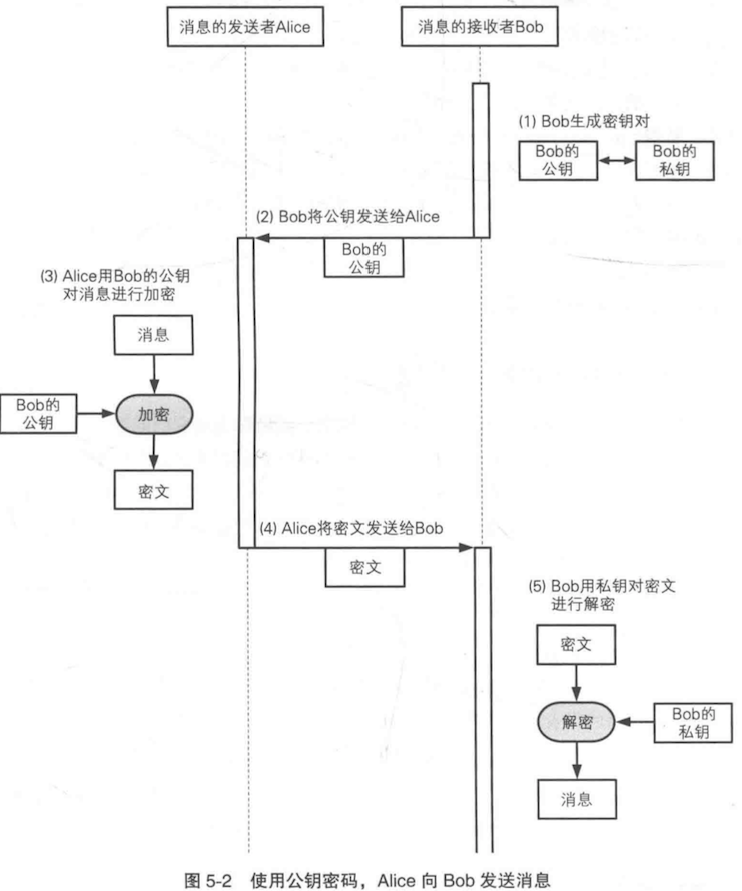

公钥密码解决了密钥配送的问题，但依然面临着下面的问题

* 认证问题： 判断所得到的公钥是否正确合法。
* 处理速度： 公钥密码的处理速度只有对称密码的几百分之一。

##### RSA
RSA是目前使用最广泛的公钥密码算法，名字是由它的三位开发者的姓氏(Rivest-Shamir-Adleman)的首字母组成。RSA可以被使用公钥密码和数字签名。在RSA中，明文、密钥和密文都是数字。

RSA加密过程为对代表明文的数字的E次方求$\mod N$的结果为密文

密文 = 明文$^E \mod N$


RSA解密过程为对表示密文的数字的D次方求$\mod N$就可以得到明文

明文 = 密文$^D \mod N$

RSA算法基于一个十分简单的数学难题：RSA使用因式分解的原理，两个大质数相乘很容易，但大数分解质因子很难.即：将两个大质数相乘十分容易，但是想要对其乘积进行因式分解却极其困难，因此可以将乘积公开作为加密密钥。


#### 单项散列函数

**单向散列函数**(one-way hash function)可以确认消息的完整性(integrity): 消息没有被篡改。单向散列函数的输入为消息(message)，输出为散列值(hash value)。它根据消息的内容计算出散列值，而散列值可以被用来检查消息的完整性。

[^4]
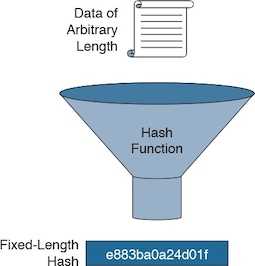


散列值必须具备以下性质：

* 根据任意长度的消息计算出固定长度的散列值：输入的消息必须是能够任意长度的，输出的散列值应该是短且固定的。
* 能够快速计算：必须在有限时间内完成计算
* 消息不同散列值也不同：哪怕消息中只有1比特的改变，也必须有很高的概率产生不同的散列值
* 单向性：无法通过散列值反算出消息的性质

##### MD5

MD5能够产生128比特的散列值，现已不推荐使用：

```bash
➜ md5 Gemfile
MD5 (Gemfile) = b4d26da29ddb9b0a1b1581e74aa2bba0
```
##### SHA-1

SHA-1能够产生160比特的散列值，现已不推荐使用。

##### SHA256

SHA256能够产生256比特的散列值。


##### 无法解决的问题

单项散列函数能够辨别出“篡改”，但无法辨别出“伪装”。 例如：主动攻击者Mallory伪装成Alice，向Bob同时发送了消息和散列值，这时Bob能够通过单向散列函数检查消息的完整性，但是这只是针对发送的消息进行检查，而无法检查出发送者的身份是否被Mallory进行了伪装。数字签名不仅能够向通信对象保证消息没有被篡改，还能够向所有第三方确认消息真的来自Alice。


#### 数字签名

**数字签名**(digital signature)可以确认消息的来源。数字签名对**签名密钥**和**验证密钥**进行了区分，使用验证密钥是无法生成签名的。签名密钥只能由签名的人持有，而验证密钥则是任何需要验证签名的人都可以持有。

其实数字签名就是通过将公钥密码"反过来用"实现的。

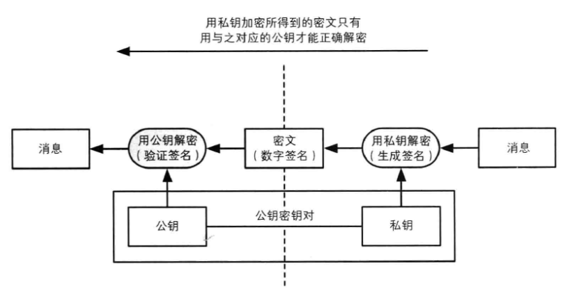


数字签名一般先用单向散列函数求出消息的散列值，然后再将散列值进行加密(对散列值签名)。无论消息有多长，散列值永远那么短，因此对其进行加密是非常快速的。

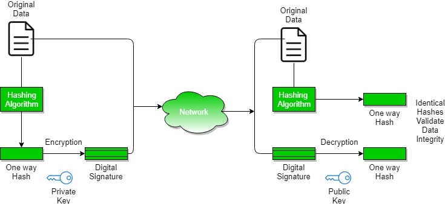


下面的例子使用SHA-1散列和RSA签名[^4]：

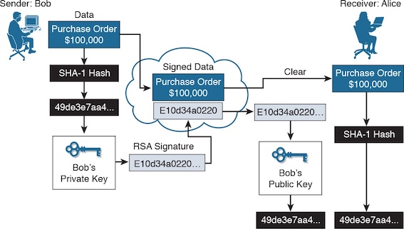


#### 证书

**公钥证书**(Public-Key Certificate, PKC, 简称**证书**)由认证机构(Certification Authority, CA)对公钥施加数字签名。


[^3]
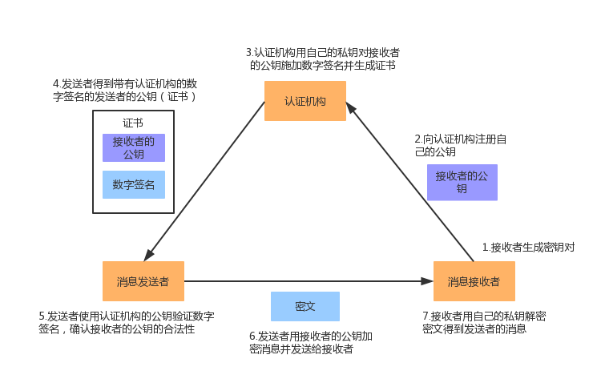
下面是gitbooks.io站点的证书证序列号，颁发者，有效期，签名算法等

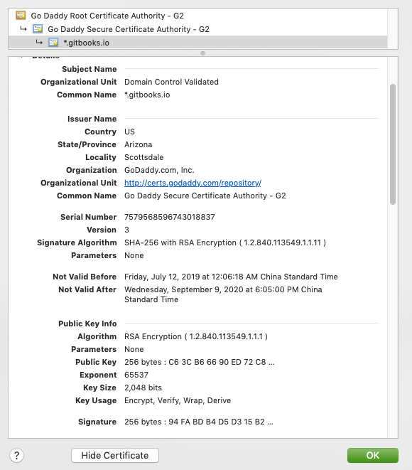


#### 随机数

随机数可以生成密钥、密钥对、初始化向量等，应用于对称密码、公钥密码、数字签名等。需要用随机数来生成密钥，因为随机数有以下性质：

* 随机性：不存在统计学偏差，是完全杂乱的数列
* 不可预测性：不能从过去的数列推测出下一个出现的数
* 不可重现性：除非将数列本身保存下来，否则不能重现相同的数列

上面三个性质中，越往下越严格。具备随机性，不代表一定具备不可预测性。密码技术中所使用的随机数，仅仅具备随机性是不够的，至少还需要具备不可预测性。


要生成具备不可重现性的随机数列，需要从不可重现的物理现象中获取信息。英特尔的CPU中内置了数字随机数生成器(Digital Random Number Generator, DRNG)，随机信号来自于电路中产生的热噪声。它提供了两种指令：RDSEED指令生成不可重现的随机数，一般被用作其他伪随机数生成器的种子；RDRAND指令生成不可预测的随机数。


##### 伪随机数生成器

可以生成随机数的软件称为**伪随机数生成器**(Pseudo Random Number Generator, PRNG)。仅靠软件是无法生成具备不可重现性的随机数列的，只能生成伪随机数，因为运行软件的计算机本身仅具备有限的内部状态。


用密码实现伪随机数生成器

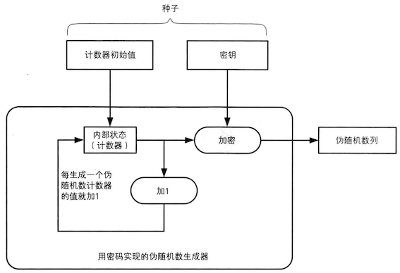


### 2 TLS/SSL

TLS/SSL(Transport Layer Security/Secure Sockets Layer)是世界上应用最广泛的密码通信方法。SSL（Secure Sockets Layer，安全套接层）是1994年由网景公司（Netscape）设计的一种协议，并在该公司的Web浏览器上进行了实现。随后，很多Web浏览器都采用了这一协议，使其成为了事实上的行业标准。SSL已经于1995年发布了3.0版本，但在2014年，SSL3.0协议被发现存在可能导致POODLE攻击的安全漏洞，因此SSL3.0已经不安全了。TLS（Transport Layer Security ，传输层安全）是IETF在SSL3.0的基础上设计的协议。在1999年作为RFC2246发布的TLS1.0，实际上相当于SSL3.1。

TSL/SSL提供了一种密码通信的框架，这意味着SSL/TLS中使用的对称密码、公钥密码、数字签名、单向散列函数等技术，都是像零件一样进行替换的。

TLS协议由应用协议(Application)、警告协议(Alert)、密码规格变更协议(ChangeCipherSpec)、握手协议(HandShake)以及下层的记录协议组成(Record)[^2]。

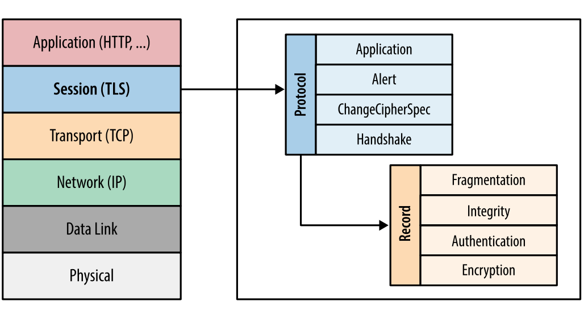


####  握手协议

握手协议[^2]：
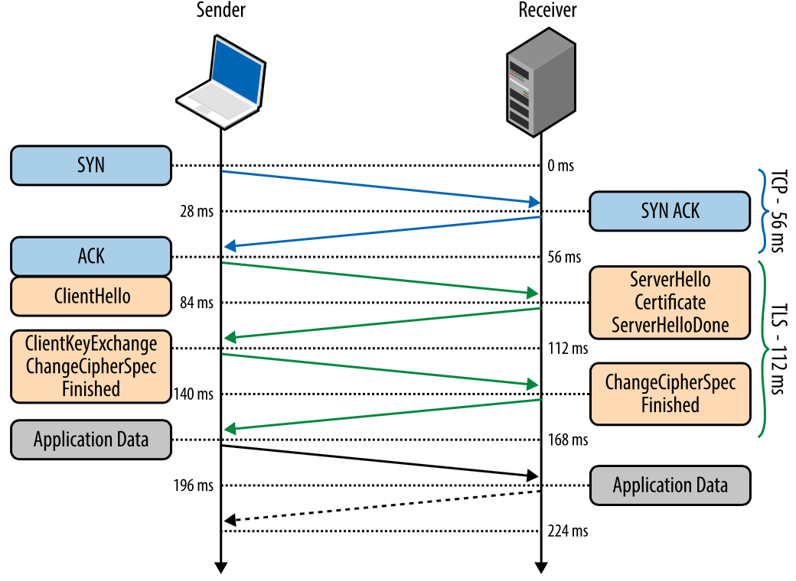


#### HTTPS
Web中可以通过TLS/SSL(Transport Layer Security/Secure Sockets Layer)对HTTP通信进行加密。使用TLS/SSL的HTTP通信叫HTTPS通信。HTTPS采用对称加密方式，在发送公共密钥时采用公钥加密方式。

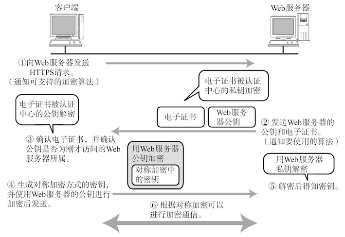

确认公钥是否正确主要使⽤认证中⼼(CA)签发的证书，⽽主要的认证中⼼的信息已经嵌⼊到浏览器的出⼚设置中。如果Web浏览器中尚未加⼊某个认证中⼼，那么会在页⾯上提⽰⼀个警告信息。


### 3 防火墙


[^1]: 图解密码技术，第三版
[^2]: Web性能权威指南，Networking 101， https://hpbn.co/transport-layer-security-tls/
[^3]: 把《图解密码技术》读薄, https://toutiao.io/posts/4ngs8w/preview
[^4]: Day 29. Cryptographic Technologies, http://ptgmedia.pearsoncmg.com/imprint_downloads/cisco/digitalstudyguide/9780134424064/ch29.html